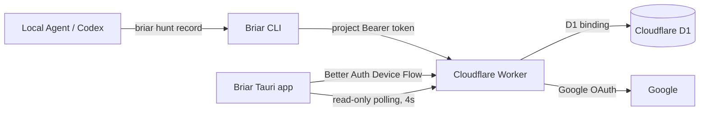

# Briar

Briar is a Tauri v2 Agent Development Environment for observing local agents. The first release reproduces the Wordbricks Auto Hunt dashboard as a generic, read-only desktop app.

Repository source code stays local. Agents send only task state and Git metadata to a Cloudflare Worker, while users, projects, and Auto Hunt state are stored in Cloudflare D1.

## What is included

- Tauri v2 + React + Vite + TypeScript desktop app
- Cloudflare Worker API with Better Auth Google sign-in
- OAuth 2.0 Device Authorization for the desktop app and CLI
- Cloudflare D1 storage through a Worker binding
- D1 migrations for Better Auth and Auto Hunt state
- OS keychain storage for the desktop session token
- Project-scoped Agent ingest tokens stored as SHA-256 hashes
- `briar` CLI for login, repository connection, and Auto Hunt event recording
- Wordbricks stage contract: `queued`, `analyzing`, `implementing`, `pr_open`, `staging_qa`, `production_qa`, `completed`
- Exceptional states: `blocked`, `failed`, `cancelled`
- A demo dashboard when no Worker URL is configured

## Architecture



The Worker owns Better Auth, dashboard APIs, Agent ingest APIs, authorization checks, and all database access. D1 is not exposed directly to the desktop app or CLI.

## Install

Requirements: Bun, Rust, Tauri system prerequisites, and Wrangler 4.x.

```bash
bun install
bun run worker:types
```

## Local development

Decrypt the checked-in `.env.production` with the private key stored in the ignored `.env.keys` file, then apply the D1 migration to Wrangler's local database:

```bash
bun run secrets:check
bun run d1:migrate:local
```

Google login requires real OAuth credentials in the encrypted environment. `bun run worker:dev` decrypts them only for the child process, writes a mode-`0600` temporary Wrangler environment file, and deletes it when Wrangler exits.

Start the Worker:

```bash
bun run worker:dev
```

In another terminal, configure and run the desktop app:

```bash
cp .env.example .env.local
# VITE_BRIAR_API_URL=http://127.0.0.1:8787
# VITE_BRIAR_DEMO=false
bun tauri dev
```

Without `VITE_BRIAR_API_URL`, Briar opens the built-in demo dashboard.

## Production D1 database

The checked-in Wrangler configuration is linked to the `briar-db` database in the Wordbricks Cloudflare account. To provision another environment, authenticate Wrangler, create a new database, and replace the existing `database_id` in `wrangler.jsonc`:

```bash
bunx wrangler login
bunx wrangler d1 create briar-db
```

Then regenerate binding types and apply migrations:

```bash
bun run worker:types
bun run d1:migrate:remote
```

The migration under `migrations/` creates the Better Auth tables, Device Authorization storage, the Auto Hunt schema, constraints, and indexes. Auto Hunt event transitions use D1 atomic batches and stable run IDs to preserve retry-safe idempotency.

## Secret management and Worker deployment

Worker secrets are managed with [dotenvx](https://dotenvx.com/). The encrypted `.env.production` file is safe to commit. The private `.env.keys` file is ignored by Git and must never be committed.

```bash
# Add or rotate a secret. dotenvx updates .env.production and .env.keys.
bunx dotenvx set BETTER_AUTH_SECRET 'new-value' -f .env.production --no-native --no-armor
bunx dotenvx set GOOGLE_CLIENT_ID 'new-value' -f .env.production --no-native --no-armor
bunx dotenvx set GOOGLE_CLIENT_SECRET 'new-value' -f .env.production --no-native --no-armor

bun run secrets:check
bun run worker:build
bun run worker:deploy
```

`worker:deploy` decrypts the values in memory, writes a mode-`0600` temporary JSON file, deploys it with Wrangler's `--secrets-file`, and removes the temporary file in a `finally` block. Cloudflare continues to store the deployed values as encrypted Worker Secrets. For CI, store the single dotenvx decryption key (`DOTENV_PRIVATE_KEY_PRODUCTION`) in the CI secret store instead of committing `.env.keys`.

In Google Cloud Console, add the deployed Worker callback URI:

```text
https://<worker-domain>/api/auth/callback/google
```

Configure the desktop build and CLI with the same Worker origin:

```dotenv
VITE_BRIAR_API_URL=https://<worker-domain>
VITE_BRIAR_DEMO=false
```

```bash
export BRIAR_API_URL='https://<worker-domain>'
```

## Connect an agent

Link the CLI during development:

```bash
bun link
briar login
```

After login, create a project from the desktop onboarding screen and copy its one-time `briar connect` command. You can also create it from the CLI:

```bash
briar project create --name wordbricks --repository /absolute/path/to/wordbricks
```

Record the lifecycle using a stable, retry-safe event key for every transition:

```bash
briar hunt record \
  --source issue \
  --source-key WB-142 \
  --title "Fix checkout race" \
  --stage queued \
  --event-key WB-142:queued:1 \
  --detail "Auto Hunt queued"

briar hunt record \
  --source issue \
  --source-key WB-142 \
  --title "Fix checkout race" \
  --stage implementing \
  --event-key WB-142:implementing:1 \
  --detail "Agent is implementing the fix"
```

The CLI discovers the current branch, commit SHA, and `origin` URL automatically. Reusing an event key with identical data is safe; reusing it with different data is rejected.

## Checks

```bash
bun run check
bun run test
bun run build
bun run d1:migrate:local
bun run worker:types
bun run worker:check
bun run worker:build
bun run worker:startup
cargo check --manifest-path src-tauri/Cargo.toml
```
