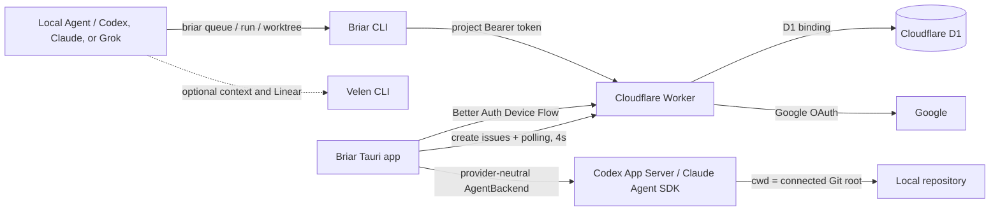

# Briar

Briar is a repository-agnostic Agent Development Environment for running and observing production-bound Auto Hunt work. It extracts the Wordbricks workflow into a reusable D1-backed lifecycle with optional Velen context and Linear mirroring.

Repository source code stays local. Agents send only task state and Git metadata to a Cloudflare Worker, while users, projects, and Auto Hunt state are stored in Cloudflare D1.

## What is included

- Tauri v2 + React + Vite + TypeScript desktop app
- Cloudflare Worker API with Better Auth Google sign-in
- OAuth 2.0 Device Authorization for the desktop app and CLI
- Cloudflare D1 storage through a Worker binding
- D1 migrations for Better Auth and Auto Hunt state
- Persistent desktop sessions stored in a permission-restricted app config file
- Project-scoped Agent ingest tokens stored as SHA-256 hashes
- `briar` CLI for project setup, queue claims, run events, evidence, and worktrees
- A validated `briar-workflow` skill installed for Codex, Claude, and Grok
- Version-matched workflow guidance embedded in the CLI and served by `briar skills get`
- Project-scoped LLM conversations through Codex App Server or Claude Agent SDK
- Optional Velen CLI context with repository-specific organization/source settings
- Optional Linear integration through a configured Velen source
- Slack OAuth integration with a `/create` menu shortcut, issue modal, and `@Briar` quick intake
- Native React controls in a light desktop theme
- Universal run status plus repository-specific workflow stages selected at connection time
- Exceptional states: `blocked`, `failed`, `cancelled`
- A demo dashboard when no Worker URL is configured

## Architecture



The Worker owns Better Auth, dashboard APIs, Agent ingest APIs, authorization checks, and all database access. D1 is not exposed directly to the desktop app or CLI.

Slack App provisioning and deployment are covered in
[docs/operations/slack-integration.md](docs/operations/slack-integration.md).

## Install

Requirements: Bun, Rust, Tauri system prerequisites, Wrangler 4.x, and at least
one installed and authenticated coding agent: Codex CLI, Claude Code, or Grok.
Install and authenticate Velen CLI only for projects that use Velen context or
Linear mirroring.

```bash
bun install
bun run worker:types
```

## Local development

Start the local Worker and Tauri desktop app together. This validates the
encrypted secrets, applies pending local D1 migrations, waits for the Worker,
and stops both processes when you press `Ctrl+C`. The combined command uses
`http://127.0.0.1:8788` for its local Worker:

```bash
bun run dev:all
```

To run the processes separately, follow the steps below.

Decrypt the checked-in `.env.production` with the private key stored in the ignored `.env.keys` file, then apply the D1 migration to Wrangler's local database:

```bash
bun run secrets:check
bun run d1:migrate:local
```

Google login requires real OAuth credentials in the encrypted environment. `bun run worker:dev` decrypts them only for the child process, writes a mode-`0600` temporary Wrangler environment file, and deletes it when Wrangler exits.

Start the Worker:

```bash
bun run worker:dev
```

In another terminal, configure and run the desktop app:

```bash
cp .env.example .env.local
# VITE_BRIAR_API_URL=http://127.0.0.1:8787
# VITE_BRIAR_DEMO=false
bun tauri dev
```

Without `VITE_BRIAR_API_URL`, Briar opens the built-in demo dashboard.

## Android companion

The Android build is a companion to Briar Desktop. It signs in to the same
Worker API and supports project switching, dashboard monitoring, issue creation
with attachments, and retry/cancel actions. Repository setup, Velen, the Briar
CLI, Codex App Server, and Auto Hunt execution remain on the desktop agent.

Install Android Studio or the Android command-line tools, JDK 21, Android SDK
36, Build Tools 35+, and NDK 27.2. Set `JAVA_HOME`, `ANDROID_HOME`, and
`NDK_HOME`, then initialize or run the generated Android project:

```bash
bun run android:init
bun run android:dev
```

Build an installable ARM64 debug APK or unsigned release APK/AAB:

```bash
bun run android:build:debug
bun run android:build
```

Artifacts are written below
`src-tauri/gen/android/app/build/outputs/`. Release packages must be signed with
the production Android keystore before distribution through Google Play.

## Project LLM integration

All model-backed desktop features must use `chatWithProjectLlm` or
`createProjectChat` from `src/lib/project-llm.ts`. That gateway invokes the
native `project_llm_chat` command, which routes the request through the
provider-neutral `AgentBackend` boundary in `src-tauri/src/agent`. Provider
implementations keep their native transport private; Briar does not call a
model provider API directly.

The native command resolves `projectId` from Briar's local connection config,
verifies that the saved path is the Git root, and supplies that absolute path as
the backend working directory. Callers cannot supply a filesystem path.
Conversations are scoped to both the project and provider, and Briar rejects a
conversation ID issued for another project or backend.
App settings independently enable the installed Codex and Claude providers.
Each project then stores its selected backend (`codex` or `claude`), optional
provider model override, and approval policy (`untrusted`, `on-request`, or
`never`) locally; existing projects default to Codex, the provider's default
model, and `never`.
Interactive command and file-change requests from `untrusted` and `on-request`
are shown in a native Briar confirmation dialog and sent back to App Server as
an approval or denial.
Optional `instructions` and `outputSchema` support reusable one-shot LLM
features as well as multi-turn chat.

The current `CodexBackend` transport follows the
[Codex App Server protocol](https://learn.chatgpt.com/docs/app-server):
JSONL over stdio, one `initialize`/`initialized` handshake per connection, then
thread and turn requests while consuming notifications through
`turn/completed`. It translates agent messages and turn completion into
provider-neutral events while retaining the raw App Server payload for local
diagnostics and compatibility with existing Auto Hunt logs.

`ClaudeBackend` runs a bundled Bun adapter around the official
`@anthropic-ai/claude-agent-sdk` and uses the user's authenticated Claude Code
executable. The adapter maps SDK streaming, result, and permission callbacks to
the same Briar events and approval function. Bash always runs in Claude's
OS-level sandbox with fail-closed startup and the unsandboxed escape disabled;
read-only project analysis exposes only `Read`, `Glob`, and `Grep`.

## Production D1 database

Completed log retention, R2 archive verification, monitoring, deletion, backup,
and recovery are documented in
[the D1 hot / R2 cold retention runbook](docs/operations/log-retention-archive.md).

The checked-in Wrangler configuration is linked to the `briar-db` database in the Wordbricks Cloudflare account. To provision another environment, authenticate Wrangler, create a new database, and replace the existing `database_id` in `wrangler.jsonc`:

```bash
bunx wrangler login
bunx wrangler d1 create briar-db
```

Then regenerate binding types and apply migrations:

```bash
bun run worker:types
bun run d1:migrate:remote
```

The migration under `migrations/` creates the Better Auth tables, Device Authorization storage, the Auto Hunt schema, constraints, and indexes. Auto Hunt event transitions use D1 atomic batches and stable run IDs to preserve retry-safe idempotency.

## Secret management and Worker deployment

Worker secrets are managed with [dotenvx](https://dotenvx.com/). The encrypted `.env.production` file is safe to commit. The private `.env.keys` file is ignored by Git and must never be committed.

```bash
# Add or rotate a secret. dotenvx updates .env.production and .env.keys.
bunx dotenvx set BETTER_AUTH_SECRET 'new-value' -f .env.production --no-native --no-armor
bunx dotenvx set GOOGLE_CLIENT_ID 'new-value' -f .env.production --no-native --no-armor
bunx dotenvx set GOOGLE_CLIENT_SECRET 'new-value' -f .env.production --no-native --no-armor
bunx dotenvx set GITHUB_APP_CLIENT_ID 'github-app-client-id' -f .env.production --no-native --no-armor
bunx dotenvx set GITHUB_APP_CLIENT_SECRET 'github-app-client-secret' -f .env.production --no-native --no-armor
bunx dotenvx set GITHUB_APP_SLUG 'github-app-slug' -f .env.production --no-native --no-armor
bunx dotenvx set GITHUB_CALLBACK_ORIGIN 'https://<worker-domain>' -f .env.production --no-native --no-armor
bunx dotenvx set GITHUB_WEBHOOK_SECRET 'same-value-configured-in-github-app' -f .env.production --no-native --no-armor
bunx dotenvx set SLACK_CLIENT_ID 'new-value' -f .env.production --no-native --no-armor
bunx dotenvx set SLACK_CLIENT_SECRET 'new-value' -f .env.production --no-native --no-armor
bunx dotenvx set SLACK_SIGNING_SECRET 'new-value' -f .env.production --no-native --no-armor
bunx dotenvx set SLACK_TOKEN_ENCRYPTION_KEY "$(openssl rand -base64 32)" -f .env.production --no-native --no-armor

bun run secrets:check
bun run worker:build
bun run worker:deploy
```

`worker:deploy` decrypts the values in memory, writes a mode-`0600` temporary JSON file, deploys it with Wrangler's `--secrets-file`, and removes the temporary file in a `finally` block. Cloudflare continues to store the deployed values as encrypted Worker Secrets. For CI, store the single dotenvx decryption key (`DOTENV_PRIVATE_KEY_PRODUCTION`) in the CI secret store instead of committing `.env.keys`.

In Google Cloud Console, add the deployed Worker callback URI:

```text
https://<worker-domain>/api/auth/callback/google
```

Configure the desktop build and CLI with the same Worker origin:

```dotenv
VITE_BRIAR_API_URL=https://<worker-domain>
VITE_BRIAR_DEMO=false
```

```bash
export BRIAR_API_URL='https://<worker-domain>'
```

## Connect an agent

Link the CLI during development:

```bash
bun link
briar login
```

After login, create a project from the desktop onboarding screen, select the workflow that matches the repository, and pick the Git repository. New projects default to the deployment-free `local` workflow; review, release, research, and custom stage selections are available. Optional Velen context and Velen-backed Linear mirroring can be connected later from project settings. Briar validates every selection, stores the path/token/settings locally, stores non-secret integration settings in D1, and installs the Briar CLI plus Auto Hunt skills automatically. Each desktop launch also synchronizes those local assets with the bundled app version, so installing an app update updates the CLI and skills on relaunch. The repository path and Agent token are never sent to the Worker as project metadata.

You can also create and connect a project from inside a Git repository with the CLI:

```bash
briar project create --name wordbricks
```

Create issues and manage their execution order from a connected repository:

```bash
briar issue create \
  --title "Ship checkout retry" \
  --description-file ./issue.md \
  --priority 2 \
  --status queued

briar issue dependency add \
  --dependent-run "<run-id>" \
  --prerequisite-run "<run-id-that-must-finish-first>"

briar issue dependency remove \
  --dependent-run "<run-id>" \
  --prerequisite-run "<run-id-that-no-longer-blocks-it>"
```

These commands use the account from `briar login` and the project connected to
the current repository. Issue priority is optional and ranges from 1 to 4; new
issues enter the Auto Hunt queue unless `--status backlog` is selected.

The installed Skill is intentionally a small discovery stub. Load the full guide from the
same CLI binary that will execute the workflow:

```bash
briar skills list
briar skills get briar-workflow
```

Record the universal status and configured workflow stage using a stable, retry-safe event key:

```bash
briar project doctor
briar workflow show
briar queue claim

briar run event add \
  --source issue \
  --source-key WB-142 \
  --title "Fix checkout race" \
  --status queued \
  --event-key WB-142:queued:1 \
  --status-detail "Queued for execution"

briar run event add \
  --run "<run-id>" \
  --status running \
  --workflow-stage implementing \
  --event-key WB-142:implementing:1 \
  --status-detail "Agent is implementing the fix"
```

The app can create titled, described, prioritized work in the queue. Each run snapshots the project's workflow so later settings do not rewrite active or historical work. `briar queue claim` atomically claims the highest-priority oldest item with a 15-minute lease. The claim token is stored only in the mode-`0600` local config, sent on the first processing transition, and then removed. The CLI discovers repository, workspace, branch, commit SHA, and `origin` URL automatically. Event and evidence keys are retry-safe: identical retries succeed and changed payloads conflict. Completion requires every required snapshot stage, its configured evidence, a result summary, and a terminal linked Linear issue when enabled.

## Local CI and signoff

Pull request CI runs on the developer machine and records the result on the
tested commit with [gh-signoff](https://github.com/basecamp/gh-signoff).
GitHub requires four partial signoffs:

- `signoff/app-worker`
- `signoff/d1-migrations`
- `signoff/rust`
- `signoff/security`

Install the local tools once:

```bash
gh extension install basecamp/gh-signoff
cargo install cargo-audit --version 0.22.2 --locked
brew install gitleaks
```

Run checks while developing:

```bash
bun run ci:local
```

After committing and pushing the exact revision that passed, run the checks
again and publish all four required statuses:

```bash
bun run ci:signoff
```

`ci:signoff` includes the typecheck and all other local checks, runs its four
independent contexts concurrently, and is the only validation command needed
after the release commit is pushed. Do not run a separate `bun run check`
immediately before it.

Pass one or more context names to run or sign off only those phases, for
example `scripts/ci-local.sh security --signoff`. Release candidates and
Production releases also run locally:

```bash
bun run release:macos:candidate
bun run release:macos:production
bun run release:macos:production -- --publish
```

Production credentials are loaded from the checked-in, encrypted `.env.release`
file through dotenvx. The private `.env.keys` file remains ignored and must be
present on the release host; without it the Production release command exits.
Run `bun run secrets:verify-encrypted` before committing secret-file changes.
Public signing and publishing identifiers live in `config/release.env`.

The candidate command skips its expensive ad-hoc bundle build when the diff
from `BRIAR_PREVIOUS_VERSION` contains no release, signing, packaging, updater,
dependency, or bundle-configuration changes. Routine releases must use this
automatic gate; reserve `-- --force` for testing changes to the release
pipeline itself. Candidate and Production builds share a locked Cargo target
cache across worktrees.

The first Production command builds, signs, notarizes, and verifies the local
artifacts once. The second command only revalidates and publishes those exact
files. It uploads immutable GitHub and R2 artifacts concurrently, promotes
`latest.json` only after every versioned upload succeeds, does not rebuild,
resign, or renotarize, and only mutates GitHub and R2 when `--publish` is
explicit.
See [the local Production release runbook](docs/operations/production-release.md)
for host, credential, signed-tag, and rollback requirements.
