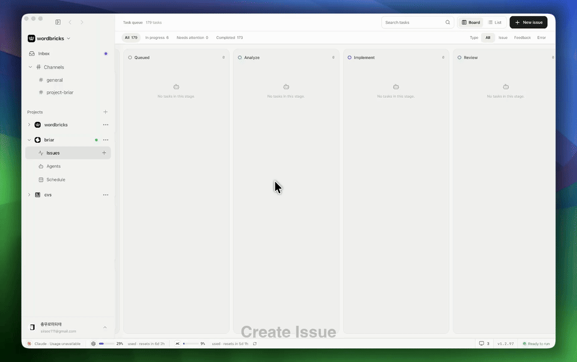

<picture><source media="(prefers-color-scheme: dark)" srcset="./src/assets/brand/briar-logo-dark.png" /></picture>

# Briar

[English](README.md) · [简体中文](README.zh-CN.md)

Briar 是一个由云端协调、在本地执行的 Agent Development Environment，帮助你把编码 Agent 的工作从 issue 推进到 PR。

[](./landing/public/briar-issue-to-complete-demo.mp4)

## Briar 能做什么

- 从桌面端、Web、移动 companion 或 Slack 收集 issue，并统一放入队列。
- 使用 Codex、Claude、Grok 和 OpenCode 运行保存好的项目 Agent。
- 通过 Auto Hunt 处理队列中的工作，每个 issue 都在独立的 Git worktree 中执行。
- 定义分析、实现、本地 QA、审核和发布等仓库专属阶段。
- 记录可安全重试的状态和证据，让团队清楚看到改了什么、什么通过了、还需要关注什么。
- 在审核检查点暂停，批准或要求修改后继续，并将完整的 issue 对话保留在运行记录中。
- 连接 GitHub 获取 PR 状态，并可选接入 Velen 和 Linear。
- 让仓库源代码和路径留在运行 Agent 的设备上。

## 使用方法

> [!WARNING]
> Briar 至少需要安装并完成认证的编码 Agent CLI：Codex CLI、Claude Code、Grok CLI 或 OpenCode CLI。

下载最新的 [macOS Apple Silicon 版 Briar](https://briar-api.wbai.workers.dev/releases/latest/mac-aarch64.dmg)。Android companion 构建版本和更新说明请查看 [GitHub Releases](https://github.com/wordbricks/briar/releases/latest)。

1. 登录并连接一个本地 Git 仓库。
2. 选择 Agent 提供商，查看 Briar 为项目生成的工作流。
3. 创建 issue、设置优先级，并将准备好的工作移入队列。
4. 需要处理队列中的 issue 时，让保存好的项目 Agent 运行 Auto Hunt。
5. 在仪表盘中跟踪每次运行，检查证据，并在审核检查点批准或要求修改。

Briar 在连接项目时会安装并同步 CLI 和工作流技能。Velen、Linear、Slack 和 GitHub 集成均为可选项。

## 本地开发

依赖：Bun 1.4.0、Rust 1.96.0、Tauri 系统依赖、Wrangler 4.x，以及至少一个受支持的编码 Agent CLI。

```sh
bun install
bun run worker:types
bun tauri dev
```

没有 Worker URL 时，应用会打开内置的演示仪表盘。要同时运行桌面应用、本地 Worker 和本地 D1 数据库，请添加解密开发环境所需的私钥文件，然后运行：

```sh
bun run dev:all
```

常用检查：

```sh
bun run check
bun test
bun run ci:local
```

## 隐私

Briar 会在你的设备上针对 Git 仓库运行 Agent。仓库源代码和本地仓库路径不会上传到 Briar Worker。

Worker 会在 Cloudflare D1 中保存账户、组织、项目、issue 和 Auto Hunt 状态，以及协调运行所需的任务和 Git 元数据。你选择的编码 Agent 提供商仍会通过各自经过认证的客户端接收其会话所需的提示、文件上下文、命令输出和工具结果。

## 其他说明

Briar 正在积极开发中，功能和内部实现可能会快速变化，也可能存在尚未打磨完善的地方。

欢迎提交 issue 和 pull request，尤其是 bug 修复、可靠性改进、文档和小型维护改动。

## 贡献代码

提交 pull request 前，请运行相关本地检查并保持改动范围清晰。工作流和运营文档位于 [`docs/`](docs/)，包括[隔离 worktree](docs/operations/workflow-worktrees.md)、[GitHub 集成](docs/operations/github-integration.md)、[Slack 集成](docs/operations/slack-integration.md)和[生产发布](docs/operations/production-release.md)指南。

需要帮助或发现问题？请[创建 GitHub issue](https://github.com/wordbricks/briar/issues)。

## 许可证

除非另有说明，Briar 采用 [Apache License 2.0](LICENSE) 许可证。第三方组件仍受其各自许可证约束。
