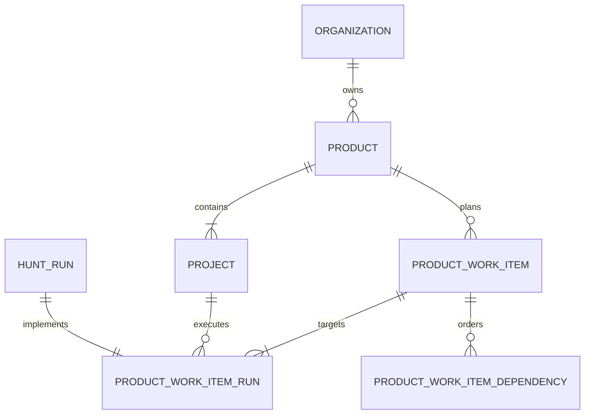

# Product and Project hierarchy

## Decision

Briar uses `Organization -> Product -> Project`.

- A **Product** is the planning and integration boundary visible to people.
- A **Project** remains the execution boundary and maps to exactly one source
  repository/worktree configuration.
- A **Product Work Item** represents one product change and fans out into one
  existing Hunt Run for every selected Project.

Keeping Project repository-scoped preserves queue claiming, worker policies,
workflow configuration, secrets, and worktree isolation. It also avoids adding
repository selectors to every execution table and CLI command.

## Data model

Every pre-existing Project is migrated into a same-named Product. New Projects
may join an existing Product or create a same-named Product for compatibility
with older clients.

## Creation and execution flow

1. The user creates one Product Work Item and selects the affected Projects.
2. The API validates that every selected Project belongs to the Product.
3. The API creates one child Hunt Run per Project and links all children to the
   Product Work Item.
4. Attachments and execution context are copied to each child so existing
   repository workers need no new artifact lookup path.
5. The user may run Projects in parallel or in listed order. Ordered execution
   is stored as cross-Project dependencies and queue claiming blocks a child
   until its prerequisite child is complete.
6. Child status changes aggregate into the Product Work Item. When all required
   children complete it becomes `ready_for_review`; a human explicitly accepts
   the integration to mark it `completed`.

The fan-out write is transactional at the application boundary: if parent
creation or linking fails, created child runs and uploaded objects are removed.

## Status aggregation

Product Work Item status is derived from required child runs with this
precedence:

1. all complete -> `ready_for_review`
2. any running -> `in_progress`
3. any blocked -> `blocked`
4. any failed -> `failed`
5. any queued -> `queued`
6. otherwise -> `backlog`

`completed` and `cancelled` are explicit parent decisions. A completed item is
reopened automatically if a required child is no longer complete.

## API surface

- `GET|POST /products`
- `GET|PATCH|DELETE /products/:productId`
- `PUT /projects/:projectId/product`
- `GET|POST /products/:productId/work-items`
- `GET|PATCH /products/:productId/work-items/:workItemId`
- `POST|DELETE /products/:productId/work-items/:workItemId/dependencies`

Project responses include `productId` and `productName`. The mobile OpenAPI
contract and native iOS model require both fields; Android uses the shared
React client contract.

## Delivery plan

- [x] Add Product ownership and migrate existing Projects without changing
  their execution identity.
- [x] Add Product Work Items, child-run links, status aggregation, and
  cross-Project dependencies.
- [x] Add Product and fan-out endpoints while preserving single-Project issue
  endpoints.
- [x] Group Projects by Product and add multi-repository issue creation in the
  desktop and Android shared UI.
- [x] Group the native iOS Project picker by Product and update its contract.
- [x] Add database, contract, type, and component coverage.
- [ ] Roll out the migration before requiring the new Project response fields
  from deployed clients.

## Operational invariants

- A Project belongs to one Product and one Organization.
- Every Product Work Item targets at least one Project from its Product.
- A Product Work Item has at most one child Hunt Run per Project.
- Cross-Project dependency edges belong to the same Product Work Item and may
  not form cycles.
- Workers continue to claim and execute a single Project at a time.
