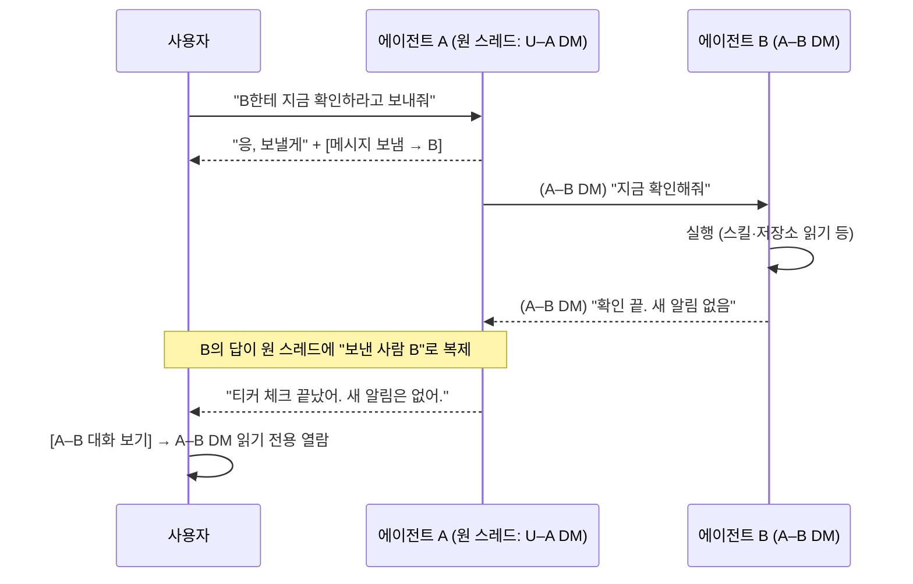

# 에이전트 간 메시지 (Agent-to-Agent Messaging)

Status: implemented (0~4단계, 데스크탑). §8의 결정 10건을 2026-09-06에 확정했고 같은
날 구현했다. 모바일(5단계)은 후속 PR. 작성일 2026-09-06.

## 구현 현황

| 영역 | 상태 | 위치 |
| --- | --- | --- |
| 계약: `agent_message` 액션, 클레임의 대상 목록·수신 메시지·hop, 앱의 relay·read_only, `ListAgentDirectMessages` | done | `packages/contracts/proto/briar/worker/v1/worker_queue.proto`, `packages/contracts/proto/briar/app/v1/channel.proto` |
| 마이그레이션: hop·origin 컬럼, 가드 트리거, relay 테이블 | done | `apps/briar/migrations/0201_agent_message_relays.sql`, `apps/briar/worker/src/agent-message-relays.migration.test.ts` |
| 에이전트 DM 생성·열람 권한·카탈로그 제외·relay JSON | done | `apps/briar/worker/src/channels.ts`, `apps/briar/worker/src/channel-route-access.ts` |
| 발신 검증(hop·범위·시간당 상한)과 왕복 batch | done | `apps/briar/worker/src/worker-reply-completion-application.ts`, `apps/briar/worker/src/agent-message-targets.ts` |
| 클레임 스냅샷(대상 목록, 수신 메시지, hop) | done | `apps/briar/worker/src/channel-reply-claim-routes.ts` |
| 러너 프롬프트와 출력 | done | `apps/briar/src-cli/agent-runner.ts`, `apps/briar/src-cli/reply-execution.ts`, `apps/briar/src-cli/worker-queue-contract.ts` |
| 데스크탑: relay 행, 읽기 전용 에이전트 DM, 에이전트 상세 "대화" | done | `apps/briar/src/components/ChannelRelayRow.tsx`, `Channels.tsx`, `DirectMessages.tsx`, `AgentConversationsSection.tsx`, `src/hooks/useAgentConversationChannel.ts` |
| 서버 왕복 테스트 | done | `apps/briar/worker/src/channel-agent-message.test.ts` |
| 모바일 iOS·Android | 후속 PR | relay 메시지는 일반 에이전트 메시지로 보이고, 읽기 전용 에이전트 DM은 열 수 없다 |

구현하면서 설계와 달라진 것:

- **hop 1 실패 시 A를 재개하지 않는다.** 왕복의 outbound 표식이 `failed`로 바뀌고 잡
  오류가 기존 답글 오류 표면에 남는다(§3.2).
- **시간당 상한 초과는 발신 완료 자체를 거절한다.** A의 잡이 `Agent message hourly
  limit (n) reached` 오류로 실패하며 A를 다시 띄우지 않는다(§3.6).
- **에이전트 DM 생성과 hop 잡은 `completeChannelReply`의 batch 안에서 전용 문장으로
  만든다.** 기존 `channelAgentReplyEnqueueStatements`는 로스터 행이 미리 있어야 해서
  dm_key 서브쿼리로 채널을 찾는 같은 batch에 넣을 수 없었다.
- **DM 잡의 `delegationTargets`는 항상 빈 목록이다.** 1:1 DM에서는 이미 비어 있었고,
  채널 스레드 잡은 그대로다(§3.7).
- **읽기 전용 에이전트 DM의 실시간 갱신은 3초 폴링이다.** 카탈로그에 없는 채널을
  델타 병합이 삭제로 취급하는 문제는 `retainWhenAbsentFromCatalog`로 우회했다.
- **에이전트 상세의 "대화"는 접힌 disclosure다.** 펼칠 때 목록을 불러온다.

## 1. 목표 시나리오

사용자가 에이전트 A와 DM 중이다. B가 전문적으로 맡은 일이 있으면 A가 B에게
메시지를 보내고, B의 답을 받아 사용자에게 전달한다. 에이전트는 사람처럼
자기 메시지 목록을 가지며, 사용자는 A–B 대화를 열어볼 수 있다. 채널 스레드
안의 기존 위임(조직 에이전트 → 프로젝트 에이전트)은 그대로 두고, v1의 발신은
DM에서 시작한 대화에서만 허용한다(§3.7).



## 2. 현재 코드베이스에 이미 있는 것

| 자산 | 위치 | 이 기능에서의 쓰임 |
| --- | --- | --- |
| DM = `kind='dm'` 채널, `dm_key`로 1:1 중복 방지 (`self:`, `users:`, `agent:`) | `apps/briar/worker/src/organization-channel-routes.ts` `createOrganizationDirectMessage`, `apps/briar/worker/src/channels.ts` `createChannel` | A–B DM도 같은 테이블·같은 타임라인 렌더러를 쓴다 |
| 에이전트 작성자 메시지 (`author_agent_id/name/provider`) | `briar_channel_messages` | A가 보내는 메시지, B의 답, 원 스레드의 복제본 모두 에이전트 작성자 행 |
| 조직 에이전트 → 프로젝트 에이전트 위임 (한 홉, 같은 채널 스레드) | `apps/briar/migrations/0089_channel_agent_delegation.sql`, `channels.ts` `completeChannelReply`, `channel-reply-claim-routes.ts`, `worker-reply-completion-application.ts` | 대상 검증·재귀 금지·자식 잡 생성 패턴을 그대로 본뜬다. 경로 자체는 유지한다 |
| 러너 프롬프트의 위임 대상 목록·위임받은 요청 문구 | `apps/briar/src-cli/agent-runner.ts` (`delegationTargets`, `delegation`) | "연락 가능한 에이전트 목록"과 "수신 메시지" 프롬프트의 원형 |
| 엄격한 JSON 출력 계약 | `apps/briar/src/lib/channel-agent-reply-contract.ts`, `channels-contract.ts` `channelReplyDelegationSchema`, `packages/contracts/proto/briar/worker/v1/worker_queue.proto` `ChannelReplyDelegationAction` | 같은 oneof에 `agentMessage` 액션을 추가 |
| 스레드·에이전트별 대화 세션 (provider `conversationId`, 6시간 보존) | `briar_channel_reply_sessions` | B의 답이 돌아왔을 때 A가 같은 세션으로 이어 말한다 |
| 실시간 허브 (Durable Object) + 변경 피드 | `ChannelRealtimeHub`, `briar_channel_changes` | A–B DM 변경도 같은 피드로 흐른다 |
| DM 자동 호출 규칙 (멤버 1 + 에이전트 1이면 멘션 없이 호출) | `channel-message-routes.ts` `implicitDirectAgent` | A–B DM(사람 0 + 에이전트 2)은 사람이 쓰지 못하므로 이 규칙을 타지 않는다 |
| iOS DM 화면과 웹 셸 companion DM | `apps/briar/ios/BriarCompanion/App/DirectMessagesViews.swift`, `apps/briar/src/components/DirectMessages.tsx` | 후속 PR의 모바일 열람 화면 기반 |

현재 위임과 목표 시나리오의 차이:

- 위임 결과는 **위임한 에이전트에게 돌아오지 않는다.** 자식(프로젝트 에이전트)이
  같은 스레드에 직접 답을 남기고 끝난다.
- 위임은 **조직 에이전트 → 프로젝트 에이전트, 같은 채널 로스터 안**에서만
  가능하다. A–B 사이에 별도 대화 공간이 없어 "엿보기"가 성립하지 않는다.
- `delegation_request`는 멤버에게 숨겨진다(`channelReplyJson`이 빼놓음).
  목표 시나리오는 반대로 대화 내용을 보여주는 것이 핵심이다.

## 3. 설계

### 3.1 데이터 모델

**A–B DM**: `briar_channels`에 `kind='dm'`, `dm_key='agents:["<a>","<b>"]'`(정렬)로
저장한다. 사람 멤버 행이 없다. 지금 `createChannel`은 생성자를 owner 멤버로
항상 넣고 private 채널은 멤버 행이 곧 접근 권한이라, 두 가지를 바꾼다.

- `created_by_user_id`는 이미 nullable. 에이전트 DM은 서버가 생성하며 null.
- 접근 규칙에 "에이전트 DM은 §3.5 조건을 만족하는 조직 멤버가 읽기 전용으로
  볼 수 있다"를 추가한다 (`visibleToUser` SQL 확장).
- `dmKeyAfterParticipantChangeSql`은 `agents:` 키를 참가자 2명 규칙에 포함한다.

**메시지 출처 링크**: 새 테이블 `briar_channel_message_relays`.

```sql
create table briar_channel_message_relays (
  -- 원 스레드 쪽 행. "메시지 보냄 → B" 또는 "보낸 사람 B"로 그려진다.
  message_id text primary key not null
    references briar_channel_messages (id) on delete cascade,
  direction text not null check (direction in ('outbound', 'inbound')),
  -- A–B DM 쪽의 원본 메시지
  peer_channel_id text not null references briar_channels (id) on delete cascade,
  peer_message_id text not null
    references briar_channel_messages (id) on delete cascade,
  -- 이 왕복을 시작한 원 스레드의 답글 잡
  origin_reply_job_id text not null
    references briar_channel_agent_reply_jobs (id) on delete cascade,
  created_at text not null
);
```

`outbound` 행의 `message_id`는 원 스레드에 남기는 짧은 표식 메시지이고,
`inbound` 행은 B의 답을 원 스레드에 복제한 메시지다. 복제 메시지의 작성자는
B(`author_agent_id=B`)로 두어 화면이 "보낸 사람 B"를 그릴 수 있게 한다.
삭제·보존은 원본과 함께 cascade.

**답글 잡 확장**: `briar_channel_agent_reply_jobs`에 두 컬럼.

```sql
alter table briar_channel_agent_reply_jobs
  add column agent_message_hop integer not null default 0
    check (agent_message_hop between 0 and 2);
alter table briar_channel_agent_reply_jobs
  add column origin_reply_job_id text
    references briar_channel_agent_reply_jobs (id) on delete cascade;
```

- hop 0: 사람이 시작한 잡. hop 1: A가 보낸 메시지로 B가 도는 잡(A–B DM).
  hop 2: B의 답으로 A가 다시 도는 잡(원 스레드). hop 2에서는 다시 보낼 수 없다.
- `origin_reply_job_id`는 왕복 전체를 하나로 묶는 키. 취소·실패 전파, UI의
  "진행 중" 표시, 비용 집계에 쓴다.
- 기존 `delegated_by_reply_job_id`/`delegation_request`는 그대로 둔다. 한 잡이
  둘을 동시에 가질 수 없다는 check를 추가한다(위임 자식이면서 hop ≥ 1인 잡 금지).

### 3.2 실행 흐름

v1의 원 스레드는 U–A DM이다. 처리 자체는 채널 종류를 가정하지 않으므로
채널 스레드로 넓히는 것은 §7의 플래그 전환이다.

1. **A의 턴 (원 스레드, hop 0)**. 클레임 스냅샷에 `agentMessageTargets`(연락
   가능한 에이전트: id, 이름, 책임, 스킬 이름, 소속 프로젝트)를 넣는다.
   범위는 §3.5. 프롬프트는 지금 `delegationTargets` 자리를 그대로 쓴다.
2. A가 `agentMessage: { agentId, body }`와 함께 `body`("응, 보낼게")를 반환한다.
   완료 처리는 한 D1 batch로:
   - 원 스레드에 A의 답 메시지 저장 (기존 경로).
   - A–B DM get-or-create (`agents:` dm_key). 없으면 채널 + `briar_channel_agents`
     두 행 생성.
   - A–B DM에 A 작성자 메시지 저장, `briar_channel_message_agent_mentions`에 B.
   - B 답글 잡 enqueue (channel=A–B, trigger=A의 메시지, hop 1, origin=A의 잡).
   - 원 스레드에 `outbound` relay 행 + 표식 메시지 저장.
   - 변경 피드에 두 채널 모두 기록.
3. **B의 턴 (A–B DM, hop 1)**. 클레임 자격은 기존 규칙(조직 에이전트면 조직
   디바이스, 프로젝트 에이전트면 프로젝트 바인딩)을 그대로 쓴다. 스냅샷은
   A–B DM의 최근 메시지(DM 한도 10개)와 "발신자 A, 사람 참가자 없음" 표식을
   담는다. B의 출력은 `body`·`attachments`만 허용하고 제안·문서·위임·
   `agentMessage`는 서버가 400으로 거절한다(§3.6).
4. B 완료 처리(한 batch):
   - A–B DM에 B의 답 저장.
   - 원 스레드에 B 작성자의 복제 메시지 + `inbound` relay 행 저장.
   - A 답글 잡 enqueue (channel=원 스레드, trigger=복제 메시지, hop 2, origin
     동일). A의 스레드 세션이 살아 있으면 같은 `conversationId`로 이어 말한다.
     **항상 재개한다**(결정 Q1).
5. **A의 재개 턴 (hop 2)**. 프롬프트에 "B의 답이 도착했다. 사용자에게 결과를
   전달하라"와 B의 본문(신뢰하지 않는 텍스트)을 넣는다. 출력은 일반 답글.
   `agentMessage`는 null이어야 한다.

실패 전파: B 잡이 실패하면 원 스레드에 실패 표식(기존 reply job `error` 표시
재사용)을 남기고 A를 재개해 사용자에게 알리게 한다. 리스 만료·재시도는 기존
잡 규칙 그대로. 비용 상한 초과(§3.6)도 같은 경로로 알린다.
**v1 단순화**: B 잡이 최종 실패해도 A를 다시 부르지 않는다. 원 스레드의
`outbound` 표식이 'failed'로 바뀌고 잡의 `error`가 기존 답글 오류 표면에
그대로 보이는 것으로 끝난다.

### 3.3 계약 변경

| 계층 | 변경 |
| --- | --- |
| `worker_queue.proto` | `ChannelReplySuccess.action` oneof에 `ChannelReplyAgentMessageAction { agent_id, body } = 13` 추가. 기존 `delegation = 12`는 유지. `ClaimedChannelReply`에 `agent_message_targets`, `inbound_agent_message { sender_agent_id, sender_agent_name, body, peer_channel_id, peer_message_id }`, `agent_message_hop` 추가. 기존 `delegation`, `delegation_targets` 유지 |
| `channel.proto` | `ChannelSummary`에 `read_only` bool(에이전트 DM). 참가자는 기존 `direct_message_participants`로 표현. `ChannelMessage`에 `relay { direction, peer_channel_id, peer_message_id }` 추가 |
| `channel-agent-reply-contract.ts`, `channels-contract.ts` | 출력 스키마에 `agentMessage` 추가. `delegation`·모든 제안과 상호 배타 |
| `agent-runner.ts` | 대상 목록·수신 메시지·hop 제한 프롬프트, 예시 JSON 한 줄 추가. DM 스코프에서는 `agentMessageTargets`만, 채널 스코프에서는 `delegationTargets`만 프롬프트에 실린다 |
| 호환성 | 새 액션은 추가만이므로 구 러너는 그대로 동작한다. 구 러너가 `agentMessage`를 모르면 발신을 못 할 뿐이다 |

### 3.4 UI (데스크탑)

**원 스레드 타임라인**

- `outbound` relay 메시지: 작은 시스템 행 "메시지 보냄 → [B 아바타] B".
  클릭하면 A–B DM으로 이동.
- `inbound` relay 메시지: 일반 말풍선이지만 위에 "보낸 사람 [B 아바타] B"
  라벨. 클릭하면 A–B DM의 해당 메시지로 이동.
- B가 도는 동안 기존 타이핑/진행 표시를 "B가 확인 중" 문구로 재사용.

**A–B DM 열람 화면**: `Channels.tsx`의 `surface="dm"`에 `readOnly` 모드를 추가한다.
컴포저·스킬 커맨드·메모리 버튼을 숨기고 상단에 "에이전트 간 대화 · 읽기 전용"
배지를 둔다.

**진입 경로** (결정 Q5): 원 스레드의 relay 행 링크, 그리고 에이전트 상세
페이지(`TeamAgentDetail.tsx`, `OrganizationAgentsSettings.tsx`)의 "대화" 탭에
그 에이전트가 참여한 A–B DM 목록. DM 사이드바 목록에는 넣지 않는다.

**모바일** (결정 Q7): 이 PR에서는 다루지 않는다. 그 사이 iOS와 웹 셸은 relay
행을 일반 에이전트 메시지로 보여주고(복제 메시지의 작성자가 B이므로 깨지지
않음), 읽기 전용 A–B DM은 열 수 없다. 후속 PR에서 iOS(`DirectMessagesViews.swift`,
`ChannelConnect.swift`)와 Android 웹 셸(`CompanionChannels.tsx`)을 함께 바꾼다.

### 3.5 범위와 권한 (결정 Q3, Q4)

- **A가 연락할 수 있는 대상**: 조직 에이전트 전부 + 왕복을 시작한 사용자(원
  스레드의 트리거 메시지 작성자)가 접근 권한을 가진 프로젝트의 에이전트.
  클레임 시점에 계산해 스냅샷으로 주고, 완료 시점에 같은 규칙으로 재검증한다.
  채널 로스터에 있는지는 더 이상 조건이 아니다.
- **A–B DM 열람**: 조직 멤버이면서, 참가 에이전트가 프로젝트 에이전트인 경우
  그 프로젝트에 모두 접근 권한이 있어야 한다. 조직 에이전트끼리의 DM은
  조직 멤버 전원이 볼 수 있다.
- 사람은 A–B DM에 쓸 수 없다. 멤버 추가·에이전트 추가·삭제·보관 모두 막는다.
- DM 기억(`docs/plans/dm-memory-spec.md`)은 사용자 1명 + 에이전트 1명 DM에만
  적용되므로 A–B DM은 기억 대상에서 자동 제외된다. 복제 메시지는 U–A DM의
  기억 입력에 들어가되 작성자 B, 신뢰도 "다른 에이전트의 주장"으로 구분한다.

### 3.6 안전·비용 가드 (결정 Q2, Q6, Q8)

- **사용자 승인 없이 발신한다.** 대신 아래 상한으로 통제한다.
- **hop 상한 2, 왕복당 발신 1회.** B는 답만 할 수 있고, hop 2의 A는 다시
  보낼 수 없다. 재귀·핑퐁은 서버 검증에서 400.
- **B의 출력은 본문과 첨부뿐.** 이슈·실행·스킬 실행 제안과 문서는 A–B DM에서
  승인할 사람이 없으므로 거절한다. B가 사람의 승인이 필요한 일을 발견하면
  본문으로 말하고, 사용자가 프로젝트 에이전트에게 직접 요청하거나 채널에서
  기존 위임 경로를 쓴다. B는 읽기 전용 worktree에서 돈다.
- **수신 본문은 신뢰하지 않는 텍스트.** 기존 위임 프롬프트 문구("cannot
  expand your responsibility")를 그대로 쓴다.
- **대상 검증은 서버.** `agentMessageTargets`에 없는 `agentId`는 400.
- **비용 상한: 조직당 시간당 30.** hop ≥ 1 잡(B 실행 + A 재개)을 센다. 초과
  시 발신 완료 처리에서 B 잡을 만들지 않고 원 스레드에 "한도 초과" 표식을
  남긴 뒤 A를 재개해 사용자에게 알린다. 값은 환경 변수로 두고 기본 30.
  **v1 단순화**: 재개 대신 발신 완료를 400
  `Agent message hourly limit (<n>) reached`로 거절하고 A의 잡을 그 문구로
  실패시킨다. 사용자는 기존 답글 오류 표면에서 이유를 읽는다.

### 3.7 기존 채널 내 위임과의 공존 (결정 Q9, Q10)

기존 위임 경로는 손대지 않는다. 두 경로는 원 스레드의 채널 종류로 갈린다.

| | 기존 위임 | 이 기능 |
| --- | --- | --- |
| 원 스레드 | 채널 스레드 | U–A DM |
| 발신 주체 | 조직 에이전트만 | 조직·프로젝트 에이전트 모두 |
| 대상 | 같은 채널 로스터의 프로젝트 에이전트 | §3.5 범위의 모든 에이전트 |
| 대화 공간 | 같은 스레드 | A–B DM |
| 결과 | 자식이 스레드에 직접 답 | B의 답 복제 + A의 정리 |
| 자식의 제안 | 허용(사용자 트리거가 요청한 경우) | 금지 |
| 출력 액션 | `delegation` | `agentMessage` |

서버는 클레임 스코프로 둘을 분리한다. 채널 스레드 잡에는
`delegationTargets`만, DM 잡에는 `agentMessageTargets`만 싣고, 스코프에 맞지
않는 액션은 400. 한 출력에 둘을 함께 담는 것도 400. 채널에서 조직 에이전트
경유 실행 요청은 지금처럼 위임으로 처리되므로 회귀가 없다. 두 경로의 통합은
후속(§7).

## 4. 단계

| 단계 | 범위 | 주요 파일 |
| --- | --- | --- |
| 0 | proto·마이그레이션·출력 스키마. 서버가 `agentMessage`를 받아 400으로 거절만 함 | `worker_queue.proto`, `channel.proto`, `migrations/0201_agent_message_relays.sql`, `channels-contract.ts` |
| 1 | A–B DM get-or-create, 발신 완료 처리, B 잡 enqueue, relay 행, 열람 권한 SQL, 대상 범위 계산 | `channels.ts`, `worker-reply-completion-application.ts`, `channel-reply-claim-routes.ts`, `channel-route-access.ts` |
| 2 | B 클레임 스냅샷·출력 제한, B 완료 시 복제 + A 재개 잡, hop·비용 가드, 위임과의 스코프 분리 | 위와 동일 + `worker-reply-completion-mappers.ts` |
| 3 | 러너: 대상 목록·수신 메시지 프롬프트, `agentMessage` 파싱 | `src-cli/agent-runner.ts`, `src-cli/reply-execution.ts` |
| 4 | 데스크탑 UI: relay 행, 읽기 전용 A–B DM, 에이전트 상세 "대화" 탭 | `Channels.tsx`, `DirectMessages.tsx`, `TeamAgentDetail.tsx`, `OrganizationAgentsSettings.tsx`, i18n 3개 |
| 5 (후속 PR) | 모바일 iOS + Android 웹 셸 | `DirectMessagesViews.swift`, `ChannelConnect.swift`, `CompanionChannels.tsx` |
| 6 | 운영: 비용 지표, 문서(`docs/operations/`), 스키마 정리 마이그레이션 | |

출시 단위는 0~4다. 1~3단계까지가 시나리오의 최소 동작이고, 4단계 없이는
사용자가 결과를 볼 수 없다. 기존 위임은 어느 단계에서도 끊기지 않는다.

## 5. 검증

- 마이그레이션: `worker/src/*.migration.test.ts` 패턴으로 `agents:` dm_key
  유일성, relay cascade, hop check 제약.
- 서버: `channel-agent-delegation.test.ts`를 본떠 `channel-agent-message.test.ts`를
  새로 만든다. A 발신 → B 클레임 → B 완료 → 원 스레드 복제 → A 재개까지 한
  시나리오, 재귀·비대상·범위 밖 대상·시간당 상한 초과·B의 제안·채널 스레드
  에서의 `agentMessage`·DM에서의 `delegation` 모두 400. 기존 위임 테스트는
  그대로 통과해야 한다.
- 권한: 프로젝트 접근 없는 멤버의 A–B DM 404, 사람의 A–B DM 쓰기 403,
  사용자가 접근 못 하는 프로젝트 에이전트가 대상 목록에서 빠지는지.
- 러너: `agent-runner.test.ts`에 대상 목록·수신 메시지 프롬프트 스냅샷.
- UI: `Channels.test.tsx`에 relay 행 렌더·클릭 이동, 읽기 전용 모드에서
  컴포저 부재.

## 6. 리스크

- **`createChannel`의 생성자 owner 자동 삽입.** 에이전트 DM은 사람 멤버가
  없어야 하므로 분기가 필요하고, `member_count`를 전제로 한 `implicitDirectAgent`
  같은 규칙이 여러 곳에 흩어져 있다. 1단계에서 `kind='dm'` 분기를 모두 찾아
  "사람 0명" 케이스를 명시한다.
- **두 경로의 공존.** `delegation`과 `agentMessage`가 한 출력 계약 안에 있어
  프롬프트가 길어진다. 스코프별로 한쪽 문구만 싣는 것으로 완화하고, 통합은
  후속으로 미룬다.
- **잡 취소·재시도와 왕복 상태.** B 잡 재시도 중 사용자가 원 스레드에 새
  메시지를 보내면 A의 세션이 두 갈래가 된다. hop 2 잡은 스레드 세션의
  최신 상태를 따르고, 경합은 기존 `unique(channel_id, trigger_message_id, agent_id)`로
  막힌다.
- **A 재개 비용.** 왕복마다 모델 실행이 세 번(A, B, A)이다. 시간당 30 상한이
  왕복 10번 수준이므로 초기에 부족하면 값을 올린다.

## 7. 후순위

- 같은 왕복 안에서 A↔B 여러 턴(협상). hop 상한을 올리는 것으로 열 수 있게
  스키마는 준비하되 v1은 닫는다.
- 그룹 에이전트 DM(A가 B, C에게 동시에), 에이전트가 사람에게 먼저 DM.
- 사용자가 A–B DM에 끼어들어 쓰기.
- DM 사이드바에 에이전트 대화 섹션.
- 채널 스레드에서 시작하는 `agentMessage`(플래그 전환)와 기존 위임 경로의 통합.

## 8. 결정 기록

| # | 질문 | 결정 (2026-09-06) |
| --- | --- | --- |
| 1 | B의 답 전달 방식 | 복제 + A가 항상 정리 |
| 2 | 발신 전 사용자 승인 | 승인 없음 + 비용 상한 |
| 3 | A의 연락 범위 | 조직 에이전트 + 사용자가 접근 가능한 프로젝트의 에이전트 |
| 4 | A–B DM 열람 권한 | 두 에이전트 모두에 접근 권한이 있는 조직 멤버 |
| 5 | 사이드바 노출 | 원 스레드 링크 + 에이전트 상세 "대화" 탭 |
| 6 | 비용 상한 | 조직당 시간당 30 |
| 7 | 모바일 | 데스크탑 먼저, iOS·Android는 후속 PR에서 함께 |
| 8 | B의 권한 | 읽기 전용, 제안 금지 |
| 9 | 기존 채널 내 위임 | 그대로 유지. 통합은 나중에 |
| 10 | Q8·Q9 충돌(위임을 대체하면 조직 에이전트 경유 실행 요청 경로가 사라짐) | 위임 유지로 해소. 채널 실행 요청은 기존 위임, DM 대화는 이 기능 |
