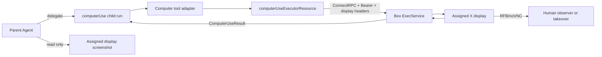

# Grok Bot 방식을 이식한 Provider-neutral Briar Computer Use SPEC

상태: 핵심 코드 구현 중. AMI 배포와 프로덕션 활성화 전이다.

작성일: 2026-09-01.

기준 Grok Bot 소스: `/Users/jay/git/grok-bot-0.18-reconstructed`, commit
`a9f633e09d49a85829b8236331b9e21f7e612634`.

기준 Briar 소스: 이 문서를 포함한 worktree, commit
`fe43ec218749687fd64f2383b05ce227e88d4e43`.

이 문서의 목표는 **Grok Bot의 Computer Use 구현 방식을 가능한 한 그대로
Briar에 이식하는 것**이다. Briar에 이미 있는 화면 기능에 임의의 도구를 덧붙이는
설계가 아니다. Grok의 Agent 역할 분리, action schema, ResourceAccessor,
ConnectRPC 원격 실행, Agent별 desktop 할당, VNC 관찰 경로를 기준 동작으로 삼는다.

여기서 **Grok은 구현 방식의 기준이지 Briar의 필수 provider가 아니다.** Briar의
Computer Use core는 provider-neutral이어야 하며, 부모와 computerUse child는 사용자가
선택한 provider를 그대로 유지한다. provider별 차이는 동일한 Briar-owned MCP server를
각 provider의 설정 형식에 연결하는 얇은 adapter에만 둔다.

이 문서와 기준 Grok 소스가 충돌하면 기준 commit의 소스 동작이 우선한다. 단,
재구성 저장소에 없는 in-box 저수준 입력 구현은 동일하다고 주장하지 않는다.

## 1. 결론

Briar는 아래 경로를 구현해야 한다.

```text
부모 Briar Agent (선택한 provider)
  ├─ Screenshot: 자기 화면을 읽기만 함
  └─ computerUse 하위 Agent를 한 개 실행
       ↓
     Computer tool
       ↓ typed protobuf actions
     computerUseExecutorResource
       ↓ authenticated ConnectRPC / ExecService
     관리형 컴퓨터의 box executor
       ↓ 같은 Agent에게 할당된 X display
     click / type / scroll / screenshot
       ↓ ComputerUseResult
     같은 provider의 하위 Agent → 부모 Agent
```

사람이 보는 원격 화면은 같은 display를 VNC로 보여주지만, Computer action을
운반하는 경로는 아니다.

### 1.1 반드시 그대로 가져올 것

| Grok의 동작 | Briar 이식 기준 |
| --- | --- |
| 부모 Agent는 화면을 직접 조작하지 않는다. | 부모에는 읽기 전용 Screenshot과 하위 Agent 제어만 준다. |
| 조작은 `computerUse` 하위 Agent가 맡는다. | Briar가 별도 background child run을 만들고 상태를 관리한다. |
| 한 부모 화면에는 조작 하위 Agent가 한 개뿐이다. | parent display 단위 mutex를 둔다. |
| action은 protobuf oneof다. | field number와 의미가 호환되는 schema를 사용한다. |
| tool call은 `ResourceAccessor`를 거친다. | provider와 box 사이에 같은 resource abstraction을 둔다. |
| 실제 실행은 authenticated ConnectRPC다. | MCP, shell, RFB를 core action transport로 쓰지 않는다. |
| Agent별로 독립 desktop window를 할당한다. | 고정 `DISPLAY=:1` 하나를 전 Agent가 공유하지 않는다. |
| display assignment와 owner token을 유지한다. | 재시작 후에도 같은 Agent가 같은 display를 회수한다. |
| VNC는 관찰과 사람의 takeover용이다. | Agent action과 VNC 화면이 같은 display를 가리키게 한다. |
| 화면 변경 action 뒤 screenshot을 반환한다. | 마지막 action이 screenshot이 아니면 자동으로 추가한다. |

### 1.2 폐기하는 이전 설계

이 문서의 이전 판에 있던 아래 결정은 더 이상 유효하지 않다.

- provider에 local MCP server만 붙이는 구조.
- Unix domain socket X11 broker를 core executor로 쓰는 구조.
- 모든 Agent가 `DISPLAY=:1` 하나를 공유하는 구조.
- 관리형 컴퓨터 전체를 `maxConcurrentSessions=1`로 제한하는 구조.
- claimed work 전체를 device-wide global lease로 잠그는 구조.
- Codex를 첫 기준 provider로 삼는 구조.
- screenshot과 입력을 무조건 저장하지 않는 Grok 비호환 결과 계약.
- 부모와 child를 Grok으로 고정하는 구조.

MCP는 provider가 Briar-owned tool을 받을 다른 방법이 없을 때 **북쪽 adapter**로는
쓸 수 있다. 그래도 MCP 뒤의 실행 경로는 반드시 ResourceAccessor와 ConnectRPC
executor여야 한다.

## 2. 확인된 Grok 기준 구현

### 2.1 Computer tool

`source/host/runner/tools/sand-computer-tool.ts`가 모델용 Computer tool을 정의한다.

지원 action은 다음과 같다.

| 모델 action | protobuf action | 핵심 입력 |
| --- | --- | --- |
| `screenshot` | `ScreenshotAction` | 없음 |
| `click` | `ClickAction` | 좌표, button, count, modifier keys |
| `move` | `MouseMoveAction` | 좌표 |
| `drag` | `DragAction` | 경로, button, modifier keys |
| `type` | `TypeAction` | text |
| `key` | `KeyAction` | key, hold duration |
| `scroll` | `ScrollAction` | 좌표, 방향, 양, modifier keys |
| `wait` | `WaitAction` | duration |

한 tool call은 첫 action과 최대 9개의 `then` action을 받는다. `wait`는 최대
30초이고 click count는 1~3이다. 마지막 action이 screenshot이 아니면 executor로
보내기 전에 screenshot을 붙인다. click과 drag에는 auto-review가 사용할 수 있는
사람이 읽을 수 있는 설명을 요구할 수 있다.

### 2.2 wire schema

기준 schema는
`source/packages/proto/generated/agent/v1/computer_use_tool_pb.ts`에서 확인한다.
Briar는 다음 field number를 바꾸지 않는다.

```proto
package agent.v1;

message Coordinate { int32 x = 1; int32 y = 2; }

message ComputerUseArgs {
  string tool_call_id = 1;
  repeated ComputerUseAction actions = 2;
  optional string description = 3;
  optional bool bind_unmapped_characters = 4;
}

message ComputerUseAction {
  oneof action {
    MouseMoveAction mouse_move = 1;
    ClickAction click = 2;
    MouseDownAction mouse_down = 3;
    MouseUpAction mouse_up = 4;
    DragAction drag = 5;
    ScrollAction scroll = 6;
    TypeAction type = 7;
    KeyAction key = 8;
    WaitAction wait = 9;
    ScreenshotAction screenshot = 10;
    CursorPositionAction cursor_position = 11;
  }
}

message ComputerUseResult {
  oneof result {
    ComputerUseSuccess success = 1;
    ComputerUseError error = 2;
  }
}
```

세부 action도 기준 schema와 wire-compatible해야 한다.

- `ClickAction`: optional coordinate, button, count, optional modifier keys.
- `MouseDownAction`, `MouseUpAction`: button.
- `DragAction`: repeated path, button, optional modifier keys.
- `ScrollAction`: optional coordinate, direction, amount, optional modifier keys.
- `TypeAction`: text.
- `KeyAction`: key, optional `hold_duration_ms`.
- `WaitAction`: `duration_ms`.
- `ScreenshotAction`, `CursorPositionAction`: 빈 message.
- success: action count, duration, optional screenshot, log, screenshot path,
  cursor position.
- error: error, action count, duration, optional log, screenshot, screenshot path.

enum 값도 Grok과 맞춘다. mouse button은 left, right, middle, back, forward를,
scroll direction은 up, down, left, right를 지원한다.

### 2.3 ResourceAccessor와 ConnectRPC

`source/packages/agent-exec/computer-use.ts`는
`computerUseExecutorResource`를 등록한다. serializer 이름은
`computerUseArgs`, deserializer 이름은 `computerUseResult`다. 호출자는 저수준
HTTP endpoint를 직접 알지 않고 `resourceAccessor.get(resource).execute(...)`를
사용한다.

`source/host/box/box-remote-accessor.ts`와
`source/host/box/generated-production.ts`의 실행 경로는 다음과 같다.

1. `http://host:port` base URL로 Connect transport를 만든다.
2. HTTP/1.1 binary Connect protocol을 사용한다.
3. 모든 호출에 `Authorization: Bearer <token>`을 넣는다.
4. fork display라면 display와 owner header도 넣는다.
5. `ExecService.exec`의 stream envelope로 resource call을 보낸다.
6. box의 controlled executor가 protobuf args를 decode하고 실행한다.
7. protobuf result를 같은 stream으로 돌려준다.

Briar 구현도 이 계층을 유지한다. provider adapter가 ConnectRPC를 직접 만들거나
box HTTP endpoint를 호출하게 하지 않는다.

### 2.4 shared desktop와 window assignment

`source/host/box/shared-desktop-sand-box.ts`는 한 shared box 안에서 Agent ID별로
desktop을 할당한다.

- box ID는 `shared`다.
- primary window index는 1이다.
- fork window index는 2부터 시작한다.
- 기본 최대 window 수는 100이다.
- assignment는 `/home/box/.sand-window-assignments.json`에 저장할 수 있다.
- 각 assignment에는 Agent ID, display index, owner token이 있다.
- 새 assignment의 owner token은 UUID다.
- 이미 다른 Agent가 가진 display는 재사용하지 않는다.
- release하면 fork desktop을 중지하고 assignment를 지운다.

production composition은 primary의 computer use를 gate한다. 정상 Agent는 fork
display를 받아야 하며, primary는 관리와 bootstrap 경로로 남는다.

`source/host/box/box-windows.ts`와
`source/host/box/loopback-sand-box.ts`는 다음 endpoint를 사용한다.

| 용도 | 기준 값 |
| --- | --- |
| primary exec daemon | port 1337 |
| fork display router | port 1339 |
| primary noVNC | port 6080 |
| fork noVNC router | port 6081 |
| fork display header | `x-sand-display` |
| owner header | `x-sand-window-owner` |

fork를 시작할 때 primary accessor가 start-window script를 실행한다. 이후
ConnectRPC 호출은 1339 router로 가며 display token과 owner token으로 정확한
desktop에 전달된다. owner가 맞지 않으면 실행하지 않는다.

### 2.5 부모 Agent와 computerUse 하위 Agent

Grok prompt와 `source/host/runner/tools/sand-computer-use-subagent.ts`,
`source/host/runner/computer-use.ts`, `source/host/runner/agent-adapters.ts`가 역할을
나눈다.

부모 Agent:

- 읽기 전용 Screenshot으로 자기 desktop을 볼 수 있다.
- GUI 조작을 직접 수행하지 않는다.
- `computerUse` type의 하위 Agent에게 좁고 명확한 GUI 작업을 맡긴다.
- 하위 Agent를 확인하고, 메시지를 보내고, 중지할 수 있다.
- 비밀번호, 2FA, CAPTCHA, 결제 같은 사람이 해야 할 상황을 handoff한다.

computerUse 하위 Agent:

- background로 실행된다.
- 부모와 같은 desktop을 조작한다.
- Computer tool을 갖는다.
- screenshot → action → screenshot 검증 루프를 따른다.
- 한 부모 desktop에 동시에 하나만 존재한다.
- 작업이 끝나면 결과를 부모에게 돌려준다.

이 분리는 prompt 문구만으로 구현하지 않는다. Briar runtime이 child run과 display
binding을 만들고 동시성 제한을 강제해야 한다.

### 2.6 VNC의 역할

Grok의 VNC URL은 executor가 쓰는 것과 같은 assigned display에서 만들어진다.
VNC는 다음 용도다.

- 사람이 Agent 진행 상황을 본다.
- Agent가 요청한 경우 사람이 같은 화면을 takeover한다.
- 사람 조작이 끝나면 Agent가 같은 화면 상태에서 이어간다.

VNC/RFB frame을 Computer action으로 바꾸거나 RFB byte를 Agent tool에서 주입하지
않는다. 같은 display를 공유한다는 것과 같은 transport를 쓴다는 것은 다르다.

### 2.7 정적 분석의 한계

기준 저장소는 재구성된 소스다. co-resident production image가 가진 실제 in-box
Computer Use 저수준 구현은 완전히 복원되어 있지 않다.

- `source/box-exec-daemon/server.ts`의 standalone daemon은
  `computerUseSupported: false`를 광고한다.
- production 조합은 shipped box image가 fork desktop, 1339 router와 실제
  executor를 제공한다고 전제한다.
- local Docker mode도 Agent마다 container를 만드는 것이 아니라
  `grok-bot-local-vm`이라는 한 shared container와 gateway를 사용한다.

따라서 Briar가 동일 image를 적법하게 고정 digest로 사용할 수 없다면, 저수준
executor는 Briar가 구현하되 이 문서의 proto, transport, assignment, result와
parity test를 통과해야 한다. 이 부분을 “Grok 코드를 그대로 복사했다”고 표현하면
안 된다.

## 3. 현재 Briar 구현 상태

### 3.1 Agent 실행

[detached provider turn](../../apps/briar/src-cli/detached-provider-turn.ts)은 provider
runner를 별도 process로 실행한다. sidecar 계약에는 `parent`/`computerUse` run kind,
display binding, owner token, parent provider가 포함된다. coordinator가 background
child의 start/check/message/stop과 한 display당 child 하나 제한을 담당한다.

### 3.2 Provider runner adapter

공통 Computer Use MCP descriptor를 provider별 형식으로 변환한다.

| Provider | 주입 방식 | 현재 코드 상태 |
| --- | --- | --- |
| Codex | App Server `--config mcp_servers.*` | 연결됨 |
| Claude | Agent SDK `options.mcpServers` | 연결됨 |
| Cursor | ACP `session/new`·`session/load`의 `mcpServers` | 연결됨 |
| Grok | ACP `session/new`·`session/load`의 `mcpServers` | 연결됨 |
| OpenCode | `OPENCODE_CONFIG_CONTENT.mcp` local server | 연결됨 |
| OpenRouter | OpenCode runner의 같은 MCP 경로 | 연결됨 |
| Antigravity | 안전한 run-local MCP 주입 경로 미확인 | 광고하지 않음 |

adapter는 Computer action을 실행하지 않는다. 모든 provider가 같은 parent/child MCP,
ResourceAccessor, ConnectRPC executor와 display binding을 사용한다. Antigravity도
user-global 설정을 바꾸지 않는 세션 단위 연결이 확인되면 같은 adapter 계약으로
추가한다.

### 3.3 관리형 컴퓨터 화면

[remote desktop launcher](../../infrastructure/managed-computers/briar-remote-desktop)는
기본 `DISPLAY=:1`, 1280×720, loopback RFB port 5901인 TigerVNC 한 개를 실행한다.
[remote session agent](../../apps/briar/src-cli/managed-computer-remote-session-agent.ts)는
항상 한 host와 port에 연결한다.

코드에는 window supervisor, display별 assignment/owner token, ConnectRPC computer
executor와 remote display 선택이 추가됐다. 아직 남은 것은 실제 관리형 이미지에서의
동시 실행, 재시작 복구, VNC 픽셀 일치와 takeover runtime 검증이다.

### 3.4 Worker capability

[WorkerCapabilities](../../packages/contracts/proto/briar/types/v1/worker.proto)의
Computer Use capability는 실제로 건강한 provider와 adapter의 교집합만 광고한다.
Grok 존재 여부를 특별 조건으로 사용하지 않는다.

## 4. Briar 목표 구조



### 4.1 구성요소

| 구성요소 | 책임 |
| --- | --- |
| Computer Use coordinator | parent-child lifecycle, 한 child 제한, 상태와 handoff |
| Provider tool adapter | provider tool call을 Grok-compatible action으로 변환 |
| ResourceAccessor | executor resource 등록과 조회, serialization 경계 |
| ConnectRPC client | authenticated `ExecService.exec` stream 전송 |
| Box exec service | resource envelope decode, controlled executor 호출 |
| Shared desktop manager | Agent별 display와 owner token 할당 및 복구 |
| Window supervisor/router | fork desktop 시작·중지, header 기반 route |
| Computer executor | 좌표 입력, keyboard, screenshot, result 생성 |
| Remote display selector | 사람이 assigned display를 보거나 takeover하도록 연결 |

## 5. 구현 계약

### 5.1 contract 파일

다음 파일을 추가한다. 실제 이름은 repository conventions에 맞게 조정할 수 있지만
wire contract는 바꾸지 않는다.

```text
packages/contracts/proto/agent/v1/computer_use_tool.proto
packages/contracts/proto/agent/v1/exec.proto
packages/contracts/proto/agent/v1/resource.proto
```

Grok 기준 proto에서 필요한 message와 service를 가져오고 Buf descriptor test로
field number, oneof case, enum number를 고정한다. Briar용 편의 DTO를 wire message에
섞지 않는다.

### 5.2 tool validation

Computer tool adapter는 Grok과 같은 검증을 한다.

- 허용된 action만 받는다.
- 한 call은 최대 10 actions다.
- wait는 30초 이하다.
- click count는 1~3이다.
- 좌표는 정수이고 현재 screenshot 범위 안이어야 한다.
- drag는 시작과 끝 또는 유효한 path를 가져야 한다.
- 마지막이 screenshot이 아니면 screenshot을 추가한다.
- 실행 중간 실패 시 성공으로 포장하지 않고 `ComputerUseError`를 반환한다.
- action count와 duration을 결과에 넣는다.

화면 크기는 모델 prompt에 하드코딩하지 않고 마지막 screenshot metadata와 runtime
capability에서 가져온다. Grok 기본과 parity를 위해 첫 production profile은
1280×720으로 유지한다.

### 5.3 child run contract

새 sidecar/domain contract는 최소 다음을 가진다.

```ts
type AgentRunKind = "parent" | "computerUse";

interface ComputerUseChildBinding {
  parentRunId: string;
  childRunId: string;
  agentId: string;
  managedComputerId: string;
  displayIndex: number;
  ownerToken: string;
  provider: AgentProvider;
}
```

상태는 `starting`, `running`, `waiting_for_human`, `completed`, `failed`, `stopped`를
지원한다. parent가 끝나거나 취소되면 child를 중지한다. child가 끝나면 display는
parent가 계속 소유하고, top-level Agent session이 종료되거나 명시적으로 release될
때만 shared desktop assignment를 해제한다.

한 parent display에 active `computerUse` child가 이미 있으면 새 child를 만들지
않고 기존 child에 메시지를 보내거나 명시적인 occupied 오류를 반환한다.

### 5.4 parent와 child의 tool 차이

부모 tool set:

- `Screenshot` 또는 동등한 read-only view.
- `StartComputerUse`.
- `CheckSubagent`.
- `MessageSubagent`.
- `StopSubagent`.
- `RequestHumanTakeover`.

child tool set:

- Computer: screenshot, click, move, drag, type, key, scroll, wait.
- 작업에 필요한 최소한의 read/shell 도구.
- parent에게 결과나 handoff 필요를 보고하는 도구.

부모에게 mutating Computer tool을 직접 주지 않는다. child에게 다른 child를 만드는
도구를 주지 않는다.

### 5.5 provider-neutral adapter

부모 provider를 child binding에 기록하고 child가 그대로 상속한다. provider 변경이나
Grok fallback은 허용하지 않는다. core coordinator와 executor는 provider를 모르며,
각 runner adapter만 공통 stdio MCP descriptor를 자기 설정 형식으로 바꾼다.

provider가 native tool injection을 지원하면 그것을 쓴다. 지원하지 않고 MCP만
지원하면 local MCP가 다음 Briar-owned tools를 노출할 수 있다.

- 부모: screenshot, child start/check/message/stop.
- child: Computer action.

이 MCP server는 action을 직접 실행하지 않는다. 검증된 protobuf를
`computerUseExecutorResource`에 넘기는 adapter일 뿐이다.

provider capability가 확인되지 않았거나 안전한 run-local 주입 방식이 없으면 해당
provider의 Computer Use를 광고하지 않는다. prompt만으로 tool이 있다고 속이거나
사용자 전역 MCP 설정을 수정하지 않는다.

### 5.6 ResourceAccessor

Briar에 Grok과 같은 resource registry를 만든다.

```ts
const computerUseExecutorResource = createResource(
  manager => new ExecutorResource(
    manager,
    createServerSerializer("computerUseArgs"),
    createClientDeserializer("computerUseResult"),
  ),
  registerControlledComputerUseHandler,
);
```

실제 API 이름은 달라도 되지만 다음 특성은 유지한다.

- caller는 transport 주소 대신 typed resource를 받는다.
- client/server serialization 이름이 안정적이다.
- executor 호출은 cancel signal을 전달한다.
- resource가 없거나 monitor가 없으면 명시적으로 실패한다.
- shell executor를 Computer Use fallback으로 사용하지 않는다.

### 5.7 ConnectRPC endpoint

관리형 컴퓨터 안에 `briar-box-exec` service를 설치한다.

- loopback에만 bind한다.
- primary는 1337, fork router는 1339를 우선 사용한다.
- HTTP/1.1 binary Connect protocol을 지원한다.
- `Authorization: Bearer`를 필수로 검증한다.
- fork 요청은 display token과 owner token을 모두 검증한다.
- 요청 body와 response body에 size limit을 둔다.
- stream cancel을 실행 cancel로 전달한다.
- screenshot을 로그 문자열로 출력하지 않는다.
- readiness는 exec resource 존재와 `computerUseSupported=true`를 함께 확인한다.

포트가 기존 Briar 서비스와 충돌하면 바꿀 수 있지만, endpoint 역할과 header
semantics를 바꾸지 않는다. 변경한 port는 capability에서 명시한다.

### 5.8 shared desktop manager

기존 단일 `briar-remote-desktop.service`를 supervisor 구조로 확장한다.

```text
display 1  → primary/bootstrap, Agent computer use 금지
display 2  → Agent A
display 3  → Agent B
display 4  → Agent C
...
```

첫 구현은 Grok처럼 최대 100개 index를 표현할 수 있어야 한다. 실제 동시에 띄울
수 있는 수는 managed computer의 CPU/RAM capability로 더 낮게 광고할 수 있다.

assignment record:

```json
{
  "agentId": "...",
  "displayIndex": 2,
  "ownerToken": "uuid",
  "updatedAt": "ISO-8601"
}
```

저장 위치는 root가 아닌 `briar` service account만 읽을 수 있어야 한다. Grok과
같은 복구 동작을 유지한다.

- 같은 Agent가 돌아오면 기존 assignment를 회수한다.
- 다른 Agent가 가진 display는 빼앗지 않는다.
- owner token이 다르면 router가 거절한다.
- process crash 후 stale process와 lock을 확인하고 안전하게 복구한다.
- 명시적 release에서만 desktop과 profile을 정리하며, 정리 전에 display profile의 로그인
  상태를 공유 저장소에 capture한다([computer-use-shared-browser-login.md](computer-use-shared-browser-login.md)).
- managed computer 재부팅 후 persisted assignments에 필요한 windows를 재생성한다.

browser process와 session data의 시작 방식도 Grok fixture와 비교한다. 재구성 소스에서
독립 browser profile이 확인되지 않은 상태에서 Briar만의 profile 격리를 “Grok과
동일한 동작”으로 규정하지 않는다. 추가 격리가 필요하면 parity와 별도 보안 강화로
구분해 기록한다.

### 5.9 저수준 executor

재구성 Grok 소스에 구현이 없으므로 Briar가 Linux executor를 구현한다. 이 구현은
임의 shell 문자열을 받지 않고 typed action만 받는다.

필수 동작:

- assigned `DISPLAY`에서 screenshot 캡처.
- 좌표 mouse move, button down/up, single/double/triple click.
- 지정 경로 drag.
- 상하좌우 scroll.
- Unicode text 입력과 `bind_unmapped_characters` 처리.
- named key와 modifier combination.
- wait와 cursor position.
- 마지막 화면을 PNG base64와 선택적 local path로 반환.
- action별 cancel과 전체 deadline.

입력 구현은 XTest, uinput 또는 검증된 desktop automation library를 사용할 수 있다.
선택은 내부 구현 세부사항이지만, Grok parity fixture의 좌표, key, screenshot 결과를
통과해야 한다. `xdotool <사용자 문자열>` 같은 shell command 조합은 금지한다.

### 5.10 screenshot과 결과 저장

Grok schema는 screenshot bytes와 `screenshot_path`를 결과에 포함할 수 있고,
redacted proto는 다음처럼 field classification을 적용한다.

- description, typed text, screenshot, log, error: `CODE` classification.
- screenshot path: `PATH` classification.
- 좌표, button, count, duration, action count: 구조화 metadata.

Briar도 같은 경계를 구현한다. 이전 문서처럼 screenshot과 input을 무조건 버리면
Grok의 transcript와 결과 표시 동작을 그대로 이식한 것이 아니다.

- model 실행에는 원본 screenshot을 전달할 수 있다.
- transcript/evidence 저장은 Briar privacy mode와 purpose check를 통과해야 한다.
- screenshot path는 관리형 컴퓨터의 허용된 evidence directory 아래여야 한다.
- 일반 diagnostic log에는 screenshot base64와 typed text를 넣지 않는다.
- 사용자에게 보이는 transcript에서는 저장 여부와 redaction 상태가 명확해야 한다.
- retention은 기존 Briar attachment/evidence 정책을 사용하되 Computer Use임을 표시한다.

### 5.11 navigation audit와 auto-review

`source/host/runner/remote-box-resources.ts`처럼 action 전후 browser navigation state를
관찰하고 audit intent를 남긴다.

- action 전 baseline을 캡처한다.
- click/drag description을 auto-review에 전달한다.
- 실행 직전에 정책을 다시 확인한다.
- action 후 URL/navigation 변화를 probe한다.
- action type count, duration, success/error를 기록한다.

auto-review는 resource call 앞의 barrier다. provider prompt만으로 대체하지 않는다.
초기 Briar 정책이 모든 action을 허용하더라도 barrier interface는 유지해 이후
도메인, 결제, destructive action 정책을 추가할 수 있게 한다.

## 6. 권한과 배치

Grok 내부 구조를 그대로 가져오되 Briar 제품에는 누가 이 기능을 쓸 수 있는지
결정하는 외부 gate가 필요하다.

### 6.1 Agent policy

새 Agent 설정은 최소 다음 값을 가진다.

```proto
enum ComputerUsePolicy {
  COMPUTER_USE_POLICY_UNSPECIFIED = 0;
  COMPUTER_USE_POLICY_DISABLED = 1;
  COMPUTER_USE_POLICY_UNATTENDED = 2;
}
```

- 기존 Agent와 누락 값은 `DISABLED`다.
- `UNATTENDED`는 child action마다 별도 승인을 기다리지 않는다.
- password, 2FA, CAPTCHA, payment는 prompt와 policy barrier에서 사람에게 넘긴다.
- policy는 dispatch 시 work snapshot에 넣고 prompt로 권한을 확대하지 않는다.
- Organization Agent와 Project Agent, desktop, web, iOS, Android contract를 함께
  갱신한다.

이 gate는 Grok core architecture를 바꾸지 않는다. enabled 이후 실행 경로는
동일한 parent-child-resource-executor 구조다.

### 6.2 Worker capability

`WorkerCapabilities` field 9에 다음을 추가한다.

```proto
message ComputerUseCapability {
  uint32 protocol = 1;
  string transport = 2;              // "connectrpc-resource-exec"
  repeated AgentProvider providers = 3;
  uint32 max_windows = 4;
  bool shared_desktop = 5;
  bool human_takeover = 6;
  string schema_digest = 7;
}

optional ComputerUseCapability computer_use = 9;
```

Worker는 아래 조건을 모두 통과할 때만 광고한다.

- box exec service readiness.
- `computerUseExecutorResource` registration.
- 실제 screenshot canary.
- window supervisor와 fork router readiness.
- provider adapter validation.
- managed computer identity.

server는 Computer Use work를 이 capability가 있는 designated Worker에만 준다.
capability 누락을 일반 Worker에서 shell fallback으로 처리하지 않는다.

## 7. 사람의 원격 화면과 takeover

현재 remote session API는 managed computer 하나의 5901 endpoint만 안다. 이를
Agent/display-aware하게 바꾼다.

remote session 생성 요청은 최소 `agentId` 또는 실행의 `displayBindingId`를 받는다.
Worker가 assignment를 확인한 뒤 그 display의 RFB/noVNC endpoint를 relay에 연결한다.

상태 전이:

```text
agent_control
  → takeover_requested
  → child_paused_or_stopped
  → human_control
  → human_released
  → fresh_screenshot
  → agent_control
```

사람이 takeover하기 전에 active child input을 pause하거나 cancel한다. 사람과 Agent가
동시에 input을 보내지 않게 하는 범위는 **그 display**다. 관리형 컴퓨터 전체를
잠그지 않는다. view-only 관찰은 input channel을 만들지 않는 한 동시에 허용할 수
있다.

원격 화면 URL이나 relay credential에 owner token을 노출하지 않는다. relay는
server-side binding으로 display를 선택한다.

## 8. 실패와 복구

| 실패 | 필수 동작 |
| --- | --- |
| executor resource 없음 | capability를 내리고 child 시작을 거절한다. |
| primary만 있고 fork monitor 없음 | `no monitor`로 명시 실패한다. |
| owner token 불일치 | action을 실행하지 않고 ownership error를 반환한다. |
| child 중복 시작 | 기존 child를 반환하거나 occupied error를 낸다. |
| Connect stream 끊김 | 진행 중 action을 cancel하고 재시도 전에 screenshot을 새로 찍는다. |
| 부분 action 성공 | 성공한 action count와 error screenshot을 반환한다. 자동 재클릭하지 않는다. |
| display process crash | 같은 assignment로 window를 재생성하고 fresh screenshot 후 계속한다. |
| parent 취소 | child와 in-flight executor를 함께 cancel한다. |
| Worker 재시작 | persisted assignment와 child terminal state를 reconcile한다. |
| 사람 takeover | child input을 먼저 멈추고 같은 display를 연결한다. |

click, type, 결제처럼 멱등하지 않은 action batch는 transport retry를 자동으로 하지
않는다. 연결 결과가 불명확하면 screenshot으로 상태를 확인하고 모델이 다음 action을
결정하게 한다.

## 9. parity 검증

### 9.1 정적 parity

- proto descriptor의 package, field number, enum number, oneof case 비교.
- tool JSON schema의 action 이름, 제한, `then` 최대 개수 비교.
- 마지막 auto-screenshot 동작 비교.
- serializer/deserializer resource 이름 비교.
- Connect headers와 endpoint 선택 비교.
- primary/fork index와 owner collision 동작 비교.

기준 Grok repo를 test fixture/oracle로 읽는 스크립트를 둘 수 있다. 기준 commit이
바뀌면 diff를 사람이 검토하고 schema digest를 갱신한다.

### 9.2 runtime parity

고정 1280×720 test desktop에서 다음 golden scenario를 실행한다.

1. screenshot의 크기와 PNG decode를 검증한다.
2. move 후 cursor position을 검증한다.
3. left/right/double click을 검증한다.
4. drag path가 test canvas의 예상 선을 만드는지 검증한다.
5. ASCII와 한글 type을 검증한다.
6. modifier key와 named key를 검증한다.
7. 상하좌우 scroll을 검증한다.
8. wait duration과 cancel을 검증한다.
9. action batch 마지막 screenshot 자동 추가를 검증한다.
10. 중간 실패의 action count와 error screenshot을 검증한다.

### 9.3 격리와 동시성

- Agent A와 B가 display 2, 3을 각각 받는다.
- A의 click이 B 화면을 바꾸지 않는다.
- 같은 Agent 재연결이 같은 display와 profile을 회수한다.
- 한 Agent의 display에서 본 로그인이 release 뒤 다른 Agent의 display에서도 보인다.
- 잘못된 owner token이 거절된다.
- 같은 parent의 두 번째 child가 거절된다.
- 다른 parent의 child들은 각 display에서 동시에 실행된다.
- primary display에서는 normal Agent Computer Use가 거절된다.

### 9.4 VNC 일치

- executor screenshot과 사람이 보는 remote display가 픽셀상 같은 화면인지 확인한다.
- 사람이 takeover한 후 fresh screenshot이 사람의 변경을 반영하는지 확인한다.
- view-only 연결이 Agent input을 막지 않는지 확인한다.
- human control 중 Agent input이 실행되지 않는지 확인한다.

### 9.5 Briar 회귀

- `computerUsePolicy=disabled`인 기존 Agent 동작이 바뀌지 않는다.
- capability 없는 일반/local Worker가 Computer Use work를 claim하지 않는다.
- Computer Use가 없는 issue, reply, channel, DM 실행 경로가 그대로 동작한다.
- provider별 기존 conversation resume가 유지된다.
- desktop, web, iOS, Android의 policy 표시와 저장이 일치한다.
- transcript redaction과 attachment retention test를 통과한다.

## 10. 구현 순서

### Phase 0 — 기준 고정

- Grok 기준 commit과 schema digest를 fixture에 기록한다.
- proto와 action schema parity test를 먼저 만든다.
- 재구성 소스에 없는 low-level executor 범위를 명시한다.

완료 조건: Briar contract가 Grok wire schema와 동일함을 자동 검증한다.

### Phase 1 — box와 shared desktop

- `briar-box-exec`, primary endpoint, fork router를 만든다.
- window supervisor와 persisted assignments를 만든다.
- Agent별 display와 owner token을 구현한다.
- standalone canary에서 screenshot과 input을 검증한다.

완료 조건: 두 Agent가 같은 managed computer에서 서로 다른 화면을 동시에 조작한다.

### Phase 2 — ResourceAccessor와 Computer tool

- executor resource, serializer, Connect client/server를 구현한다.
- Grok-compatible tool validation과 auto-screenshot을 구현한다.
- result redaction/classification을 구현한다.

완료 조건: provider 없이 direct fixture가 end-to-end action/result를 통과한다.

### Phase 3 — parent/child orchestration

- `computerUse` child run과 parent control tools를 구현한다.
- 한 parent display에 child 하나를 강제한다.
- cancel, resume, handoff 상태를 구현한다.

완료 조건: 부모는 직접 click하지 않고 child를 통해 같은 화면 작업을 끝낸다.

### Phase 4 — Provider-neutral runner 연결

- Codex, Claude, Cursor, Grok, OpenCode, OpenRouter adapter를 같은 변경 단위로 연결한다.
- 부모 provider를 child가 그대로 상속한다.
- 건강한 provider와 구현된 adapter의 교집합만 capability로 광고한다.
- provider별 실제 웹 GUI canary와 conversation resume를 검증한다.

완료 조건: 광고된 모든 provider가 같은 golden GUI task와 cancel/resume test를
통과하고 core executor trace는 provider와 무관하게 동일하다.

### Phase 5 — 추가 provider

- Antigravity처럼 아직 안전한 run-local tool 주입이 없는 provider를 조사한다.
- 사용자 전역 설정을 수정하지 않는 adapter가 확인된 경우에만 capability를 추가한다.

완료 조건: 새 provider가 기존 core 변경 없이 adapter와 canary만으로 추가된다.

### Phase 6 — remote observation과 rollout

- Agent/display-aware remote session을 배포한다.
- view-only와 takeover를 검증한다.
- disposable canary managed computer에서 AMI와 Worker를 검증한다.
- capability를 opt-in Agent와 canary device부터 점진적으로 켠다.

완료 조건: merge, AMI/Worker 배포, capability read-back, 실제 action 결과를 각각
증거로 남긴다.

## 11. 예상 변경 지점

| 영역 | 주요 변경 |
| --- | --- |
| `packages/contracts/proto/agent/v1/` | Grok-compatible computer use, exec, resource proto |
| `packages/contracts/proto/briar/sidecar/v1/` | parent/child run과 tool event |
| `packages/contracts/proto/briar/types/v1/worker.proto` | Computer Use capability field 9 |
| `apps/briar/src-cli/` | coordinator, display binding, resource client, claim 검증 |
| `apps/briar/src-agent/` | 공통 MCP descriptor와 provider별 얇은 adapter |
| `infrastructure/managed-computers/` | box exec service, window supervisor/router, multi-display services |
| Worker API와 D1 | Agent policy, work snapshot, child state, display binding metadata |
| remote session relay | Agent/display 선택, view-only, takeover state |
| desktop/web/iOS/Android | policy와 Computer Use 상태, 화면 열기, takeover UX |

Effect TypeScript 코드를 작성하기 전에는 repository 지침에 따라
`node_modules/effect/AGENTS.md`를 완전히 읽는다.

## 12. 완료 정의

다음이 모두 충족되어야 “Grok Bot 구현 방식을 Briar에 이식했다”고 말할 수 있다.

- 부모 Agent와 `computerUse` 하위 Agent의 역할 분리가 runtime에서 강제된다.
- action/result proto가 기준 Grok schema와 wire-compatible하다.
- action이 ResourceAccessor와 authenticated ConnectRPC executor를 통과한다.
- Agent별 display와 owner token이 지속되고 서로 격리된다.
- VNC가 action executor와 같은 display를 보여주며 action transport로 쓰이지 않는다.
- 화면 변경 action 뒤 screenshot이 자동 반환된다.
- 부모와 child가 선택한 provider를 그대로 유지하며 Grok fallback이 없다.
- 광고된 모든 provider는 adapter 차이만 있고 core executor 경로를 공유한다.
- 새 provider는 core를 수정하지 않고 adapter와 capability 추가만으로 연결할 수 있다.
- capability, policy, redaction, cancel, takeover와 recovery test를 통과한다.
- merge, 배포, capability read-back, 실제 GUI 결과가 별도 증거로 확인된다.

아직 충족되지 않은 항목이 있으면 “Computer Use 도구를 추가했다”라고는 말할 수
있어도 “Grok Bot 방식을 그대로 이식했다”라고 말하지 않는다.

## 13. 기준 소스 목록

Grok Bot:

- `source/host/runner/tools/sand-computer-tool.ts`
- `source/host/runner/tools/sand-computer-use-subagent.ts`
- `source/host/runner/host-computer-tool-dependencies.ts`
- `source/host/runner/computer-use.ts`
- `source/host/runner/agent-adapters.ts`
- `source/host/runner/remote-box-resources.ts`
- `source/packages/agent-exec/computer-use.ts`
- `source/packages/proto/generated/agent/v1/computer_use_tool_pb.ts`
- `source/packages/redacted-protos/generated/agent/v1/computer_use_tool_redacted.ts`
- `source/host/box/box-remote-accessor.ts`
- `source/host/box/generated-production.ts`
- `source/host/box/shared-desktop-sand-box.ts`
- `source/host/box/loopback-sand-box.ts`
- `source/host/box/box-windows.ts`
- `source/host/box/production.ts`
- `source/box-exec-daemon/server.ts`
- `source/electron-main/box/local-docker-host-connector.ts`

Briar:

- [detached-provider-turn.ts](../../apps/briar/src-cli/detached-provider-turn.ts)
- [issue-execution.ts](../../apps/briar/src-cli/issue-execution.ts)
- [grok-runner.ts](../../apps/briar/src-agent/grok-runner.ts)
- [agent_runner.proto](../../packages/contracts/proto/briar/sidecar/v1/agent_runner.proto)
- [worker.proto](../../packages/contracts/proto/briar/types/v1/worker.proto)
- [briar-remote-desktop](../../infrastructure/managed-computers/briar-remote-desktop)
- [managed-computer-remote-session-agent.ts](../../apps/briar/src-cli/managed-computer-remote-session-agent.ts)
