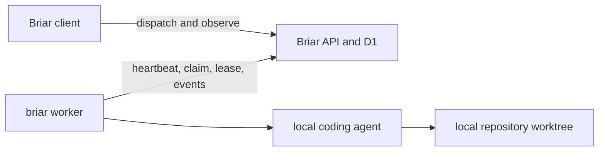

# Detached execution workers

Status: implemented. Updated 2026-07-29.

## Goal

A Briar user without a local repository or coding agent can dispatch queued
project work to an organization member's opted-in machine. The execution
machine owns the repository and agent credentials, runs independently of the
requesting desktop, and reports progress through the Briar API.

The only remote execution model is a detached pull worker:



The worker makes outbound HTTPS requests. Requesting clients never connect to
the execution machine and do not need its repository path, network address, or
credentials.

## Local and server state

Server state:

- worker identity, label, owner, organization, and project binding;
- readiness, provider, versions, heartbeat, and disabled/stale state;
- requested worker and requesting user for each dispatched run;
- claim, lease, worker attribution, run events, and bounded transcripts.

Worker-local state:

- repository path;
- coding-agent, GitHub, Velen, and Briar credentials;
- service definition and logs;
- sandbox and worktree paths.

Repository paths and third-party credentials never enter D1.

## Existing implementation

| Area | State | Location |
| --- | --- | --- |
| Org device, project binding, credential schema, and run attribution | done | `apps/briar/migrations/0013_execution_workers.sql`, `apps/briar/migrations/0034_execution_worker_credentials.sql` |
| Worker register, heartbeat, lease, transcript, and read APIs | done | `apps/briar/worker/src/workers.ts`, `apps/briar/worker/src/index.ts` |
| Stalled-run reaper and claim concurrency guards | done | `apps/briar/worker/src/workers.ts` |
| Worker loop and service installer | done | `apps/briar/src-cli/worker.ts`, Tauri organization Worker settings |
| Detached coding-agent launch | done | `apps/briar/src-cli/agent-runner.ts`, `runClaimedIssue` in `apps/briar/src-cli/index.ts` |
| Worker discovery and observation UI | done | dashboard readiness strip and dispatch dialog |
| Worker enrollment, credential rotation/revocation, and scoped runtime auth | done | API, schema, CLI |
| Targeted dispatch and reassignment | done | migration 0035, API, CLI claim filter, renderer |
| Organization Worker management and project execution policy | done | migration 0038, organization/project settings, API claim enforcement |

## Worker registration

The desktop on the execution machine provides the primary setup flow:

1. The signed-in user opens **Organization settings → Workers**.
2. They enable one or more locally connected projects for this computer.
3. Briar verifies the local repository, agent, Git, and required integrations.
4. The API issues a revocable worker credential scoped to that worker and its
   project bindings.
5. Briar installs and starts the background service.

The Worker is an organization-scoped physical device. Each enabled project
creates a project binding containing repository-specific readiness and
provider information. Adding a second project reuses the device credential
instead of rotating it, so services already running for other projects remain
connected.

Enrollment uses the signed-in user's session and returns a `briar_worker_`
credential. Only its SHA-256 hash is stored in D1. The opaque device identity
is generated randomly, kept in Briar's mode-0600 local config, and hashed by
the API. Re-enrollment rotates the credential for that device; disabling the
device revokes it and all of its project bindings.

The project-wide `briar_agent_` token remains available for local workflow
sessions, but detached workers do not use it.

Worker credentials may register readiness, heartbeat, claim eligible work,
renew a held lease, and append events or transcripts. They may not change
organization membership, project settings, or another worker.

The worker owner and organization administrators can pause or revoke a worker.

Project settings do not register computers. **Project settings → Execution
environments** stores only the project policy: allow every connected Worker or
an explicit allowlist, plus an optional default selection for the dispatch
dialog. The API enforces the allowlist during both dispatch and atomic claim.
The default is presentation state and never creates an Agent-to-Worker
ownership relationship.

## Dispatch

Run state includes:

- `requested_agent_provider` — the execution provider selected independently
  from the logical Agent, with the Agent's configured provider as the legacy
  fallback;
- `requested_worker_id` — nullable for automatic routing;
- `requested_by_user_id`;
- `dispatch_mode` — `specific` or `any`;
- `dispatched_at`;
- optional fallback policy for a worker that stays unavailable.

An idempotent user-authenticated endpoint dispatches or reassigns an existing
run:

```text
POST /projects/:projectId/runs/:runId/dispatch
{
  "agentId": "logical-project-agent-id",
  "provider": "codex | claude | grok",
  "workerId": "optional-worker-id",
  "requestId": "idempotency-key"
}
```

The claim query accepts only unassigned work or work assigned to the caller:

```sql
requested_worker_id is null or requested_worker_id = :worker_id
```

Every execution path uses the same atomic claim and lease. A notification or
short poll may wake a worker quickly, but the durable queue remains the source
of truth.

## `briar worker`

```text
briar worker register --project <id> [--label <text>]
briar worker unregister --project <id>
briar worker --project <id> [--max-issues <n>] [--once]
briar worker status
briar worker install-service [--project <id>] [--label <text>]
briar worker uninstall-service
```

Loop:

1. register and report readiness;
2. heartbeat;
3. claim one eligible queued issue;
4. allocate its Briar-managed worktree;
5. launch the configured local agent;
6. stream bounded progress and transcript batches;
7. renew the lease while the process is alive;
8. complete, block, fail, or release the run;
9. immediately reuse the released device slot;
10. clean up according to the workflow worktree policy.

Each physical worker device has a configurable `max_concurrent_sessions`
capacity shared by all of its project bindings. Every claimed run consumes one
slot. Project worker services keep filling free slots, while the API enforces
the device-wide limit inside the atomic claim statement so simultaneous claims
from different project bindings cannot oversubscribe the machine.

macOS uses a user LaunchAgent and Linux uses a user systemd service. Unit files
contain no agent token and use restrictive permissions.

## Agent launcher

The desktop launcher remains provider-specific in Rust, while detached workers
use the bundled runners in `apps/briar/src-agent/`. All four supported providers now use
the same detached runner envelope; detached Codex specifically uses the same
App Server JSON-RPC handshake, normalized Agent events, approval decisions,
and terminal result handling as the desktop Codex backend. Transcript upload
preserves client/server direction and normalized session/message events.

Heartbeat and execution-timeout improvements remain a separate follow-up so
the provider transport change can be observed independently.

Detached workers cannot wait for interactive approvals. A project whose policy
requires a prompt is ineligible until the worker owner chooses a noninteractive
policy. Worker execution policy separately limits allowed workflows, stages,
hours, and concurrency.

## Observation

Project UI:

- worker list with `available`, `busy`, `offline`, `needs attention`, and
  `disabled` states;
- provider and readiness summary without exposing local paths;
- worker selector for **Create and run** and **Run now**;
- worker badge and requesting user on each run;
- queue, claim, execution, lease-loss, requeue, and completion events;
- remote transcript fallback when no local session log exists;
- cancel and explicit reassign actions.

If no eligible worker is online, the UI queues the run rather than attempting a
local execution that cannot succeed.

## Failure and concurrency rules

- Claims are atomic and exclusive.
- A worker device cannot hold more live run leases than its configured
  `max_concurrent_sessions`; lowering the limit drains naturally without
  cancelling work already in flight.
- Workers keep a 15-minute lease and poll it every 30 seconds so cancellation
  or reassignment terminates the child process promptly.
- Lease loss or cancellation aborts the child agent immediately.
- Late writes from a superseded claim are rejected.
- Expired runs are requeued up to an attempt ceiling, then blocked.
- A specifically assigned run does not move to another worker unless its
  dispatch policy explicitly permits fallback.
- Automation does not start a second execution for an actively leased run.
- Dispatch endpoints are idempotent.

## Security

- Sharing a worker is explicit, per project, and reversible.
- Dispatch requires a project permission in addition to worker-owner opt-in.
- Agent, Git, repository, and integration credentials remain on the worker.
- Work runs in a Briar-managed worktree and follows the saved sandbox policy.
- Agent and repository text is untrusted input.
- Server transcripts are project-scoped, size-capped, retention-capped, and
  escaped when rendered.
- Raw tool payload storage should be opt-in; structured progress is the default.

## Validation

- Worker API tests for registration, scoped credentials, targeted claims,
  concurrent claims, lease renewal, cancellation, reaping, and late writes.
- CLI tests for empty-queue backoff, service restart, child abort on lease loss,
  targeted claim filtering, and every supported provider.
- Renderer tests for no-local-repository dispatch, worker selection, offline
  fallback, progress observation, cancellation, and reassignment.
- Migration tests proving existing project and worker records remain readable.
- `bun run ci:local`, followed by `bun run ci:signoff`.
