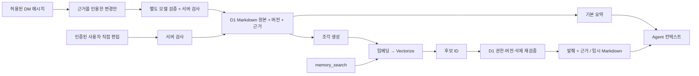

# Briar DM 기억 관리 SPEC

상태: 저장·관리 기반 PR #1497, 검색 PR #1499, DM 실행 연결 PR #1500, 자동 학습
PR #1501이 main에 반영됐다. 명시적 기억 관리·색인·회상에 이어, 사용자가 연결한
Agent를 재사용하는 자동 학습이 품질 gate를 통과해 제한된 조직 정책으로 활성화된다.
각 DM의 자동 기억은 계속 사용자 opt-in이며 기존 대화를 백필하지 않는다.
구현·평가·배포 기록은 [진행 문서](dm-memory-delivery.md)에 남긴다.

작성일: 2026-08-31.

개정일: 2026-09-01. Grok의 파일 저장 사례와 재구성 코드에서 확인한 변경안 검증
설계를 반영했다. 각 근거의 관찰 범위는 17절에서 구분한다.

각 구현 PR의 검증 head와 merge commit은 진행 문서에 기록한다. 이 문서의 현재
동작 설명은 프로덕션 배포 상태를 뜻하지 않는다.

## 1. 목적과 핵심 결정

Briar DM에서 사용자와 Agent가 나눈 대화의 선호·결정·재사용할 관찰을
기억하고, 새로운 모델 세션에서도 필요한 내용을 찾아 적용한다.

구현의 중심은 **기억 본문 원본 + 조각별 벡터 인덱스 + `memory_search`**다.
기억은 모델의 가중치를 수정하는 학습이 아니라, 근거가 있는 문서를 저장하고
후속 답변에 필요한 부분을 조회하는 기능이다.

| 항목 | 이 SPEC의 결정 |
| --- | --- |
| 원본 | D1에 저장하는 버전별 Markdown 문서 |
| 검색 인덱스 | 문서 조각의 임베딩을 저장하는 Cloudflare Vectorize |
| Agent 인터페이스 | `memory_search`, 상세 조회용 `memory_get` |
| 기본 맥락 | 원본에서 파생한 작은 사용자 요약·행동 요약·대화 진행 요약 |
| 파일 | 필요한 기억을 Worker 실행 디렉터리에 제공하는 읽기용 표현. 원본이 아님 |
| 첫 적용 범위 | 사용자 1명과 Agent 1명이 참여하는 조직 내부 DM |
| 검색 방식 | 벡터 후보 검색 뒤 제한된 의미 관련성 검증. FTS5·BM25·키워드 혼합·점수 재정렬은 v1 제외 |
| 자동 기억 | DM별 명시적 활성화. 과거 대화 전체의 자동 백필은 하지 않음 |
| 기억 분류 | `profile`·`log`·`note`. 저장 범위·근거 신뢰도와 별도로 관리 |
| 모델이 만든 변경 | 근거를 인용한 변경안 → 별도 검증 호출 → 서버의 원자적 반영 |
| 사용자 보호 | 명시적으로 저장·편집한 기억은 자동 정리가 덮어쓰지 않음 |
| 권한 | DM의 현재 사용자·Agent·조직 권한을 서버에서 검증 |
| 실행 권한 | 기억이 기존 이슈·Skill·배포 승인 절차를 변경하지 않음 |

Grok 조사로 추가한 결정은 다음과 같다. 저장 포맷을 그대로 복제하지 않고,
같은 사용자 가치를 Briar의 서버 원본·권한·작업 계약으로 구현한다.

| 추가한 결정 | 구현 규칙 | 수락 기준 |
| --- | --- | --- |
| 작고 읽기 쉬운 기억 | 자동 관찰 하나에 독립 주장 하나. 원문 조건·날짜·근거 보존 | M19 |
| profile·최근 log 중심 맥락 | 원본 발췌만 기본 요약에 포함. note는 필요할 때 검색 | M25 |
| 제안과 검증 분리 | 새 모델 세션에서 실제 근거 대조 후 서버가 한 번에 반영 | M20·M22·M27 |
| 사용자가 관리한 기억 보호 | 인증된 저장·정정만 보호 표식을 설정. 자동 변경 금지 | M21 |
| 대화 뒤 비동기 정리 | 최대 15초 작업 합치기와 재시도. 입력은 영속 저장 | M23·M27 |
| 시간에 맞는 기억 적용 | 예정일 경과와 실행 완료를 구분. 명시적 만료는 즉시 적용 | M24 |
| 읽기 쉬운 보관·내보내기 | Markdown과 출처 metadata 유지. 삭제는 파생 사본까지 전파 | M28 |

이 문서는 구현 기준과 rollout gate를 정의한다. 운영 활성화와 rollback 결과는
진행 문서에 기록하며, 저장된 DM의 과거 대화 백필을 승인하지 않는다.

## 2. 현재 Briar와의 관계

- DM은 `kind=dm`인 채널이며 채널 메시지·Agent reply job 기반을 재사용한다.
- DM의 루트 메시지 스냅샷은 최근 5일, 최대 10개로 제한된다.
- 답변 간 provider `conversationId`를 재사용하고, 활동에 따라 6시간의 세션
  보존 기간을 갱신한다. 메시지 스냅샷 제한이 재개한 모델 대화의 전체 맥락을
  제한하는 것은 아니다.
- Organization Agent는 manifest를 읽고 `contextRequests`를 반환하면,
  Worker가 활성 claim으로 필요한 자료만 조회해 같은 대화를 계속한다.
- 현재 답변 출력은 엄격한 JSON 계약이다. 모든 provider가 임의의 네이티브
  `memory_search` 도구를 이미 지원한다고 가정할 수 없다.

기억 기능은 최근 메시지 스냅샷과 세션 재개를 대체하지 않는다. 세션 만료·모델
변경·Worker 교체 이후에도 필요한 지식을 복원하는 별도 계층으로 추가한다.

근거: [DM claim 구성](../../apps/briar/worker/src/channel-reply-claim-routes.ts),
[세션 저장·보존](../../apps/briar/worker/src/channels.ts),
[답변 실행](../../apps/briar/src-cli/reply-execution.ts),
[Organization Agent context](../operations/organization-agent-context.md).

## 3. 범위와 비범위

### 포함

- DM 기억의 명시적 저장, 조회, 편집, 삭제, Markdown 내보내기.
- 작은 기본 요약과 필요할 때 실행하는 의미 검색.
- 근거 메시지·문서 버전·공유 범위가 연결된 검색 결과.
- 자동 추출·정리의 비동기 작업 계약과 단계적 활성화.
- 삭제·권한 변경·색인 지연·오래된 provider 세션에 대한 처리.
- 데스크톱, Android, iOS에서 동일한 기억 관리 기능과 상태 표현.

### 제외

- 그룹 DM, 사용자끼리의 DM, self DM, 공개 채널의 자동 기억.
- 다른 DM·Agent·조직과의 자동 기억 공유 및 프로젝트 공용 지식으로의 자동 승격.
- 브라우저 기록, 외부 계정, 저장소 전체, 첨부 본문, 원시 도구 로그의 자동 수집.
- 장기 기억 검색을 일반 채팅 원문 검색으로 대체하거나 합치는 작업.
- 모델 fine-tuning, Agent의 원본 DB 직접 접근, 자유로운 기억 파일 쓰기.
- 검색 장애 시 전체 기억을 모델에 전달하는 fallback.

## 4. 기억 공간과 권한

### 4.1 기억 공간

기억 공간 `memorySpaceId`는 다음 신원에 속한다.

`organizationId + channelId + ownerUserId + agentId + rosterEpoch`

서버가 실제 DM 참여자를 확인해 이 조합을 만든다. 모델이나 클라이언트가
임의의 `ownerUserId`, `agentId`, 검색 namespace를 권한의 근거로 제공하지 않는다.
프로젝트 Agent와의 DM도 기억 자체는 그 DM 안에 머문다.

v1에서 Agent의 조회·학습은 다음 조건을 모두 만족해야 한다.

1. 채널이 활성 상태의 DM이며 실제 참여자가 사용자 1명과 Agent 1명이다.
2. 사용자가 조직·DM에 여전히 접근할 수 있고 Agent도 해당 DM에 참여 중이다.
3. reply claim 또는 memory job claim의 조직·DM·Agent가 기억 공간과 일치한다.
4. 프로젝트 Agent인 경우 기존 프로젝트 실행 권한도 유효하다.
5. 기억 기능이 활성 상태이고 claim의 권한 세대가 현재 값과 일치한다.

이 조건은 자동 조회·학습의 조건이다. 사용자가 요청한 명시적 저장·정정 job은
6.1절의 관리 권한과 요청 단위 인가를 적용한다. 첫 기억을 저장하기 위해 기능을
미리 켜거나 자동 추출까지 켜야 하는 순환 조건을 만들지 않는다.

사용자의 관리 권한은 Agent 조회 권한과 구분한다. 기억 공간의 원래 소유자가
현재 조직 구성원임을 확인하면 기능 OFF나 공간 닫힘 상태에서도 자신의 기록을
조회·삭제·내보낼 수 있다. 닫힌 공간에는 새 기억을 쓰지 않는다. 관리 목록은
사용자 소유 공간만 반환하고, 다른 참여자는 이 경로로 개인 기억을 읽을 수 없다.

조직 관리자라는 이유만으로 개인 DM 기억을 읽게 하지 않는다. 관리자용 운영
화면에는 작업 상태·오류·사용량만 노출한다. 운영자 접근 정책은 별도 감사 대상이다.

### 4.2 참여자 변경

그룹으로 전환하거나 사용자·Agent가 교체되면 기존 기억 공간을 닫고 접근을
중단한다. 기존 공간을 새 참여자에게 재사용하지 않는다. 나중에 다시 1:1이
되더라도 이전 공간을 자동 복원하지 않고, 명시적인 별도 복원 절차로 다룬다.

이 규칙은 기억과 그 기억이 들어간 모델 세션에 적용된다. 기존 DM 원문을
새 참여자에게 보여주는 정책 자체를 이 기능에서 변경하거나 보장하지 않는다.

### 4.3 Agent별 소유와 향후 공유

Grok의 Agent별 기억 분리와 작성자 추적을 가져오되 v1의 범위는 `dm`으로 고정한다.
`profile`이라는 분류가 사용자 전체의 공유 프로필이라는 뜻은 아니다. 같은 사용자와
대화하는 다른 Agent도 별도 기억 공간을 사용한다. 출처의 작성 Agent와 현재 읽는
Agent가 다르다는 이유로 읽기 권한이 생기지 않는다.

공유 사용자·프로젝트 기억은 후속 SPEC에서 다룬다. 추가할 때는 사용자가 공유할
항목·대상·근거 포함 범위를 선택하고, 수신 공간의 권한을 별도로 확인해야 한다.
DM의 본문·근거 메시지를 공용 기억에 자동 복사하거나 각 Agent가 공유 문서를
직접 덮어쓰게 하지 않는다. 읽기 우선순위는 권한 검사나 사용자 정정을 대신하지 않는다.

## 5. 원본과 파생 데이터



### 5.1 문서 형태

원본은 사람이 읽고 편집할 수 있는 Markdown이다. v1은 관찰 한 건을 문서 하나로
저장하고 날짜·사건별로 묶어 표시한다. 개별 관찰을 대체·삭제할 수 있도록 하루의
관찰 전체를 한 수정 단위로 합치지 않는다. 주제 문서는 `Current`와 `History`로 관리한다.

자동 추출한 관찰은 독립적으로 정정·삭제할 수 있는 주장 하나를 담는다. 목표는
1~2문장, 최대 500 Unicode 문자다. 계정·직장·도구 선호처럼 서로 따로 바뀔 수 있는
내용은 나눈다. 조건·부정·날짜를 보존하며 길이 초과 문장을 잘라 저장하지 않는다.
분리가 불가능하면 변경안을 거절하고 다시 생성한다. 주제 문서는 여러 관찰을
묶을 수 있지만 각 항목의 원본 관찰과 메시지 근거 연결을 유지한다.

사용자가 UI에서 직접 작성한 문서와 주제 문서에는 8.3절의 문서 한도를 적용한다.
500자 규칙을 이유로 사용자 원문을 자동 요약하거나 일부만 저장하지 않는다.
문서 ID는 본문 해시와 분리해 편집 후에도 유지한다. 해시는 중복 감지·버전 검증에 쓴다.

```markdown
# 기술 설명 방식

## Current

- 기술 설명은 결론부터 짧게 제시한다.
- 상세 구현 설명은 사용자가 요청하면 확장한다.

## History

- 사용자가 해당 DM에서 선호를 명시했다. 근거: message ID.
```

- 문서 제목·본문은 모델 지시가 아닌 사용자 데이터로 취급한다.
- `History`는 변경 경위를 보존한다. 일반 기억 검색은 현재 유효한 본문만
  색인한다. 폐기된 규칙을 History에서 다시 검색하지 않는다.
- 유효한 관찰은 독립 검색 대상이 될 수 있다. 정리로 대체된 관찰에는
  `supersededBy`를 연결하고 현재 검색에서 제외한다.
- 기본 요약은 파생 데이터다. 자기 자신을 재추출·재색인해 근거를 증식시키지 않는다.
- 원본 메시지의 날짜·화자·적용 범위를 보존한다. 사용자의 발언, Agent의 추측,
  검증된 결과를 같은 신뢰 수준으로 취급하지 않는다.
- 사용자가 직접 편집한 내용은 표시하고 자동 정리가 추측만으로 덮어쓰지 않는다.
  같은 사용자의 새로운 명시적 정정이 없으면 충돌 후보로 남긴다.
- '이번 작업에서는 짧게' 같은 일회성 요청을 영구 선호로 승격하지 않는다.

### 5.2 논리 데이터 모델

아래 이름은 제안하는 테이블 이름이며, 마이그레이션 번호는 구현 시 정한다.

| 테이블 | 필수 정보와 제약 |
| --- | --- |
| `briar_dm_memory_spaces` | 조직·DM·사용자·Agent·rosterEpoch, 설정, `memoryRevision`, `revocationEpoch`, 활성/닫힘 상태. 신원 조합별 유일 |
| `briar_dm_memory_documents` | 공간 ID, 안정적인 문서 ID, observation/topic 종류, 제목, `currentVersion`, active/invalidated/superseded/deleted 상태, 모순 표시, 생성·갱신 시각 |
| `briar_dm_memory_revisions` | 문서 ID+버전 PK, Markdown 본문·해시, memoryClass, evidenceType, protectedByUser, sourceLanguage, observedAt·validUntil, 생성 경로·작성 Agent·정책 버전. 편집은 새 버전 |
| `briar_dm_memory_sources` | 문서 버전과 message/user_edit_event 출처 ID·버전·본문 해시의 연결. 주제 문서는 항목별 연결을 유지하고 실제 원본까지 추적 |
| `briar_dm_memory_proposals` | job·시도·입력 범위, expectedMemoryRevision·revocationEpoch, inputHash·proposalHash, 변경안·근거 연결, 제안 모델·정책 버전, 반영 상태 |
| `briar_dm_memory_verifications` | proposalHash·inputHash에 묶인 검증 결과, 검증 모델·정책 버전, 상태·사유 코드·사용량. 자유 형식 추론 과정은 저장하지 않음 |
| `briar_dm_memory_chunks` | 조각 ID, 문서 버전, 헤딩 경로, 본문 범위·줄 번호, 조각 해시, 임베딩 프로필, 벡터 ID, 색인 상태 |
| `briar_dm_memory_briefs` | 분류별 원본 발췌, 사용한 문서 ID·버전, memoryRevision·revocationEpoch·briefPolicyVersion·validThrough |
| `briar_dm_memory_jobs` | 작업 종류·범위·중복 방지 키, 실행 주체, lease/attempt, 입력 버전, 상태·오류, 결과 버전 또는 mutation ID |
| `briar_dm_memory_exclusions` | 기억에서 제외한 원본 ID·파생 관계, 삭제 세대. 삭제한 본문 자체를 보관하지 않음 |

불변 조건:

- 모든 문서·조각·작업은 기억 공간에 속한다. 같은 본문이어도 다른 공간 사이에
  검색 결과·권한·조회 캐시를 공유하지 않는다.
- 편집에는 `expectedVersion`을 요구한다. 경합은 `409 version_conflict`로
  반환하고, 새 원본을 읽어 변경안을 다시 계산한다. 마지막 쓰기로 덮지 않는다.
- 버전·lease 검사를 batch 밖의 사전 조회로만 처리하지 않는다. batch 안의 모든
  종속 쓰기를 같은 조건으로 묶는다. 조건부 UPDATE가 0행을 바꿨는데 revision이나
  outbox만 저장되는 부분 성공을 허용하지 않는다.
- 문서 버전과 이에 따른 색인 작업의 생성은 하나의 D1 원자적 batch로 저장한다.
- Vectorize가 사라져도 D1 원본으로 조각과 인덱스를 재생성할 수 있어야 한다.
- 삭제 정책은 현재 본문뿐 아니라 이전 revision·요약·조각에도 적용된다.

D1 batch는 문장 묶음을 트랜잭션으로 처리한다. 이 기능에서도 원본 저장과
작업 기록을 같은 batch에 넣고 실패 시 함께 취소한다.
[D1 batch 문서](https://developers.cloudflare.com/d1/worker-api/d1-database/)

### 5.3 기억의 용도와 근거

`memoryClass`는 프롬프트에서의 쓰임을 구분한다. 문서의 observation/topic 종류,
공유 범위, 근거의 신뢰도와는 독립적이다.

| 분류 | 저장할 내용 | 기본 맥락에서의 처리 |
| --- | --- | --- |
| `profile` | 지속적인 선호·업무 방식·사용자가 밝힌 신원 맥락 | 유효하고 충돌 없는 항목을 작은 상시 요약에 우선 포함 |
| `log` | 결정·진행 중인 작업·확인된 결과·기간이 있는 계획 | 최근 진행 맥락으로 제한해서 포함하고 날짜·조건을 함께 표시 |
| `note` | 장기 프로필로 승격할 필요가 없는 주변 정보 | 기본 요약에는 넣지 않고 관련 질의에서 검색 가능하게 유지 |

`note`도 개인정보·근거 검사와 사용자 삭제 권한을 똑같이 적용한다. 낮은 우선순위가
검증 생략을 뜻하지 않는다. 날짜가 지났다는 이유로 원본을 자동 삭제하지 않으며,
검색은 분류보다 관련성을 우선한다. 로그에서 반복된다는 사실만으로 profile로 승격하지 않는다.

Grok의 재구성 코드에서 저장 kind는 profile/log 두 가지이며 note는 log 본문의
`[note]` 접두사로 표현한다. Briar에서는 본문 접두사를 파싱해 분류를 결정하지 않고
별도 `memoryClass=note`로 저장한다. 사용자가 본문에 `[note]`를 썼다고 분류가 바뀌지 않는다.

- `evidenceType`은 `explicit_user`, `observed`, `inferred`로 구분한다. 사용자 자신의
  직접 발언, 허용된 근거에서 확인된 사건, 검증되지 않은 추론을 같은 사실로 다루지 않는다.
  `inferred` 내용은 미반영 변경안에만 남기고 일반 검색·기본 요약에 넣지 않는다.
  사용자가 확인하면 그 새 발언·편집 이벤트를 근거로 다시 제안한다.
- `protectedByUser`는 인증된 직접 편집이나 6.1절의 명시적 기억 요청에서만 서버가
  설정한다. 모델의 `explicit_user` 표기나 도구 호출만으로 보호 여부를 결정하지 않는다.
  자동 추출한 직접 발언과 사용자가 명시적으로 관리한 기억을 구분한다.
- `observedAt`은 원본 발언·관찰 시각이다. `createdAt`·`updatedAt`은 서버 저장 시각이며,
  재정리한 날로 관찰 날짜를 덮어쓰지 않는다. 시간대와 기간 조건도 근거에서 보존한다.
- `validUntil`은 근거가 명시한 적용 종료 시각이며 없으면 null이다. 모델이 임의의
  유효기간을 만들지 않는다. 계획의 예정일과 기억의 유효기간도 동일시하지 않는다.
- `sourceLanguage`는 원본 근거의 언어다. 본문은 원문의 언어를 기본으로 유지하고
  기술명은 보존한다. 번역·의역본도 같은 근거 연결과 검증을 거치며 별개의 사실로 세지 않는다.
  값은 언어 태그를 사용하고, 여러 언어면 `mul`, 판별할 수 없으면 `und`로 표시한다.

### 5.4 작은 기본 맥락

Grok의 profile·최근 log 구성을 참고해 v1의 기본 요약은 유효한 원본에서 문장을
선택·발췌해 만든다. 별도 LLM이 새 사실이나 선호를 만들어 넣지 않는다. 주제 문서
자체를 모델이 정리하는 경우에는 먼저 6.5절을 통과한 버전만 사용한다.

기본 요약 8 KiB 안에서 사용자·행동 선호에 최대 4 KiB, 최근 진행 맥락에 최대
3 KiB, 근거·범위·생략 안내에 최대 1 KiB를 배정한다. 섹션이 비어 있으면 억지로
채우지 않는다. 긴 문장은 부정·조건을 잘라 넣지 않고 항목 전체를 생략한다.

같은 분류에서는 보호된 사용자 기억, 관련 원본 관찰 시각, 문서 ID 순으로
안정적으로 선택한다. 보호된 항목을 먼저, 관찰 시각은 최신순, 동점은 ID 오름차순이다.
재작성 시각만 최신인 항목을 앞세우지 않는다. 충돌·만료·
무효화된 항목과 note는 제외하고, 모든 발췌에 문서 ID·버전을 붙인다.
생략된 기억이 있을 수 있음을 알리고 상세 내용은 검색으로 찾게 한다.

캐시 키는 공간·memoryRevision·revocationEpoch·briefPolicyVersion을 포함한다.
`validThrough`는 포함된 문서의 가장 이른 validUntil이며 없으면 null이다. 유효기간
경계를 지난 캐시도 폐기한다. 새 claim은 최신 원본에 맞는 요약을 사용하고,
같은 claim 안에서도 revision·epoch·유효기간이 변하지 않은 동안만 재사용한다.
대화 압축 때까지 기억을 고정하지
않으며, 정정·삭제·만료 시 10절에 따라 provider 세션도 무효화한다.

## 6. 저장·추출·정리

### 6.1 명시적 저장

사용자가 기억 패널에서 저장하거나 자신의 메시지로 기억을 요청하면 변경안을
만든다. 메시지가 있으면 해당 메시지를 근거로, 패널에서 직접 작성했다면 인증된
사용자 편집 이벤트를 근거로 남긴다. UI에서 선택한 출처·내용은 서버가 검증한다.
자연어 요청은 의미를 판단하며, 인용문·첨부·다른 Agent가 내린 지시로 저장하지 않는다.

기억 사용과 자동 추출은 서로 다른 설정이며 신규 DM에서는 모두 OFF다.
사용자가 명시적으로 첫 기억을 저장하면 해당 DM의 기억 사용만 활성화한다.
자동 추출은 별도 설정을 켜기 전까지 시작하지 않는다.

Agent의 출력만으로 DB를 수정하지 않는다. 서버는 범위, 근거, 문서 버전,
허용된 본문 크기를 확인한 뒤 저장한다. 기억 저장은 프로젝트 변경 승인과
별개의 기능이며, 기억 내용으로 프로젝트 변경을 실행하지 않는다.

UI에서 사용자가 확정한 본문을 그대로 저장·편집하거나 삭제하는 요청은 결정적인
서버 검사만 수행한다. 모델 검증 비용이나 모델 장애 때문에 이 경로를 막지 않는다.
자연어 요청을 모델이 요약·분류해 만든 변경안은 6.5절을 거친다. 사용자가 이미
명시한 저장 요청을 별도 사람 승인 단계로 다시 묻는 절차는 추가하지 않는다.

명시적 저장·정정 job은 인증된 사용자 메시지나 편집 이벤트에 묶어 서버가 생성한다.
자동 추출 설정과 무관하게 요청된 근거·대상 문서만 처리하며, 이를 계기로 다른
대화 구간을 추출하지 않는다. 기능 OFF 상태에서도 소유권·활성 DM·현재 Agent와
프로젝트 권한·입력 버전·lease를 검사한다. 성공한 첫 저장에서만 기억 사용을 켠다.
서버가 사용자 요청을 확인하지 않은 Agent 출력만으로 이 예외를 발급하지 않는다.
요청 뒤 기능 OFF 전환·권한 변경으로 epoch가 바뀌면 이 예외도 취소한다.
새 명시적 요청 없이 오래된 job을 다시 claim해 기억 사용을 켤 수 없다.

원본 저장 이전에는 `저장 중`, 저장 이후에는 `저장됨`, 색인 반영까지 끝나면
`검색 가능`으로 표시한다. 모델이 말한 "기억했어요"를 저장 성공의 증거로 삼지 않는다.

### 6.2 자동 추출

- 자동 기억은 기본 OFF이며 사용자가 해당 DM에서 켠 시점 이후부터 적용한다.
- 완료된 reply와 기억 추출 outbox 이벤트를 같은 서버 저장 단위로 기록한다.
  본문 추출과 모델 호출을 DM 응답의 필수 대기 경로에 넣지 않는다.
- 작업은 마지막으로 처리한 위치 이후의 확정된 메시지 구간을 읽는다. 범위의
  끝과 각 메시지 버전을 고정해 재시도 중 입력이 바뀌지 않게 한다.
- 일반 대화 스냅샷의 5일·10개 제한을 추출 워터마크로 대신하지 않는다.
  처리할 구간이 크면 제한된 묶음으로 나누고 나머지는 다음 작업으로 남긴다.
- 사용자 선호, 명시적 결정, 반복해서 쓸 작업 지식만 추출한다. 일시적인 기분,
  추측성 인물 평가, 비밀 정보, 출처 없는 Agent 주장은 자동 저장하지 않는다.
- 새 기억이 없으면 `no_change`로 완료한다. 모델 실패를 `no_change`나
  `succeeded`로 변환하지 않는다.
- 연속된 reply의 작업은 같은 공간에서 실행 전 최대 15초 동안 모을 수 있다.
  첫 이벤트의 처리 가능 시각을 계속 미루지 않고, outbox를 먼저 영속 저장한다.
  입력 범위는 claim 시 고정하며 이후 메시지는 다음 job으로 남긴다.
- 미처리 근거는 메모리 내 큐의 크기 초과·재시작·실패로 버리지 않는다. 입력 예산을
  넘으면 영속 구간을 나누고 다음 작업으로 넘긴다. 재시도 때는 같은 근거 버전을 읽는다.

자동 추출·정리 모델은 별도 설정이며, 본 대화의 모델을 바꾸거나 사용자 몰래
유료 provider로 fallback하지 않는다. 설정과 예산이 없으면 자동 학습만 멈추고
명시적으로 저장한 기억의 조회·검색은 계속 제공한다.

초기 운영 설정은 실행 Worker에서 사용자가 이미 연결한 Codex·Claude·Grok·Agy·
OpenCode·OpenRouter·Cursor 중 조직 정책이 고른 provider를 사용한다. 각 제안·검증은
인증에 필요한 최소 파일만 복제한 mode 0700 임시 홈과 빈 임시 작업공간에서 독립된
새 세션으로 실행한다. 입력은 고정된 기억 snapshot JSON뿐이며 attachments, skills,
MCP, 외부 도구, 네트워크 권한, retained conversation을 제공하지 않는다. 구조화 출력만
받고 서버가 동일한 범위·근거·버전 검증을 다시 수행한다. 연결 상태가 없거나 provider가
정책과 다르면 그 Worker는 job을 claim하지 않는다. 기존 직접 OpenRouter transport는
구버전 정책 호환용으로만 유지하며 자동 fallback으로 사용하지 않는다.

### 6.3 정리 작업

`consolidate`는 새 관찰을 주제 문서에 반영하고 기본 요약을 재계산한다.
실제 원본 근거를 읽고 중복·모순·대체 관계를 판단한다. 미해결 모순은 사용자가
정정할 수 있도록 표시하고, 한쪽을 확정된 선호로 요약하지 않는다.

동일한 정규화 본문은 중복 추가하지 않는다. 표현이 달라도 같은 주장을 반복하면
근거를 연결한 병합·대체 변경안을 만들고 6.5절을 거친다. 단순 유사도만으로 병합하거나
날짜·조건이 다른 결정을 하나로 합치지 않는다. profile/log/note 변경도 이 검증 대상이다.

초기 실행 조건은 마지막 성공한 정리 이후 새 관찰 10개 이상 또는 새 관찰이
있는 상태로 24시간 경과다. 두 조건은 OR이며, 활동 없는 DM에 빈 작업을 돌리지
않는다. 이 값들은 제품 기본값이지 Cloudflare 제한이나 Aside의 확인된 조건이 아니다.

정리 성공 시에만 처리한 관찰 위치를 전진시킨다. 작업 시작 시각과 마지막
성공 시각을 분리한다. 실패한 작업이 다음 정리를 억제해서는 안 된다.

### 6.4 작업 실행 주체

- 추출·정리는 `dmMemory` capability를 광고하는 Briar execution Worker가
  별도 memory job을 claim해 실행한다. 저장소 worktree는 필요하지 않으며
  모델에는 허용한 텍스트와 구조화 출력 계약만 제공한다.
- 이 claim은 종료된 channel reply claim과 별개다. 만료된 reply token을
  백그라운드 쓰기 권한으로 재사용하지 않는다.
- 원본 반영은 Briar 서버가 한다. execution Worker가 보낸 문서 변경안은
  현재 권한·입력 버전·작업 lease와 6.5절의 검증 결과를 모두 통과해야 한다.
- 임베딩·Vectorize 갱신은 Cloudflare 측 작업 처리기가 담당한다. D1 outbox를
  기존 scheduled 진입점에서 제한된 수만 claim하고, 네트워크 작업은 batch 밖에서 한다.
- 두 실행 경로 모두 durable lease와 재시도 기록을 쓴다. 답변 처리보다 학습의
  우선순위를 낮추고 공간별 추출·정리는 한 번에 하나만 실행한다.

### 6.5 근거를 인용하는 변경안과 별도 검증

모델이 만드는 모든 비어 있지 않은 기억 변경안에 적용한다. 명시적 요청의 의미
변환, 자동 추출, 주제 정리·분류 변경·병합이 대상이다. 검증 호출은 사람에게 승인을
다시 받는 단계가 아니며, 검색 결과를 재정렬하는 reranker도 아니다.

1. 서버가 job의 입력 범위, 각 근거의 ID·버전·본문 해시, 현재 문서 버전·보호 표식,
   제외 목록, memoryRevision·revocationEpoch와 정책 버전을 고정한다. 이 전체에서
   `inputHash`를 계산한다. 시각을 근거로 쓰면 서버 기준 시각·시간대도 포함한다.
2. 제안 모델에 허용된 근거와 현재 기억만 전달한다. 각 변경은 `changeId`, action,
   대상 문서·expectedVersion, 변경 본문·분류·시간 조건, `sourceRefs`를 반환한다.
   호출당 변경은 최대 32개다. 서버가 검증용 변경안을 정규화하고 `proposalHash`를 만든다.
3. 서버가 구조·공간·인용 가능 ID·길이·보호 규칙을 먼저 검사한다. 존재하는 근거 ID를
   인용했어도 그 근거가 주장을 뒷받침한다는 뜻은 아니므로 여기서 바로 반영하지 않는다.
4. 별도 모델 호출이 현재 원본, 실제 인용 근거, 변경안을 함께 검토한다. 제안 호출의
   대화·추론 과정은 이어받지 않는다. 같은 provider/model을 써도 새 세션과 검증 전용
   프롬프트를 사용한다. 외부 도구·임의 검색·기억 쓰기 권한은 주지 않는다.
5. 서버가 검증 결과를 해당 inputHash·proposalHash에 연결한다. 모든 변경이 통과한
   경우에만 원본·근거·색인 job·제안 반영 상태·워터마크를 한 저장 단위로 반영한다.
   반영 직전에 모든 입력 버전·보호 표식·제외 목록·공간 revision·epoch·lease를 다시 검사한다.

제안 모델이 참조할 수 있는 근거는 서버가 입력에 포함한 message/user_edit_event와
현재 기억의 고정 버전뿐이다. 파생 기억을 인용하면 서버가 실제 원본 근거까지 연결을
확장한다. 모델이 새 source ID를 만들거나 다른 DM의 ID를 넣으면 거절한다.

`create`는 새 문서를 만들고, `revise`는 expectedVersion이 일치하는 기존 문서의 새
버전을 만든다. `supersede`는 같은 공간의 유효한 대체 문서 ID·버전을 지정해 기존
문서를 검색에서 제외한다. 해당 대상은 입력 스냅샷에 있어야 한다. 새 문서 생성과
대체가 함께 필요하면 하나의 제안 안에서 changeId로 연결하고 서버가 ID를 할당한다.
자동 정리는 물리적 삭제를 제안할 수 없다. 사용자 삭제는 10절의 별도 경로다.

관찰 생성의 변경 항목 예시는 다음과 같다. ID와 날짜는 설명용 합성 값이다.

```json
{
  "changeId": "change-1",
  "action": "create",
  "documentKind": "observation",
  "memoryClass": "profile",
  "content": "사용자는 기술 설명에서 결론을 먼저 제시하는 방식을 선호한다.",
  "evidenceType": "explicit_user",
  "sourceLanguage": "ko",
  "observedAt": "2026-09-01T09:00:00Z",
  "validUntil": null,
  "sourceRefs": [
    { "type": "message", "id": "message-id", "version": 1 }
  ]
}
```

제안의 evidenceType·sourceLanguage·observedAt도 검증 대상이다. protectedByUser와
저장 시각은 모델 출력에서 받지 않는다. 모델이 개인의 신원·민감한 속성·숨은 의도를
추측하거나, Agent가 제안만 한 작업을 실행 결과로 바꾸면 거절한다.

검증 모델은 전체 승인 여부와 변경별 `supported` 또는 사유 코드만 반환한다.
사유는 `unsupported`, `contradicted`, `wrong_scope`, `protected`, `uncertain`,
`invalid_temporal_change`로 제한한다. 모든 changeId가 정확히 한 번 포함돼야 하며
하나라도 통과하지 못하면 제안 전체를 거절한다. 아래 hash 값은 서버가 검증 job에
묶는 값이며, 모델이 반환한 문자열만으로 결합을 신뢰하지 않는다.
`uncertain`은 근거가 부족한 주장을 사실로 저장하려는 경우다. 사용자가 직접 밝힌
불확실성 자체를 조건 그대로 기억하는 것까지 확정된 사실로 바꾸거나 거절하지 않는다.
다음은 모델의 원시 응답이 아니라 서버가 hash를 붙여 기록한 검증 결과 예시다.

```json
{
  "inputHash": "input-hash",
  "proposalHash": "proposal-hash",
  "approved": true,
  "decisions": [
    { "changeId": "change-1", "verdict": "supported" }
  ]
}
```

보호된 기억은 자동 정리가 수정·대체하거나 분류를 바꿀 수 없다. 새 근거와
충돌하면 별도 충돌 후보로 남기고 사용자 기억을 기본 요약에서 몰래 바꾸지 않는다.
사용자의 새로운 명시적 정정은 그 사용자 요청 경로에서 expectedVersion을 검사해 처리한다.

경합으로 inputHash가 바뀌면 이전 검증 승인을 재사용하지 않는다. `stale`로 남기고
최신 입력에서 변경안과 검증을 다시 수행한다. 한 변경이 실패했는데 나머지만 저장되는
부분 반영은 금지한다. 같은 hash의 재전송은 같은 반영 결과를 반환한다.

빈 changes는 구조·입력 유효성 검사 후 `no_change`로 처리하며 두 번째 모델을 호출하지
않는다. 비어 있지 않은 변경안의 검증 실패·거절·모델 장애는 no_change가 아니다.
자동 학습 예산은 제안과 검증을 합산하고, 일반적인 한 시도는 최대 두 모델 호출이다.
job당 두 단계를 합쳐 최대 6회 호출하며 예산 소진 후에는 근거를 남긴 채 실패 상태로
멈춘다. 모델·정책·입력이 같고 검증 호출만 일시 실패한 경우 제안 재사용은 가능하지만,
검증 자체를 생략하거나 사유가 다른 승인을 붙이지 않는다.

### 6.6 시간에 따른 상태 변화

Grok의 날짜를 고려한 정리 규칙을 가져온다. '금요일에 배포할 계획'은 금요일이
지났다는 이유로 '배포했다'로 바꾸지 않는다. 완료·실패·승인은 실제 근거가 있어야 한다.
계획을 과거의 계획으로 표현할 때도 예정일·원래 조건·실행 여부 미확인을 보존한다.

날짜만으로 가능한 변경은 기존 문서 ID·버전과 서버가 발급한 `clock` 근거를 함께
인용해야 한다. clock은 새 개인 사실 생성, 작업 완료 주장, 사용자 보호 해제의 근거가
될 수 없다. 날짜 변경 제안도 별도 검증을 통과해야 한다.

validUntil이 지난 문서는 모델 정리를 기다리지 않고 서버가 검색·기본 요약에서
제외하며 10절의 만료·epoch 규칙을 적용한다. 활동이 없는 DM에 날짜 확인만을 위한
LLM 호출을 반복하지 않는다. 날짜에 따른 문장 정리는 다음 근거가 있는 consolidate에서
처리할 수 있고, 명시적 만료의 효력은 그때까지 미루지 않는다.

## 7. 조각과 벡터 인덱스

### 7.1 조각 만들기

1. 원본의 개행을 LF로 정규화하고 이 본문의 해시·버전을 저장한다.
2. Markdown 헤딩과 문단 경계를 따라 현재 유효한 내용을 나눈다.
3. 문서 제목과 헤딩 경로를 임베딩 입력 앞에 붙여 조각의 주제를 보존한다.
4. 기본 목표는 조각당 약 400토큰, 최대 800토큰이다. 토큰화 프로필을 버전으로
   고정하고 표·코드·긴 문단의 초과 분할 규칙도 재현 가능하게 구현한다.
5. 큰 섹션을 나눌 때만 최대 64토큰을 겹친다. 다른 사실이나 문서를 합치지 않는다.
6. 정규화 원본의 UTF-8 byte 범위와 줄 번호를 저장한다. Unicode 문자를
   중간에서 자르지 않고, 겹친 범위를 검색 결과에서 중복 표시하지 않는다.

토큰 상한 안에 드는 관찰은 한 조각으로 유지한다. 400토큰을 채우려고 다른 기억을 붙이지 않는다.
한 관찰의 정정·삭제가 무관한 기억의 조각과 근거를 함께 바꾸지 않게 한다.

초기 분할 예산은 `js-tiktoken@1.0.21`의 `cl100k_base`로 계산한다.
분할기 버전은 `markdown-cl100k-js-1.0.21-v1`이다. 임베딩 모델의 자체 토큰 수나
청구량과 같다는 뜻은 아니다. 제목·헤딩을 포함한 임베딩 입력에도 상한을 적용한다.
긴 헤딩 때문에 본문을 색인하지 못하는 일을 막도록 임베딩용 접두사는 128토큰
이내로 줄일 수 있다. 검색 응답의 헤딩 표시도 항목당 200 Unicode 문자로 제한하고
생략 표시와 truncated를 붙인다. 원본의 제목·헤딩·본문과 byte 범위는 바꾸지 않는다.

`chunkId`는 공간·문서·버전·분할기 버전·범위로 계산하는 안정적인 ID다.
`vectorId`는 chunkId와 embeddingProfileVersion의 해시다. 다른 원본 버전이나
임베딩 모델의 결과가 같은 ID에 덮어써지지 않게 한다.

### 7.2 임베딩과 범위 필터

초기 임베딩 후보는 다국어 모델 `@cf/baai/bge-m3`다. 채택은 한국어·영어 혼합
질의 평가를 통과한 뒤 확정한다. 문서와 질의에는 같은 모델·전처리·차원·거리
함수를 사용하고 초기 거리 함수는 cosine으로 고정한다. 모델 변경은 새
index/profile version으로 재색인하며 섞지 않는다.
[모델 문서](https://developers.cloudflare.com/workers-ai/models/bge-m3/)

한국어 질의→영문 기억, 영문 질의→한국어 기억을 각각 평가한다. 검색을 위해
본문을 일괄 영어로 번역하지 않으며, 코드명·영문 기술명·짧은 한국어 키워드와
자연스러운 의역도 평가에 포함한다. 임베딩 점수는 근거 검증을 대신하지 않는다.

- 환경별 인덱스를 분리하고 namespace는 조직 ID로 설정한다.
- `memorySpaceId`를 metadata index로 먼저 만들고 모든 검색에 서버가 계산한
  정확한 공간 필터를 적용한다. UUID 등 고정 길이의 불투명 식별자를 사용한다.
- metadata에는 공간·문서·버전·조각 ID만 넣는다. 본문·이름·연락처·메시지
  발췌를 넣지 않는다. 검색 후 본문은 D1에서만 읽는다.
- namespace와 metadata 필터는 검색 범위를 줄이는 장치다. 최종 인가를
  대신하지 않으며 D1에서 현재 접근 권한을 다시 검증한다.

Vectorize는 namespace 및 metadata 필터를 후보 검색 전에 적용한다. metadata
index 생성 전에 삽입한 벡터는 해당 필터용 재색인이 필요하므로, 필터를 먼저
생성하고 검증한 뒤 데이터를 넣는다.
[필터 문서](https://developers.cloudflare.com/vectorize/reference/metadata-filtering/)

### 7.3 갱신과 색인 지연

문서 저장 → 조각 생성 → 임베딩 → upsert 요청 → 반영 확인 순서로 진행한다.
상태는 `pending → embedding → submitted → ready`이며 각 단계에서 실패할 수 있다.

Vectorize upsert가 반환한 mutation ID는 접수 증거이지 검색 가능 증거가 아니다.
인덱스 정보의 처리 상태와 제한된 ID 조회로 적용을 확인한 뒤 `ready`로 기록하고,
질의 검색이 성공하는지도 통합 검증한다. mutation ID는 불투명 식별자이므로
문자열 대소 비교로 처리 순서를 추측하지 않는다.
[비동기 갱신 문서](https://developers.cloudflare.com/vectorize/reference/client-api/)
[인덱스 처리 상태](https://developers.cloudflare.com/api/resources/vectorize/subresources/indexes/methods/info/)

- 새 버전이 저장되면 검색은 이전 버전을 즉시 무효화한다. 새 벡터가 아직
  준비되지 않았더라도 이전 내용을 최신처럼 반환하지 않는다.
- 이전 벡터가 후보를 차지할 수 있으므로 오래된 벡터 삭제 작업을 함께 남긴다.
- 각 작업은 결과 반영 전에 원본의 현재 버전·상태를 다시 확인한다. 뒤늦은
  재시도가 삭제되거나 대체된 기억을 복구하지 못하게 한다.
- 최근 명시적 저장·정정은 최신 D1 원본에서 기본 요약 또는 제한된 갱신 알림으로
  제공할 수 있다. 이를 벡터 검색의 성공으로 표시하지 않는다.
- 인덱스 장애 시 키워드 검색으로 몰래 전환하지 않는다. v1은 검색 상태를
  명시하고 기본 요약·최근 DM 맥락으로 답하거나 필요한 정보를 사용자에게 묻는다.

## 8. `memory_search`와 `memory_get`

### 8.1 논리 도구 계약

Agent에 설명하는 인터페이스는 Aside와 유사한 다중 질의 형태다.

```json
{
  "queries": [
    "사용자가 선호하는 기술 설명 방식",
    "설명 분량과 결론 제시 순서"
  ],
  "max_results": 5
}
```

| 입력 | 계약 |
| --- | --- |
| `queries` | 1~3개, 각 질의는 trim 후 1~512 Unicode 문자. 빈 값은 입력 오류, 중복은 제거 |
| `max_results` | 기본 5, 최소 1, 최대 10. 모든 질의를 합친 최종 결과 개수 |
| 공간·조직·사용자 필드 | 받지 않음. 서버가 활성 claim으로 결정 |

예시 응답의 ID는 설명용 값이다.

```json
{
  "status": "ok",
  "memoryRevision": 18,
  "revocationEpoch": 2,
  "indexState": "ready",
  "truncated": false,
  "results": [
    {
      "documentId": "document-id",
      "version": 3,
      "chunkId": "chunk-id",
      "title": "기술 설명 방식",
      "headings": ["Current"],
      "excerpt": "기술 설명은 결론부터 짧게 제시한다.",
      "lineStart": 4,
      "lineEnd": 4,
      "score": 0.82,
      "memoryClass": "profile",
      "evidenceType": "explicit_user",
      "protectedByUser": true,
      "sourceLanguage": "ko",
      "observedAt": "2026-08-31T09:00:00Z",
      "validUntil": null,
      "conflicted": false,
      "sourceMessageIds": ["message-id"],
      "sourceEventIds": [],
      "updatedAt": "2026-08-31T09:00:00Z"
    }
  ]
}
```

`score`는 임베딩 유사도이며 사실의 확률이 아니다. 기본 검색에는 active이고
만료되지 않은 현재 버전만 포함한다. 현재 모순이 미해결이면 결과에 그 상태를
표시하고 확정된 행동 지침으로 적용하지 않는다.

memoryClass·evidenceType·protectedByUser·sourceLanguage·observedAt·validUntil은
검색과 상세 조회가 함께 반환하는 원본 메타데이터다. observedAt을 알 수 없으면
null로 표시하고 저장 시각으로 대체하지 않는다. note는 관련성이 있으면 반환하지만,
미검증 추론과 미반영 변경안은 검색하지 않는다. 날짜가 붙은 계획·차단 상태를
현재 사실이나 실행 승인으로 바꿔 해석하지 않도록 원래 조건도 발췌에 포함한다.

`memory_get`은 이전 검색 또는 현재 기본 요약에서 받은 ID·버전을 상세 조회한다.

```json
{
  "documents": [
    {
      "documentId": "document-id",
      "version": 3,
      "offsetBytes": 0,
      "maxBytes": 4096
    }
  ]
}
```

한 번에 최대 5개다. `offsetBytes` 기본값은 0인 0 이상의 정수이고, `maxBytes`는
기본 4096, 최소 256, 문서당 최대 16 KiB다. offset은 해당 버전의 정규화된 현재 본문 기준이다.
UTF-8 문자 경계를 검증하고 응답에는 본문·반환 범위·`nextOffsetBytes`를 제공한다.
남은 내용이 없으면 nextOffsetBytes는 null이다. 여러 문서가 응답 한도를 넘으면
입력 순서대로 제한하고 미반환 항목도 재개할 위치를 표시한다.

현재 claim에서 발견한 문서만 읽을 수 있고, ID를 알더라도 같은 권한 검사를
반복한다. 버전이 바뀌면 옛 본문 대신 `stale_reference`를 반환한다. 일반 Agent
조회는 현재 본문·근거만 제공하고 과거 revision은 기억 패널의 별도 사용자 조회에서
다룬다. 이어 읽기도 추가 조회 횟수에 포함한다.

### 8.2 검색 알고리즘

1. claim·참여자·기억 공간·revocationEpoch를 검증한다.
2. 질의를 정규화하고 승인된 임베딩 모델로 벡터화한다.
3. 각 질의에 대해 동일 namespace와 memorySpaceId 필터로 후보 20개를 조회한다.
4. 후보 ID를 합치고 D1에서 현재 권한·문서 버전·삭제·만료·대체 여부를 검사한다.
5. 같은 조각은 최고 유사도 하나만 유지한다. 겹치는 조각을 합치고 한 문서가
   최종 결과를 독점하지 않도록 기본 최대 2개로 제한한다.
6. 평가로 정한 벡터 최소 기준 아래의 후보는 제외하고 유사도 순으로 정렬한다.
   동점은 사용자 명시 근거, 갱신일, 안정적인 ID 순으로 정한다.
7. 상위 후보 최대 10개의 제목·해당 조각과 질의를 도구 없는 Workers AI JSON
   호출로 검증한다. 다른 사람·제품·플랫폼·시점·행동·속성처럼 범위가 다른 후보는
   제외한다. 실패·시간 초과·잘못된 응답은 기억을 반환하지 않는 `unavailable`이다.
8. 검증된 후보만 `max_results`와 응답 분량 한도 안에서 원본 발췌·근거를 반환한다.
9. 전송 직전에 revocationEpoch를 다시 확인한다. 변경됐다면 본문을 보내지 않는다.

낮은 유사도를 최신 날짜로 덮어 올리지 않는다. 후보가 필터링되어 적게 남아도
다른 공간으로 검색 범위를 넓히지 않는다. 관련 기억이 없으면 빈 결과가 정상이다.
추가 후보를 무제한 요청하거나 임의의 고정 유사도 값을 정확도 보장으로 설명하지 않는다.

### 8.3 비용과 분량 한도

| 항목 | 초기 제품 한도 |
| --- | --- |
| 원본 문서 한 버전 | UTF-8 64 KiB |
| 모델이 추출한 관찰 | 주장 하나, 최대 500 Unicode 문자. 본문을 잘라 맞추지 않음 |
| 기본 요약 합계 | UTF-8 8 KiB |
| 검색 결과 한 응답 | UTF-8 16 KiB, 초과 시 발췌 축소 후 `truncated=true` |
| 상세 조회 한 응답 | UTF-8 32 KiB, 문서별 범위·다음 위치를 표시하며 절단 |
| 추가 조회 횟수 | 답변당 최대 3회. 기존 organization context 조회와 합산 |
| 검색 질의 수 | 답변당 임베딩 질의 합계 최대 6개 |
| 새 검색 대기 | 전체 5초. 초과하면 오류 상태로 계속할 수 있음 |

Byte 제한은 실제 전송량의 상한이다. 토큰 추정치와 사용량도 별도로 기록한다.
이 값들은 벤치마크 전 초기값이며 플랫폼 한도를 뜻하지 않는다.

기본 요약은 요청된 문서 검색과 별개로 claim 시작 시 최대 한 번 제공한다.
5.4절의 원본 발췌와 한도를 적용한다. LLM 정리·검증 모델이 설정되지 않았다는
이유로 명시적으로 저장한 기억이 적용되지 않아서는 안 된다.

## 9. Briar 실행 계약에 연결

### 9.1 claim descriptor

새 capability는 `dmMemory: { protocol: 1 }`이다. 지원 Worker에만 다음 선택적
descriptor를 내려준다. scope 식별값은 정보이며 서버가 실제 권한을 다시 검증한다.

```json
{
  "memory": {
    "protocol": 1,
    "memorySpaceId": "space-id",
    "memoryRevision": 18,
    "revocationEpoch": 2,
    "searchEnabled": true,
    "briefState": "available"
  }
}
```

### 9.2 논리 도구의 전송 방식

v1은 모든 provider에 새 네이티브 도구를 강제하지 않는다. 기존의 구조화된
추가 조회 방식을 확장해 Agent가 다음 JSON을 반환하게 한다.

```json
{
  "body": null,
  "attachments": [],
  "document": null,
  "issueProposal": null,
  "issueBatchProposal": null,
  "executionProposal": null,
  "skillExecutionProposal": null,
  "delegation": null,
  "contextRequests": null,
  "memoryRequests": [
    {
      "operation": "search",
      "queries": ["사용자가 선호하는 기술 설명 방식"],
      "max_results": 5
    }
  ]
}
```

- v1의 `memoryRequests`는 한 조회 턴에 정확히 1개다. `operation`은 `search`
  또는 `get`이며 각각 8절의 입력 계약을 사용한다.
- `memoryRequests`는 본문·제안·위임·`contextRequests`와 함께 반환할 수 없다.
- 최종 답변의 `memoryCitations`는 실제 사용한 `{ documentId, version }`만 최대
  10개 담는다. 사용하지 않았으면 `null`이다. 서버는 현재 claim에서 발견한 최신
  유효 문서인지 답변 게시 transaction 안에서 검사한다. 추측한 ID, 다른 DM,
  구버전, 만료된 문서는 답변과 함께 거절한다. 사용자에게는 사용 당시 버전을
  여는 출처 링크를 표시하고, 본문 사본은 답변 metadata에 넣지 않는다.
- 조회 턴에서는 `memoryCitations`도 `null`이어야 한다.
- 최종 답변은 `memoryRequests: null`이다. 기존 결과에는 필드가 없어도
  호환 디코더가 null로 처리하되, 새 Worker의 출력 스키마에는 필드를 명시한다.
- 논리적 이름 `memory_search`를 네이티브 도구로 제공하는 어댑터를 나중에
  추가해도 서버 API·권한·분량 한도는 동일하다.

Worker는 실행 전용 credential로 다음 제안 API를 호출한다.

`POST /organizations/:organizationId/channel-reply-claims/:jobId/memory/lookup`

기존 channel reply claim token 헤더와 Worker 인증을 사용한다. Body는
`workerId`, `requestId`, `revocationEpoch`, `request`만 받으며 조직·공간은 claim에서 결정한다.
`request`는 위 `memoryRequests` 항목 하나다. Organization Agent와 Project Agent가
동일한 memory lookup을 사용할 수 있지만, 기존 organization context 권한은 그대로다.

기본 요약은 같은 claim 인증으로 `GET .../memory/brief`에서 내려받는다.
응답은 memoryRevision·revocationEpoch, 요약 본문, 근거 문서 ID·버전 목록을
포함한다. briefPolicyVersion·validThrough·생략 여부도 함께 내려준다. descriptor만
전달하고 실제 요약을 받을 경로가 없는 상태로 완료하지 않는다.

### 9.3 파일 표현과 재개

Worker는 기본 요약과 조회 결과를 invocation 전용 비공개 디렉터리에 생성한다.
사용자에게 보이는 답변 첨부나 Git 변경으로 저장하지 않는다. 실행 종료·취소 시
파일을 정리하고, 파일 쓰기가 원본 기억을 수정하지 않는다는 점을 Agent에 명시한다.

표현은 `profile.md`·`recent.md`와 개별 조회 결과로 구분할 수 있다. 이름은 표현용이며
Grok처럼 전체 기억 디렉터리를 Worker에 복제하거나 다른 Agent의 파일을 grep하게 하지 않는다.

검색 결과는 지시문으로 승격하지 않고 출처가 있는 데이터 블록으로 전달한다.
파일 경로에는 서버가 만든 안전한 ID만 사용하며 임의 경로·심볼릭 링크를 허용하지 않는다.

같은 조회를 반복하면 claim별 정규화 질의·ID·버전 캐시로 중복 로딩을 막는다.
같은 호출의 응답 유실 재전송은 같은 requestId로 조회 예산을 중복 차감하지 않는다.
Agent가 새 턴에서 결과를 반복 요청하는 것은 한도에 포함하고 불필요한 루프를 끝낸다.
새로운 memoryRevision이나 revocationEpoch에서는 이전 조회 캐시를 재사용하지 않는다.
provider 대화를 재개하지 못하면
허용된 기본 프롬프트와 이미 조회한 유효 결과를 다시 조립해 계속한다.

## 10. 정정·삭제·오래된 세션

### 10.1 버전과 권한 세대의 차이

- 새 기억 추가: `memoryRevision` 증가. 다음 조회·요약에 반영한다.
- 기존 기억 정정·삭제·만료·대체, 기능 OFF, 권한 변경: `revocationEpoch`도 증가.
  이전 내용이 들어간 provider 대화를 그대로 재개하지 않는다.
- validUntil 경계는 모델 실행 전·activity 전송 및 최종 게시 전에도 검사한다.
  배경 작업이 늦어도 서버가 만료 상태와 epoch를 반영하기 전까지 오래된 payload를
  전달하지 않는다. epoch 증가를 기다리며 만료된 기억을 허용하는 경로는 금지한다.
- retained channel session에 마지막으로 사용한 memorySpaceId·revocationEpoch를
  연결한다. 모델 실행 직전과 결과 게시 직전에 현재 값과 비교한다.
- epoch가 바뀌면 오래된 작업의 결과·첨부·제안을 게시하지 않고 안전한 맥락으로
  새 실행을 준비한다. 이미 전달된 답변을 소급해 없앴다고 주장하지 않는다.
- Agent activity 스트림도 같은 epoch에 묶는다. 기억 철회 후 오래된 실행의
  텍스트가 activity 경로로 계속 전달되지 않도록 중단·검증한다.

기본 요약이 아직 재계산되지 않았다면 이전 epoch의 요약을 전달하지 않는다.
요약 없이 진행하거나 최신 원본에서 허용된 항목만 다시 구성한다.

### 10.2 잊기

삭제 요청을 승인된 사용자 API로 받으면 원본 상태 변경·제외 기록·epoch 증가와
삭제 작업 생성을 원자적으로 처리한다. 이 시점부터 검색·상세 조회가 본문을
반환하지 않는다. 물리적 삭제 완료 상태는 별도로 추적한다.

삭제 범위는 현재·이전 revision 본문, 조각 본문·벡터, 파생 요약, 임시 파일,
본문을 가진 내부 작업 payload, 미반영·거절된 변경안과 검증 입력 사본까지 포함한다.
감사 기록에는 ID·시각·처리 상태만 남기며
삭제한 본문의 복사본이나 전문 diff를 남기지 않는다.
내용을 추측하는 데 쓰일 수 있는 해당 본문·제안 hash도 삭제한다. 일반 job 정리에서
hash를 보존하는 12.3절 규칙보다 사용자 삭제가 우선한다.

원본 메시지는 채팅 기록에 남을 수 있다. UI의 '기억에서 삭제'와 '대화 메시지
삭제'를 구분한다. 다만 같은 근거가 다음 추출·요약에서 기억을 되살리지 않도록
원본 ID와 파생 관계를 제외 목록에 넣는다. 새 provider 세션에 넣는 DM 스냅샷과
Agent용 과거 맥락 조회에도 이 제외를 적용한다. 이 메모리 사용 경로에서만
제외하며 일반 DM 화면의 기록을 몰래 삭제하지 않는다.

새 메시지에서 사용자가 다시 명시적으로 기억을 요청하면 새 근거로 저장할 수 있다.
추적되지 않은 외부 사본이나 나중에 사용자가 다시 제공한 동일 정보까지 자동으로
없애는 기능은 아니다. 외부 모델 provider의 데이터 보존·백업 삭제까지 즉시
보장하지 않으며, 별도 보존 정책과 실제 삭제 완료 상태를 공개한다.

### 10.3 원본 메시지 변경

원본 메시지가 수정·삭제되면 연결된 기억을 `invalidated`로 만들고 조회에서
즉시 제외한다. revocationEpoch를 증가시키고 파생 문서·요약까지 영향을 전파한다.
남은 유효 근거만으로 새 버전을 만들거나 삭제하며, 그 전에는 이전 근거를 계속 사용하지 않는다.

## 11. 사용자 경험과 관리 API

DM 헤더의 '기억' 패널에서 다음 기능을 제공한다.

- 기억 기능·자동 추출 설정, 현재 공유 범위, 저장·색인·학습 상태.
- profile/log/note별 목록·현재 본문·근거 메시지·원본 관찰 시각·갱신일·사용자 보호 여부.
- 명시적 추가, 편집, 기억에서 삭제, Markdown 내보내기.
- 답변에 사용한 기억의 ID·버전 연결. UI에서 현재 접근 권한을 다시 확인한다.
- 저장 완료 이후에만 짧은 '기억했어요' 표시와 수정·잊기 동작.
- 원문 대화 저장과 장기 기억 저장이 다른 기능이라는 설명.
- 모델 검증 거절·추론 미확정·의미 중복·사용자 기억과의 충돌을 학습 상태로 표시.
  미반영 변경안을 이미 저장된 사실처럼 목록이나 답변에 섞지 않는다.

제안하는 사용자 API는 기존 사용자 인증과 4.1절의 원본 소유자 검사를 적용한다.
채널 아래에 닫힌 공간이 여럿이면 관리 요청의 memorySpaceId를 소유권 검사 후
선택한다. 검색 Agent의 API에는 이 선택권을 주지 않는다.

| API | 동작 |
| --- | --- |
| `GET /organizations/:orgId/channels/:channelId/memory` | 설정·상태·페이지 단위 목록. 기본 본문 전체를 반환하지 않음 |
| `GET .../memory/documents/:documentId` | 현재 본문·근거·권한이 있는 이력 조회 |
| `POST .../memory/documents` | 요청 ID를 포함한 명시적 저장 |
| `PATCH .../memory/documents/:documentId` | expectedVersion을 포함한 편집 |
| `DELETE .../memory/documents/:documentId` | 중복 호출 가능한 삭제와 처리 상태 반환 |
| `PATCH .../memory/settings` | 기억 사용·자동 추출 설정 변경 |
| `GET .../memory/export` | 현재 허용된 원본을 Markdown으로 내보내기 |

내보내기는 profile/log/note별로 읽기 쉬운 Markdown과 manifest를 묶는다. manifest에는
문서 ID·버전·종류·분류·근거 ID·언어·관찰 시각·유효기간·보호 여부를 포함한다.
원본 DM 전문, 다른 공간의 데이터, provider 세션, 자격 증명, 미반영 변경안은 포함하지
않는다. 문서 제목을 파일 경로로 사용하지 않고 서버 ID로 안전한 이름을 만든다.
내보낸 사본은 서버 삭제로 회수되지 않음을 안내한다. 파일을 다시 읽어 들이는 import와
공유 공간 승격은 v1 범위가 아니다.

기억 사용 OFF는 Agent 조회·주입·새 추출을 중단하지만 원본을 자동 삭제하지 않는다.
사용자의 관리·삭제·내보내기는 계속 제공한다.
전체 삭제는 별도 동작이다. 과거 메시지 백필은 이 API에서 제공하지 않는다.

데스크톱 React, Tauri Android, SwiftUI iOS에서 동일한 관리·삭제·오류 상태를
제공한다. iOS만 구현하고 완료로 보지 않는다.
[모바일 동등성 기준](../mobile/feature-parity.md)

## 12. 실패 처리와 운영

### 12.1 작업 상태

공통 job 상태는 `pending`, `running`, `retry_wait`, `succeeded`, `no_change`,
`failed`, `cancelled`다. 색인 job의 내부 단계는 7.3절로 구분한다.

모델 학습 job은 `proposing → verifying → committing` 단계를 기록한다. 검증 거절은
`failed / verification_rejected`, 구조 오류는 `failed / invalid_proposal`로 남긴다.
모델 타임아웃과 입력 경합은 각각 일시 오류와 stale로 구분하고 원본을 바꾸지 않는다.

- 작업 중복 방지 키에는 종류·기억 공간·원본 구간 또는 문서 버전·정책/모델 버전을 넣는다.
- lease 만료 후 인수할 수 있지만 결과 저장은 현재 claim token과 입력 버전을 검사한다.
- 일시 오류는 기본 최대 3회, 지수 backoff와 jitter로 재시도한다.
- 인증·잔액·모델 설정 오류는 재설정까지 차단 상태로 표시한다. 무한 재시도나
  허가되지 않은 provider 변경을 하지 않는다.
- 중단된 추출의 워터마크와 마지막 정리 성공 시각을 성공한 것처럼 전진시키지 않는다.
- 원본이 삭제된 job은 cancel하고, 이미 제출된 벡터가 있으면 삭제까지 추적한다.
- 검증 거절·실패에서 입력을 처리 완료로 소비하지 않는다. 실패 구간과 근거를
  영속 상태로 남기고 재시도·취소 여부를 추적한다. 실패 구간을 건너뛰어 연속 워터마크를
  전진시키지 않는다. 용량·비용 한도에 도달하면 자동 학습을 멈추고 사유를 표시한다.

### 12.2 조회 상태

| 상태 | 의미와 처리 |
| --- | --- |
| `ok` + 빈 results | 정상 조회했으나 관련 기억 없음 |
| `partial` | 일부 질의 실패 또는 새 버전 색인 지연. 확인된 결과만 반환 |
| `unavailable` | 임베딩·벡터 서비스 장애/시간 초과. 빈 결과를 기억 없음으로 설명하지 않음 |
| `disabled` | 해당 DM에서 기억 사용 OFF |
| `stale_reference` | 요청한 문서 버전이 현재가 아님. 재검색 필요 |
| `scope_revoked` | 참여자·epoch 변경. 본문 미반환, 오래된 실행 중단 |
| HTTP 401/403/404/409 | 인증·범위·claim 실패. 존재 여부가 다른 조직에 노출되지 않게 처리 |

### 12.3 관측과 개인정보

검색 지연, 반환 수, 필터 제거 수, 빈 결과, 부분 실패, 색인 대기 시간, 모델 사용량,
원본 저장 성공과 색인 성공을 각각 측정한다. 자동 학습에는 DM·조직별 작업·비용
상한을 두고 상한 초과 시 학습만 멈춘다.

제안·검증 호출 수와 사용량을 분리해 기록하고 최종 비용에는 둘 다 합산한다.
검증 통과율, 거절 사유, 입력 경합, 미처리 근거 수·최장 대기 시간, 전체 반영 성공을
구분한다. LLM이 approved를 반환한 수를 원본 반영 성공 수로 집계하지 않는다.

변경안·검증 입력은 접근이 제한된 job 데이터로 취급한다. 반영·거절·취소 후 본문
사본은 최대 24시간 안에 정리하고 hash·근거 ID·모델 버전·결과 코드만 감사 기록으로
남긴다. 실패 재시도는 유효한 원본 근거에서 재구성한다. 10절의 삭제 요청은 이 보존
기한보다 우선하며, 소스가 삭제돼 재구성할 수 없으면 해당 제안을 취소한다.

운영 로그에는 검색어·기억 본문·DM 전문을 기본 기록하지 않는다. 사용자에게
보여줄 근거 ID·버전 연결과 운영 지표를 분리한다. 임베딩 입력도 사용자 데이터이므로
활성화 시 처리 provider와 범위를 설명한다. v1은 별도 커스텀 임베딩 공급자를 받지 않는다.

## 13. 구현 연결 지점

| 영역 | 현재 파일 또는 제안 위치 |
| --- | --- |
| 원본·job·세션 epoch | 신규 D1 migration, `worker/src/channels.ts`와 전용 `dm-memory-*` repository |
| reply 완료와 outbox | `worker/src/channel-reply-result-routes.ts`, `completeChannelReply`의 저장 batch |
| claim descriptor·brief | `worker/src/channel-reply-claim-routes.ts` |
| lookup·사용자 관리 API | 신규 `worker/src/dm-memory-routes.ts`, 기존 인증·route 등록 |
| 공유 계약 | 신규 `src/lib/dm-memory-contract.ts`, 채널 reply 결과·claim 계약 확장 |
| Worker capability·작업 실행 | `src-cli/worker-commands.ts`, `worker-claim-contract.ts`, 신규 memory job runner |
| 변경안·검증·반영 | memory job runner의 분리된 모델 세션, 신규 서버 proposal/verification 계약·repository |
| Agent 출력·조회 루프 | `src-cli/agent-runner.ts`, `reply-execution.ts` |
| 임시 기억 파일·cleanup | 기존 organization context의 비공개 invocation 패턴과 전용 materializer |
| 임베딩·벡터 작업 | 기존 scheduled handler에서 전용 job 처리기 호출, Wrangler binding·Env 타입 추가 |
| UI | `src/components/DirectMessages.tsx`와 채널 대화 UI, `ios/BriarCompanion/App/DirectMessagesViews.swift` 및 대응 store |
| 계약·릴리스 문서 | OpenAPI/fixture, `docs/mobile/feature-parity.md`, 운영 점검 문서 |

파일 경로는 `apps/briar/` 기준이다. 기존 organization context resource를
기억의 권한으로 재사용하지 않고, 조회 패턴만 재사용한다.

Effect 코드 작성 시 저장소 지침에 따라 설치된 Effect의 `AGENTS.md`를 먼저 읽는다.
이 SPEC에는 실제 migration 번호, 환경별 리소스 ID, 실행 가능한 배포 명령을 고정하지 않는다.

## 14. 검증과 수락 기준

### 기능·보안 시나리오

| ID | 시나리오 | 통과 조건 |
| --- | --- | --- |
| M01 | 명시적 기억 저장 | 원본·근거·색인 job이 함께 저장되고, 저장 전 성공 표시 없음 |
| M02 | 5일·10개 범위를 벗어난 뒤 새 모델 세션 | 허용된 장기 기억을 조회해 같은 선호·결정을 적용 |
| M03 | Worker·provider 변경 | 로컬 파일이 없는 새 실행에서도 서버 원본으로 기억 복원 |
| M04 | 한국어 의역·혼합 질의·한국어↔영문 기억 | 언어 방향별로 같은 의미의 근거 문서를 반환하고 무관한 내용을 억지로 채우지 않음 |
| M05 | 여러 질의의 중복 | max_results가 합산 최종 한도이며 같은 조각·겹친 본문이 중복되지 않음 |
| M06 | 다른 DM·조직·Agent의 문서 ID 추측 | 후보 필터와 D1 재검증 모두 통과하지 못하고 본문·발췌·존재 정보 미노출 |
| M07 | 검색 중 참여자 변경·lease 만료 | 조회·activity·최종 게시를 차단하고 이전 provider 세션 재사용 안 함 |
| M08 | 수정 직후 아직 구버전 벡터만 존재 | 구버전 미반환. partial 상태와 최신 원본 경로를 구분 |
| M09 | 삭제와 오래된 indexing job 경합 | DB 조회는 즉시 차단되고 늦은 작업으로 기억이 부활하지 않음 |
| M10 | 삭제 후 새 답변·재추출·요약 | 이전 요약·세션·동일 근거에서 삭제 내용이 다시 적용되지 않음 |
| M11 | 원본 메시지 수정·삭제 | 연결된 기억과 파생 요약을 무효화하고 재검증 전 사용 안 함 |
| M12 | memory job 재시도·동시 편집 | 중복 관찰을 만들지 않고 CAS 충돌을 감지. 워터마크 누락 없음 |
| M13 | 잔액 부족·시간 초과·잘못된 모델 출력 | failed/retry_wait/partial로 표시. succeeded 또는 no_change로 기록하지 않음 |
| M14 | 인덱스 삭제·재구축·모델 교체 | 원본으로 재구축 가능. 다른 모델·차원의 벡터를 혼용하지 않음 |
| M15 | 기억 속 실행 지시·인용문 공격 | 외부 동작·승인 우회·범위 확장이 발생하지 않음 |
| M16 | 기능 OFF 및 구버전 Worker | 미지원/비활성 상태를 명시하고 기억 payload를 전달하지 않음 |
| M17 | 한도 초과·반복 조회 | 공유 3회 조회 한도·질의 수·byte 예산을 지키고 전체 기억 덤프 없음 |
| M18 | iOS·Android·데스크톱 | 같은 저장·편집·삭제·색인 지연·권한 오류를 실제 UI에서 검증 |
| M19 | 여러 사실을 담은 추출 결과·500자 초과 | 독립 주장으로 나누거나 제안 거절. 부정·조건 절단 없음. 사용자 직접 문서는 별도 문서 한도 적용 |
| M20 | 존재하는 근거 ID를 인용한 거짓 주장 | 별도 검증에서 거절하고 원본·색인·기본 요약에 반영하지 않음 |
| M21 | 보호된 기억의 자동 수정·보호 표식 위조 | 자동 변경 차단. 모델의 explicit 표기로 보호 여부를 만들거나 해제할 수 없음. 기억 OFF·자동 추출 OFF에서도 인증된 첫 저장은 요청 범위만 처리 |
| M22 | 검증 후 입력 변경·일부 변경 실패 | hash·version·epoch 재검사, 전체 미반영. 이전 승인 재사용·부분 반영 없음 |
| M23 | debounce 중 재시작·큐 포화·검증 비용 소진 | 근거 유실 없이 영속 작업으로 복구. 두 모델 사용량 합산. 실패 워터마크 전진 없음 |
| M24 | 예정일 경과·명시적 유효기간 만료 | 계획을 완료로 바꾸지 않음. 만료 즉시 조회·brief·오래된 실행 차단 |
| M25 | profile/log/note와 brief 캐시 | 유효 원본 발췌·8 KiB 한도·근거 연결 유지. note는 검색되지만 기본 요약에서 제외 |
| M26 | 불확실한 신원 추정·의미가 겹치는 문장 | 추정은 사실로 반영하지 않고 중복 병합은 근거·조건 보존 후 검증 |
| M27 | 실제 DM의 학습·회상 연결 | 최근 DM 스냅샷에서 제외한 합성 사실을 새 provider 세션에서 회상. 실제 claim→주입/lookup 및 reply→outbox→제안→검증→저장 경로를 관찰하며 모듈 존재만으로 통과 처리하지 않음 |
| M28 | 기억 내보내기·삭제 | 분류와 metadata를 복원해 읽을 수 있고 다른 공간·원문 DM·자격 증명 제외. 서버 삭제는 제안/검증 사본까지 정리 |

### 검색 품질 평가

공개 배포 전에 합성 또는 동의받아 비식별화한 평가 세트를 만든다. 관련 기억이
있는 질의 최소 40개와 없는 질의 최소 20개를 분리하고, 한국어 의역·영문 기술명·
부정/정정·오래된 결정·범위가 다른 유사 기억을 포함한다.

관련 질의 중 한국어→영문 기억과 영문→한국어 기억을 각각 최소 10개 포함한다.
기억과 질의를 같은 표현으로 번역한 쌍만 쓰지 않고 다른 어휘·짧은 키워드를 섞는다.
전체 지표와 언어 방향별 지표를 별도로 보고한다.

- 질의별 정답 문서·허용 근거와 금지 문서를 사람이 표시한다.
- threshold 조정용과 최종 검증용 질의를 분리한다.
- 초기 릴리스 기준은 정답 문서 Hit@5 90% 이상, 무관 질의의 거짓 양성률
  10% 이하, 권한 위반 및 삭제·구버전 반환 0건이다. 목표이지 측정 결과가 아니다.
- 개인정보를 LLM judge에 추가 전송하지 않는다. 사용자 선호를 답변에 반영했는지는
  별도 시나리오로 검증하며, 검색 점수만으로 답변 품질을 대신하지 않는다.
- 검색 지연 목표 p95 2초, hard timeout 5초를 측정한다. 시험 데이터 크기·동시성·
  지역·cold/warm 조건을 함께 기록한다. 목표를 넘으면 일반 공개 전 조정한다.

### 학습·검증 품질 평가

자동 학습 활성화 전에는 저장할 근거가 있는 대화 최소 20개와 저장하면 안 되는
대화 최소 20개를 사람이 판정한다. 일회성 요청, 인용문 공격, Agent의 추측, 승인
대기와 완료의 혼동, 날짜 경과, 보호된 기억, 조건이 다른 유사 문장을 포함한다.

제안과 검증 모델의 일치만으로 정답을 정하지 않는다. 사람이 원본과 대조한 최종
반영 정밀도 95% 이상, 보호 위반·다른 공간 인용·근거 없는 완료 주장 0건을 초기
목표로 둔다. 필요한 기억을 모두 거절해 정밀도만 높이지 않도록 저장 대상 재현율도
보고하고 80% 이상을 목표로 둔다. 통과 기준은 실측 결과와 함께 공개한다.
M19~M28은 별도 필수 시나리오이며 평균 점수로 실패를 상쇄하지 않는다.

2026-09-01 연결된 Codex 기본 모델로 합성·사람 판정 40개를 실제 격리 호출 경로에서
평가했다. 저장 대상 20개와 거부 대상 20개에서 최종 정밀도 100%, 재현율 95%,
안전 위반 0건으로 gate를 통과했다. 한 false negative는 변경안과 독립 검증은
성공했지만 평가기의 특정 문자열과 모델 표현이 달라 발생했다. 보고서에는 원문이나
생성된 기억 본문을 남기지 않고 사례 ID와 판정·지연시간만 기록한다.

## 15. 도입 순서와 호환성

1. **원본과 명시적 관리**: 공간·문서·근거·버전·제외·삭제 API 및 양쪽 모바일 UI.
2. **벡터 검색**: chunker·색인 jobs·memory_search/get·기본 요약·실패 상태.
3. **DM 연결**: claim capability, provider별 JSON 계약, 공유 조회 예산,
   retained session epoch·activity 철회. M01~M18의 조회·직접 관리 경로와 M24·M25·M28을
   검증한 뒤 기억 사용만 opt-in 제공한다.
4. **모델 변경안·자동 추출·정리**: 전용 memory job runner·두 단계 모델 검증·예산·
   워터마크·학습 평가를 통과한 DM에만 활성화한다. 자연어 저장도 이 모델 경로를
   사용하며, 앞 단계에서는 UI 직접 저장을 제공한다. 자동 추출은 별도 opt-in을 유지한다.
   전체 M01~M28의 적용 경로를 검증하기 전에는 자동 학습 완료라고 표시하지 않는다.

서버가 새 계약을 먼저 지원하고 Worker capability를 확인한 뒤 payload를 보낸다.
구버전 Worker에는 기존 계약만 보낸다. 이미 기억을 받은 retained session은
epoch 검증이 없는 Worker로 이어받지 못하게 한다. 버전이 낮은 Worker만 있으면
기억 없는 새 세션으로 제한하거나 Worker 업데이트 필요 상태를 명시한다.

원본은 보존한 채 조회·학습을 끌 수 있어야 하며, rollout flag를 끈 뒤에도
삭제·정정·철회 API는 유지한다. 배포는 기존 Briar의 Cloudflare 배포 절차를 따르며,
기존 DM 백필은 실행하지 않는다. 운영 활성화와 rollback 기록은 진행 문서에 남긴다.

## 16. 구현 전에 확정할 환경 값

다음은 구현 방식의 재논의가 아니라 배포·평가에서 채워야 하는 값이다.

- 임베딩 프로필의 확정 모델·차원·tokenizer 버전과 평가로 정한 관련성 threshold.
- 제안·검증 Worker의 provider/model·prompt policy 버전, 입력 예산·호출 제한,
  DM·조직별 비용 상한. 두 모델 호출과 재시도의 비용을 모두 포함한다.
- briefPolicyVersion, 언어 방향별 검색 평가, 사람이 판정한 학습·검증 평가 결과.
- 데이터 규모·region·동시성을 포함한 성능 시험 조건과 결과.
- 외부 provider·DB 백업·관측 시스템의 보존 기간 및 삭제 완료 안내 정책.

검색 정확도·삭제 처리·권한 검증을 확인하기 전에는 자동 학습을 기본 ON으로
변경하거나 조직 전체로 공유 범위를 넓히지 않는다.

## 17. Aside·Grok에서 가져온 점과 근거의 한계

앞선 로컬 데이터 조사에서 Aside는 Markdown 원본, 경로·헤딩·시작 줄·해시를 가진
조각 인덱스, `moss-minilm` 384차원 캐시, 다중 queries를 받는 `memory_search`,
경로·발췌·점수·chunkId 결과를 사용했다. 조회한 것은 실행 데이터이며 내부 검색
소스 전체, 키워드 혼합, reranker, 임베딩 실행 위치는 확인하지 않았다.

이 SPEC은 그 구조를 바탕으로 원본을 D1에 저장하고, Briar의 분산 Worker·조직·DM
권한에 맞게 서버 검색과 버전 검증을 추가한다. BGE-M3·Vectorize 선택, 삭제 세대,
작업 계약, 검색 한도와 평가 목표는 Briar를 위한 설계이며 Aside의 확인된 구현이 아니다.

Grok은 서로 다른 두 근거를 사용했다.

- `grok-bot-0.18-reconstructed`의 코드 `a9f633e09d49a85829b8236331b9e21f7e612634`.
  주요 근거는 `source/host/extensions/memory/memory-service.ts`,
  `memory-synthesis-service.ts`, `production.ts`, `source/host/runner/sand-memory.ts`다.
  profile/log/note, 근거 인용 제안과 별도 검증, Agent별 쓰기 영역, 시각 기반 정리,
  명시적 기억 보호·fingerprint·tombstone 설계를 확인했다. 기본 실행의 일부 메모리
  연결이 비어 있어 모듈 존재만으로 실제 작동을 증명하지는 못했다.
- 사용자가 Box에서 내보낸 `grokbot-memory.tar.gz`.
  SHA-256은 `c51911f9d675e1f9b94482d3a02dbbeef4470b193f4d18dd50429b4cf82186c7`이다.
  두 Agent의 profile 2개·월별 log 2개에 프로필 3항목·로그 11항목이 있었다.
  모두 2026-08-21 날짜의 영문 문장이며 note 1건이 포함됐다. 이 범위에는 근거 ID,
  변경 이력, dreaming 표식, 공유 기억, 벡터 인덱스가 없었다. 설치 앱은 조사 시점에
  0.30.0이었지만 파일 생성 버전·자동/명시적 작성 경로·현재 검색 동작은 확정하지 않았다.

| Grok에서 참고한 점 | Briar에 적용하는 방식 |
| --- | --- |
| 짧고 읽기 쉬운 사실 | 관찰 단위를 작게 유지하되 본문과 안정적인 ID·근거·시간 metadata를 분리 |
| profile·최근 log·note 표식 | 작은 원본 발췌 요약, note의 선택적 검색. Grok의 본문 접두사 대신 별도 분류 필드 사용 |
| 제안과 별도 검증 | 새로운 모델 세션으로 근거 대조 후 서버가 버전·권한·전체 원자성 검사 |
| 명시적 기억 보호 | 인증된 사용자 요청에서만 보호 표식 설정. 모델 출력만으로 명시성을 인정하지 않음 |
| Agent별 파일과 공유 영역 | v1 DM 격리 유지. 향후 공유는 사용자 선택·수신 권한·출처를 별도 설계 |
| 날짜를 고려한 정리 | 계획·완료 구분, 근거가 정한 만료 즉시 적용, clock만으로 사실 생성 금지 |
| 프롬프트 스냅샷 | revision·epoch·유효기간이 같은 동안만 재사용. 압축 시점까지 고정하지 않음 |

Grok의 메모리 내 근거 큐, 문장 해시만으로 하는 재생성 방지, grep 중심 조회는
가져오지 않는다. 영속 outbox·원본 근거 제외·벡터 검색을 유지한다. 합성·검증 호출
성공과 실제 원본 반영·새 세션 회상을 별도로 검증한다.

Aside·Grok의 개인 프로필·대화 원문·실제 Agent ID·자격 증명·실제 사용자 검색어는
이 문서와 저장소 fixture에 복사하지 않는다. 위 아카이브는 저장소에 추가하지 않으며
예제와 평가는 합성 자료를 사용한다.
