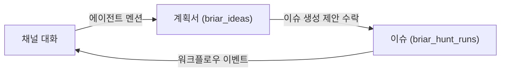

# 조직 채팅 채널

Status: implemented (1~4단계). Updated 2026-08-06.

## 구현 현황

| 영역 | 상태 | 위치 |
| --- | --- | --- |
| 에이전트 조직 스코프 승격, 핸들 | done | `migrations/0071_organization_agents.sql`, `worker/src/organization-agents.ts` |
| 조직 아이디어(`project_id is null`) | done | `migrations/0072_organization_ideas.sql`, `worker/src/ideas.ts` |
| 채널·메시지·스레드·멘션·답글 잡·제안 | done | `migrations/0073_organization_channels.sql`, `worker/src/channels.ts` |
| 조직 스코프 변경 피드 | done | `migrations/0074_channel_delta_sync.sql` |
| 채널 API와 조직 스코프 클레임 평면 | done | `worker/src/index.ts` |
| 워커 러너 `channelReply` | done | `src-cli/index.ts`, `src-cli/agent-runner.ts` |
| 데스크탑 채널 화면과 멘션 픽커 | done | `src/components/Channels.tsx`, `src/lib/channel-mentions.ts` |

구현하면서 설계와 달라졌거나 미룬 것:

- **클레임 인증**: 디바이스 크리덴셜이 조직 권한을 증명하고, 준비 상태와
  프로바이더 헬스는 요청이 함께 보내는 프로젝트 바인딩(`workerId`)에서 읽는다.
  디바이스 단위 프로바이더 저장소를 새로 만들지 않기 위한 선택이며, 잡 단위
  자격 검사(조직 에이전트는 조직만, 프로젝트 에이전트는 바인딩까지)는 설계대로다.
- **조직 아이디어의 chat/plan 잡은 미구현**. 채널이 만든 계획서는 읽고 목록에
  노출되지만, 계획서를 이슈로 변환하는 경로(`briar_idea_issue_plans`)는 아직
  프로젝트 아이디어 전용이다. 채널에서의 이슈 생성은 계획서 변환이 아니라
  에이전트의 이슈 생성 제안으로 처리한다.
- **채널 답글 트랜스크립트 미기록**. `briar_agent_transcript_sessions.project_id`가
  NOT NULL이라 프로젝트 없는 실행을 담을 수 없다.
- **채널 첨부 미구현**. 계획서는 첨부가 아니라 문서 카드로 처리한다.
- **모바일 미구현**. 모바일 앱 코드는 건드리지 않았으므로 iOS/Android 동시
  변경 규칙에 걸리지 않지만, `mobile-contract.ts` 확장은 남아 있다.

## 목표

조직 구성원과 에이전트가 함께 쓰는 채팅 채널을 제공한다. 채널은
아이디에이션 → 계획서 → 이슈 생성 → 실행 추적으로 이어지는 기획·개발
플로우를 한 화면 안에서 닫는 것을 목표로 한다.



기존 이슈 대화(`briar_issue_messages`)는 run에 종속되어 있어 "무엇을 만들지
정해진 뒤"의 대화만 담는다. 채널은 그 앞단계를 담당하며, 대화·문서·이슈가
같은 데이터베이스에 있다는 점을 활용해 에이전트가 전 단계를 관통한다.

## 확정된 범위 결정

| 항목 | 결정 |
| --- | --- |
| DM(1:1 대화) | MVP 범위 아님. 채널만 구현한다. |
| 에이전트 멘션 스코프 | 조직 레벨 로스터. 채널에 추가된 에이전트를 핸들로 멘션한다. |
| 에이전트 소속 | 프로젝트 에이전트와 **조직 에이전트가 공존**한다. 조직 에이전트를 1급으로 가정하고 설계한다. |
| Slack 브리지 | 후순위. 자체 채널의 존재 이유를 흐리지 않도록 명시적으로 미룬다. |
| 실시간 전송 | MVP는 변경 피드 + 폴링. WebSocket/Durable Object는 후속. |

## 재사용하는 기존 자산

| 자산 | 위치 | 채널에서의 쓰임 |
| --- | --- | --- |
| 스레드 구조(`parent_message_id`) | `migrations/0010_issue_messages.sql` | 채널 메시지 스레드에 동일 패턴 적용 |
| 구조화 멘션 저장 | `migrations/0041_issue_message_mentions.sql` | 유저 멘션 테이블을 그대로 복제 |
| 에이전트 답글 큐(클레임·리스·재시도) | `migrations/0044_issue_agent_reply_jobs.sql`, `POST /issue-reply-claims` | 채널 전용 잡 테이블과 조직 스코프 클레임으로 확장 |
| 조직 스코프 디바이스 신원 | `migrations/0034_execution_worker_credentials.sql` | 프로젝트 없는 에이전트 실행의 기반 |
| 액션 제안(사람이 수락해야 적용) | `migrations/0068_issue_action_proposals.sql` | 채널에서 이슈 생성 제안에 동일 패턴 적용 |
| 계획서 문서 + 이슈 변환 | `migrations/0056_ideas.sql`, `convertIdeaPlanToIssues` | 채널 계획서 카드의 실체로 사용 |
| 계정 스코프 읽음 상태 | `migrations/0063_inbox_read_states.sql` | 채널 멘션·스레드 답글을 기존 Inbox에 합류 |
| 델타 동기화 트리거 | `migrations/0049_dashboard_delta_sync.sql` | 조직 스코프 변경 피드의 원형 |
| 대화 UI | `src/components/HuntDashboard.tsx` `IssueConversation`, `IssueMessageItem`, `MessageComposer` | 공용 컴포넌트로 추출 후 양쪽에서 사용 |

이슈 메시지 테이블을 일반화하지 않고 채널용 테이블을 새로 만든다. 이슈
메시지는 `run_id`에 강하게 묶여 있고(아카이브, 워크플로우 이벤트, 첨부
경로) 억지로 합치면 기존 경로가 모두 회귀 위험에 들어간다.

## 에이전트 스코프

조직 에이전트는 채널 기능의 부가 요소가 아니라 전제다. 채널은 조직 스코프인데
에이전트가 항상 프로젝트에 매여 있으면, 어떤 프로젝트에도 속하지 않는 대화
(전사 공지, 프로젝트 이전 단계의 아이데이션)에서 에이전트를 쓸 수 없다.

역할 분담은 자연스럽게 갈린다.

- **조직 에이전트**: 저장소가 없다. 대화, 리서치, 계획서 작성, 이슈 라우팅
  제안을 담당한다. 채널 기본 로스터는 여기서 채운다.
- **프로젝트 에이전트**: 저장소와 워크플로우에 접근한다. 코드 작업과
  프로젝트 맥락이 필요한 답변을 담당한다. 채널에도 추가할 수 있다.

### 스키마 변경

`briar_project_agents`를 조직 스코프 신원으로 승격하고 `project_id`를
nullable로 만든다. `project_id`가 null이면 조직 에이전트다.

```sql
create table briar_project_agents_new (
  id text primary key not null,
  organization_id text not null
    references briar_organizations (id) on delete cascade,
  project_id text references briar_projects (id) on delete cascade,
  handle text check (
    handle is null
    or (length(handle) between 1 and 63 and handle not glob '*[^a-z0-9-]*')
  ),
  name text not null check (length(trim(name)) between 1 and 100),
  provider text not null,
  model text,
  responsibility text not null,
  created_at text not null,
  updated_at text not null
);
-- organization_id는 기존 project_id의 프로젝트에서 백필한다.
```

SQLite는 컬럼의 NOT NULL을 제거할 수 없어 테이블 재생성이 필요하다.
`migrations/0055_agent_provider_opencode.sql:152`가 이미 같은 테이블을
동일한 create-copy-drop-rename 패턴으로 재생성했으므로 관례 안에 있다.

영향 범위는 좁다. `briar_project_agents`를 참조하는 FK는
`briar_project_agent_schedules`, `briar_project_agent_schedule_runs`,
`briar_hunt_runs.agent_id`뿐이고, `briar_project_agent_sessions.agent_id`는
FK 없는 텍스트 컬럼이다. 다만 스케줄은 프로젝트 워크플로우에 묶여 있으므로
**조직 에이전트에는 스케줄을 허용하지 않는다**는 제약을 API에서 강제한다.

### 핸들

현재 에이전트 멘션은 `@briar` 단일 핸들이고(`src/lib/briar-mention.ts`)
에이전트 행에는 `name`만 있다. 첨부 화면처럼 `@Honey`, `@Bumble`을 구분해
부르려면 조직 내 유일한 핸들이 필요하다.

```sql
create unique index briar_project_agents_handle_idx
  on briar_project_agents (organization_id, handle)
  where handle is not null;
```

`organization_id`가 행에 직접 있으므로 조인 없이 유일성을 강제할 수 있다.
핸들 백필은 `name` 슬러그화 + 충돌 시 접미사 부여로 처리하며, SQL만으로는
안전하지 않으므로 마이그레이션 이후 1회성 백필 경로를 둔다. `briar`는
예약어로 유지한다.

## 데이터 모델

마이그레이션 번호는 `0071`부터다.

### 채널과 구성원

```sql
create table briar_channels (
  id text primary key not null,
  organization_id text not null
    references briar_organizations (id) on delete cascade,
  slug text not null check (
    length(slug) between 1 and 63 and slug not glob '*[^a-z0-9-]*'
  ),
  name text not null check (length(trim(name)) between 1 and 100),
  topic text check (topic is null or length(topic) <= 500),
  visibility text not null default 'public'
    check (visibility in ('public', 'private')),
  -- 실행 대상이 아니라 이슈·계획서 제안의 기본값이다.
  default_project_id text references briar_projects (id) on delete set null,
  created_by_user_id text references "user" (id) on delete set null,
  archived_at text,
  created_at text not null,
  updated_at text not null
);

create unique index briar_channels_slug_idx
  on briar_channels (organization_id, slug);
```

유저 구성원과 에이전트 구성원은 역할 체계가 달라 테이블을 분리한다.
SQLite 기본키에 표현식을 쓸 수 없다는 제약도 같은 결론을 가리킨다.

```sql
create table briar_channel_members (
  channel_id text not null references briar_channels (id) on delete cascade,
  user_id text not null references "user" (id) on delete cascade,
  role text not null default 'member' check (role in ('owner', 'member')),
  created_at text not null,
  primary key (channel_id, user_id)
);

create table briar_channel_agents (
  channel_id text not null references briar_channels (id) on delete cascade,
  agent_id text not null
    references briar_project_agents (id) on delete cascade,
  added_by_user_id text references "user" (id) on delete set null,
  created_at text not null,
  primary key (channel_id, agent_id)
);
```

`public` 채널은 조직 구성원 전원이 읽고 쓸 수 있으며 `briar_channel_members`
행은 사이드바 표시·알림 대상 관리용이다. `private` 채널은 멤버 행이 곧
접근 권한이다.

### 메시지

```sql
create table briar_channel_messages (
  id text primary key not null,
  channel_id text not null references briar_channels (id) on delete cascade,
  parent_message_id text
    references briar_channel_messages (id) on delete cascade,
  author_user_id text references "user" (id) on delete set null,
  author_agent_id text
    references briar_project_agents (id) on delete set null,
  author_agent_name text
    check (author_agent_name is null
      or length(trim(author_agent_name)) between 1 and 100),
  author_agent_provider text check (
    author_agent_provider is null
    or author_agent_provider in ('codex', 'claude', 'grok', 'opencode')
  ),
  body text not null check (
    body = trim(body) and length(body) between 1 and 10000
  ),
  created_at text not null,
  updated_at text not null,
  check (parent_message_id is null or parent_message_id <> id),
  check ((author_user_id is null) <> (author_agent_name is null))
);

create index briar_channel_messages_root_idx
  on briar_channel_messages (channel_id, created_at, id)
  where parent_message_id is null;

create index briar_channel_messages_thread_idx
  on briar_channel_messages (parent_message_id, created_at, id);
```

에이전트 작성자는 `author_agent_id`(삭제 시 null)와 함께 이름·프로바이더를
작성 시점 값으로 비정규화 저장한다. 에이전트가 삭제돼도 과거 대화가 익명
메시지로 무너지지 않게 하기 위함이다. 작성자 판별 기준은
`author_agent_name`의 존재이며, 위 check가 유저/에이전트 배타성을 강제한다.

### 멘션

FK 무결성을 유지하기 위해 대상별로 테이블을 나눈다.

```sql
create table briar_channel_message_mentions (
  message_id text not null
    references briar_channel_messages (id) on delete cascade,
  user_id text not null references "user" (id) on delete cascade,
  created_at text not null,
  primary key (message_id, user_id)
);

create table briar_channel_message_agent_mentions (
  message_id text not null
    references briar_channel_messages (id) on delete cascade,
  agent_id text not null
    references briar_project_agents (id) on delete cascade,
  created_at text not null,
  primary key (message_id, agent_id)
);
```

### 에이전트 답글 잡

조직 에이전트에는 프로젝트가 없으므로 `organization_id`가 필수 축이고
`project_id`는 nullable이다.

```sql
create table briar_channel_agent_reply_jobs (
  id text primary key not null,
  organization_id text not null
    references briar_organizations (id) on delete cascade,
  channel_id text not null references briar_channels (id) on delete cascade,
  -- 프로젝트 에이전트일 때만 채워진다. 조직 에이전트는 null.
  project_id text references briar_projects (id) on delete cascade,
  agent_id text not null
    references briar_project_agents (id) on delete cascade,
  trigger_message_id text not null
    references briar_channel_messages (id) on delete cascade,
  parent_message_id text not null
    references briar_channel_messages (id) on delete cascade,
  reply_message_id text not null unique,
  status text not null default 'queued'
    check (status in ('queued', 'running', 'completed', 'failed')),
  preferred_device_id text
    references briar_execution_worker_devices (id) on delete set null,
  claimed_device_id text
    references briar_execution_worker_devices (id) on delete set null,
  preferred_provider text,
  agent_provider text,
  claim_token_hash text,
  claimed_at text,
  lease_expires_at text,
  attempts integer not null default 0 check (attempts >= 0),
  error text,
  created_at text not null,
  updated_at text not null,
  completed_at text,
  unique (channel_id, trigger_message_id, agent_id)
);

create index briar_channel_agent_reply_jobs_queue_idx
  on briar_channel_agent_reply_jobs (
    organization_id, status, project_id, lease_expires_at, created_at
  );
```

잡이 프로젝트 워커 바인딩(`briar_execution_workers`)이 아니라 디바이스를
가리키는 점이 이슈 답글 잡과 다르다. 실행 주체가 조직 스코프이기 때문이다.

유니크 제약이 `agent_id`를 포함하므로 한 메시지에서 두 에이전트를 멘션하면
잡이 두 개 생기고 각각 답글을 단다. 첨부 화면의 "Honey와 Bumble이 각자
자기소개" 동작이 스키마에서 자연스럽게 나온다.

### 계획서와 액션 제안

계획서는 메시지 본문(1만 자 제한)이 아니라 `briar_ideas`에 저장하고 메시지는
카드로 참조한다. 이렇게 하면 버전 관리, `draft → ready → issues_created`
상태 머신, `convertIdeaPlanToIssues`(계획서 → 다수 이슈)를 그대로 얻는다.

```sql
create table briar_channel_message_documents (
  message_id text primary key not null
    references briar_channel_messages (id) on delete cascade,
  idea_id text not null references briar_ideas (id) on delete cascade,
  document_version integer not null check (document_version >= 1),
  created_at text not null
);

create table briar_channel_action_proposals (
  id text primary key not null,
  channel_id text not null references briar_channels (id) on delete cascade,
  -- 제안이 귀속될 프로젝트. 에이전트가 아니라 산출물이 정한다.
  project_id text not null references briar_projects (id) on delete cascade,
  trigger_message_id text not null,
  reply_message_id text not null unique,
  action_type text not null check (
    action_type in ('request_issue_create', 'request_plan_document')
  ),
  payload_json text not null check (json_valid(payload_json)),
  status text not null default 'pending'
    check (status in ('pending', 'accepted')),
  accepted_by_user_id text references "user" (id) on delete set null,
  accepted_at text,
  result_run_id text references briar_hunt_runs (id) on delete set null,
  result_idea_id text references briar_ideas (id) on delete set null,
  created_at text not null,
  updated_at text not null,
  unique (channel_id, trigger_message_id)
);
```

에이전트는 이슈를 직접 만들지 않는다. 제안을 남기고 인증된 사용자가 수락할
때만 적용되는 기존 `briar_issue_action_proposals`의 human-in-the-loop 규칙을
그대로 따른다.

### 변경 피드

```sql
create table briar_channel_sync_state (
  organization_id text primary key not null
    references briar_organizations (id) on delete cascade,
  current_version integer not null default 0 check (current_version >= 0)
);

create table briar_channel_changes (
  version integer primary key autoincrement,
  organization_id text not null
    references briar_organizations (id) on delete cascade,
  channel_id text not null,
  entity_type text not null check (
    entity_type in ('channel', 'message', 'reply_job', 'proposal')
  ),
  entity_id text,
  operation text not null check (operation in ('upsert', 'delete')),
  created_at text not null
);
```

`briar_dashboard_changes`와 동일하게 전역 autoincrement 버전을 조직으로
필터링한다. 메시지 insert와 잡 상태 전이에 트리거를 건다. 메시지 update에는
트리거를 걸지 않는다(편집은 MVP 밖이고 쓰기 증폭만 늘린다).

## 멘션 해석 규칙

서버는 본문을 재파싱하지 않고 클라이언트가 보낸 구조화된 멘션 목록만
신뢰한다. 이슈 대화가 이미 `mentionedUserIds`로 이렇게 동작한다.

- 요청 본문: `mentionedUserIds`, `mentionedAgentIds`.
- 픽커는 조직 멤버 핸들(이메일 로컬파트, `issueMentionHandle` 재사용)과
  채널에 추가된 에이전트 핸들을 함께 노출한다.
- 유저 핸들과 에이전트 핸들이 충돌해도 오작동하지 않는다. 텍스트 일치가
  트리거가 아니므로 충돌은 픽커 표시 문제로 국한된다. 픽커에서 에이전트에는
  조직 에이전트인지 어느 프로젝트 소속인지를 부기해 구분한다.
- 서버 검증: 멘션된 유저는 채널 접근 권한이 있어야 하고, 멘션된 에이전트는
  `briar_channel_agents`에 있어야 한다. 아니면 400.
- 답글 잡 트리거는 `mentionsBriar` 같은 정규식이 아니라 검증된
  `mentionedAgentIds`다.

## 실행 경로와 프로젝트 귀속

**프로젝트 귀속은 대화가 아니라 산출물이 정한다.** 조직 에이전트가 존재하는
이상 "대화에 프로젝트를 하나 붙인다"는 모델은 성립하지 않는다. 대화는
프로젝트 없이도 성립하고, 프로젝트가 필요해지는 순간은 이슈나 계획서 같은
프로젝트 스코프 산출물을 만들 때뿐이다.

### 실행: 조직 디바이스가 주체

`briar_execution_worker_devices`가 이미 조직 스코프 신원이고
(`organization_id`, 디바이스 크리덴셜), `briar_execution_workers`는 그
디바이스의 프로젝트 바인딩일 뿐이다. 따라서 프로젝트 없는 에이전트도 실행할
자리가 이미 있다.

`requireWorkerProjectBinding`(`worker/src/index.ts:2317`) 옆에
`requireWorkerOrganization`을 추가한다. 디바이스 크리덴셜을 검증하고 디바이스
조직만 확인하며 프로젝트 바인딩은 요구하지 않는다.

클레임 자격 규칙:

| 잡 | 디바이스 자격 |
| --- | --- |
| `project_id is null` (조직 에이전트) | 같은 조직의 online·accepting 디바이스 |
| `project_id is not null` (프로젝트 에이전트) | 위 조건 + 해당 프로젝트에 enabled 바인딩 + 프로젝트 실행 정책 통과 |

두 경우 모두 에이전트의 `provider`를 디바이스가 지원해야 한다. 동시성 제한은
`migrations/0036_execution_worker_concurrency.sql`이 디바이스 단위로 두고
있으므로 그대로 적용된다.

### 작업 공간

조직 에이전트 답글은 저장소가 필요 없는 대화 작업이다. 러너는 `project_id`가
null인 잡에서 worktree 준비를 건너뛴다. 이슈 답글이 항상 저장소 맥락에서
도는 현재 경로와 갈리는 지점이며 `src-cli`에서 실제 분기가 필요하다.

이 성질은 앞으로의 선택지도 넓힌다. 저장소가 필요 없는 실행은 사용자 머신에
묶일 이유가 없으므로, 서버측 실행을 도입한다면 조직 에이전트가 첫 후보다.
MVP는 기존 BYO 머신 모델을 유지한다.

### 산출물의 프로젝트

이슈 생성과 계획서 저장은 프로젝트를 요구한다(`briar_ideas.project_id`는
NOT NULL). 제안 카드가 프로젝트 필드를 들고 있으며 기본값은
`briar_channels.default_project_id`, 없으면 사용자가 고른다. 어차피 사용자가
"이 이슈를 어느 프로젝트에 넣을지" 확인해야 하는 값이므로 UI 부담이 늘지
않는다.

프로젝트 에이전트가 제안할 때는 자기 프로젝트가 기본값이다.

### 컨텍스트 경계

클레임 스냅샷에 담는 것:

- 공통: 채널 메타데이터, 해당 스레드의 메시지, 에이전트의 이름·책임·모델.
- 프로젝트 에이전트: 소속 프로젝트의 메타데이터.
- 조직 에이전트: 조직의 프로젝트 **이름과 id 목록만**. 이슈를 어디로 보낼지
  제안하는 데 필요한 최소 정보이고, 프로젝트 내용은 포함하지 않는다.

다른 채널의 내용은 어느 경우에도 포함하지 않는다. private 채널에서는
에이전트를 채널에 추가하는 행위가 접근 승인이며, 프로젝트 에이전트를
추가하려면 추가하는 사용자가 그 프로젝트에 접근 권한이 있어야 한다.

## API 표면

라우팅은 기존 `route()`의 정규식 매칭 스타일을 따른다.

| 메서드 | 경로 | 용도 |
| --- | --- | --- |
| GET/POST | `/organizations/{orgId}/channels` | 목록·생성 |
| GET/PATCH/DELETE | `/organizations/{orgId}/channels/{channelId}` | 조회·수정·보관 |
| PUT/DELETE | `.../channels/{channelId}/members/{userId}` | 멤버 관리 |
| PUT/DELETE | `.../channels/{channelId}/agents/{agentId}` | 에이전트 로스터 |
| GET | `.../channels/{channelId}/messages` | 루트 목록, `parentMessageId`로 스레드 |
| POST | `.../channels/{channelId}/messages` | 전송(첨부·멘션 포함) |
| GET | `.../messages/{messageId}/agent-replies` | 답글 잡 상태 |
| POST | `.../action-proposals/{proposalId}/accept` | 이슈·계획서 생성 수락 |
| GET | `/organizations/{orgId}/channel-changes?since=` | 델타 |
| GET/POST | `/organizations/{orgId}/agents` | 조직 에이전트 관리 |
| POST | `/channel-reply-claims` | 워커 평면. `organizationId` + 디바이스 크리덴셜 |
| POST | `/channel-reply-claims/{id}/lease`, `.../complete` | 리스·완료 |

`wrangler.jsonc`의 `run_worker_first`에 `/channel-reply-claims*`를 추가해야
한다. `/organizations*`는 이미 있어 채널 읽기·쓰기 경로는 커버된다.
`src-cli/worker.ts`의 `workType` 유니온에 `"channelReply"`를 추가하고,
워커 폴링 루프에 조직 스코프 클레임 대상을 하나 더 둔다.

## 실시간 동기화

현재 저장소에 Durable Object는 없고 대시보드는 15초 폴링이다. 채팅에는 느리다.

MVP는 위 변경 피드에 활성 채널 3초 폴링 + 낙관적 로컬 에코로 간다. 새 인프라
없이 기존 델타 병합 기계를 재사용하고, 커서 조회는 인덱스가 받쳐 빈 응답이
싸다. 채널당 Durable Object + WebSocket은 후속 단계로 두되, 변경 피드가 계속
진실의 원천이므로 DO는 같은 커서를 밀어주는 알림 계층으로 얹으면 된다.
즉 나중에 붙여도 스키마를 되돌릴 일이 없다.

이 순서를 택한 이유는 리스크 배분이다. 채널의 가치 가설(기획 플로우 통합)은
아직 검증되지 않았고, WebSocket 인증·재연결·모바일 백그라운드 처리까지
MVP에 넣으면 검증 전에 비용이 커진다. 다만 "채팅이 느리다"는 첫인상은
회복이 어려우므로, 3초 폴링에서 체감이 나쁘면 DO를 2단계 최우선으로 올린다.

## 클라이언트

- **컴포넌트 추출**: `IssueConversation`(`HuntDashboard.tsx:6870`),
  `IssueMessageItem`(`:7148`), `MessageComposer`(`:7370`)를
  `src/components/conversation/`로 옮기고 데이터 소스를 props로 주입한다.
  7951줄 모놀리스에서 떼어내는 이 작업이 프론트엔드 최대 비용이며, 동작
  변경 없는 순수 리팩터로 먼저 끝낸다.
- **조직 에이전트 관리 UI**: 기존 `ProjectAgents`/`ProjectAgentDetail`이
  프로젝트 전제로 짜여 있어 조직 설정에 대응 화면이 필요하다. 스케줄 탭은
  조직 에이전트에서 숨긴다.
- **사이드바**: 조직 채널 섹션 추가(`Sidebar.tsx`).
- **Inbox**: `useInbox.ts`의 항목 종류에 `"channel"` 추가. 읽음 상태는
  `briar_inbox_read_states`가 계정 스코프라 메시지 ID만 넣으면 된다.
- **모바일**: `AGENTS.md` 규칙상 iOS와 Android를 함께 변경해야 한다.
  `worker/src/mobile-contract.ts`에 채널 스키마를 추가하고 MVP 모바일 범위는
  읽기 + 스레드 답글 + 멘션으로 잡는다.

## 단계

| 단계 | 범위 |
| --- | --- |
| 0 | 대화 컴포넌트 추출(동작 불변 리팩터) |
| 1 | 채널·메시지·스레드·유저 멘션·Inbox·변경 피드·모바일 읽기 |
| 2 | 에이전트 스코프 마이그레이션, 조직 에이전트 CRUD, 핸들, 채널 로스터 |
| 3 | 답글 잡, 조직 스코프 클레임, `channelReply` 러너(worktree 생략 경로) |
| 4 | 계획서 카드(ideas 연결), 이슈 생성 제안 및 수락 |
| 5 | 이슈 카드 unfurl과 워크플로우 이벤트 구독, 스탠드업 다이제스트, 스레드 → 이슈 승격 |
| 후순위 | DM, Slack 브리지, 메시지 검색·편집, WebSocket, 서버측 조직 에이전트 실행 |

제품 가치의 본체는 4단계다. 1~3단계만으로는 "이슈 대화를 조직 레벨로 올린
것"에 그친다. 2단계는 채널과 독립적으로도 가치가 있으므로(조직 에이전트 자체가
제품 기능) 채널 진행과 병렬로 뗄 수 있다.

## 리스크와 열린 질문

- **에이전트 테이블 재생성**: `briar_project_agents` 재생성은 0055에 선례가
  있지만 FK 참조 3곳과 백필을 함께 검증해야 한다. 마이그레이션 후
  `foreign_key_check`를 돌린다.
- **트랜스크립트 스코프**: `briar_agent_transcript_sessions.project_id`가
  NOT NULL이라 조직 에이전트 세션을 기록할 수 없다. 3단계에서 nullable
  전환(또 한 번의 재생성) 또는 조직 에이전트 트랜스크립트 미기록 중
  선택해야 한다. 관측성을 생각하면 전환이 맞다.
- **조직 에이전트의 프로젝트 목록 노출**: 프로젝트 이름·id만 준다 해도
  private 프로젝트 이름이 채널에 흘러나올 수 있다. 조직 내 프로젝트 가시성
  정책이 현재 명시적이지 않으므로 2단계에서 확정한다.
- **계획서의 프로젝트 강제**: 프로젝트가 아직 정해지지 않은 아이데이션에서
  계획서를 쓰려면 프로젝트를 골라야 한다. MVP는 이 마찰을 받아들이고,
  실제로 걸림돌이면 `briar_ideas`를 조직 스코프로 확장한다.
- **쓰기 증폭**: 채팅 빈도로 변경 트리거가 도는 만큼 D1 쓰기가 늘어난다.
  메시지 insert와 잡 상태 전이로만 트리거를 한정하고, 보존 기간을 두어
  `briar_channel_changes`를 정리한다.
- **폴링 비용**: 활성 채널 3초 × 동시 사용자. 커서 쿼리가 인덱스만 타도록
  하고, 창이 백그라운드면 폴링을 멈춘다.
- **핸들 백필 충돌**: 기존 에이전트 이름이 중복될 수 있어 접미사 규칙과
  1회성 백필 검증이 필요하다.
- **첨부 범위**: `briar_issue_attachments`는 이미지·비디오만 허용한다. 채널
  첨부도 동일 화이트리스트로 시작하고, 일반 파일 확장은 별건으로 다룬다.

## 검증

- 마이그레이션: `worker/src/migrations.test.ts` 패턴으로 스키마와 백필 검증.
- DB 계층: `worker/src/db.test.ts` 패턴으로 멘션 검증, 조직/프로젝트 잡의
  클레임 자격 분기, 제안 수락 멱등성.
- 라우트: `worker/src/index.test.ts` 패턴으로 권한(비멤버 private 접근),
  멘션 검증 실패, 디바이스 크리덴셜 클레임, 프로젝트 바인딩 없는 디바이스가
  프로젝트 에이전트 잡을 못 가져가는지.
- 클라이언트: 추출한 대화 컴포넌트의 기존 테스트가 이슈·채널 양쪽에서 통과.
