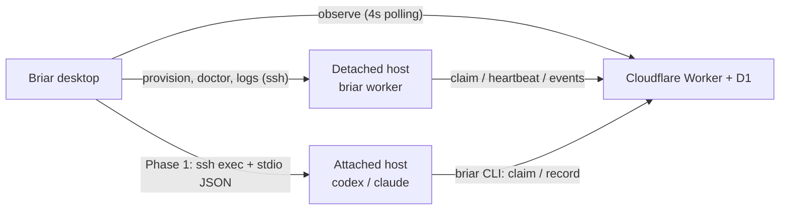

# Remote execution hosts

Status: in progress. Created 2026-07-25.

## Progress

Landed on `worktree-remote-execution-hosts`, all four local CI gates green
(`bun run ci:local`):

| Section | State | Where |
| --- | --- | --- |
| §1.1 host records, project binding | done | `src-tauri/src/lib.rs`, commit `9ed6ab8` |
| §1.2 command runner abstraction | done | `src-tauri/src/host/`, commit `f3027cc` |
| §1.3 `ssh -G` target resolution | done | `resolve_ssh_alias` in `src-tauri/src/lib.rs` |
| §1.4 askpass authentication | done | `src-tauri/src/host/ssh.rs` |
| §1.5 remote PATH bootstrap | done | `src-tauri/src/host/shell.rs` |
| §2.1 migration | done as `0013` (0012 was taken) | `migrations/0013_execution_workers.sql` |
| §2.2 worker API and reaper | done | `worker/src/workers.ts`, commit `ed42e7e` |
| §2.3 worker loop and service installer | done except the agent launcher | `src-cli/worker.ts`, commit `dd291b4` |
| §1.6 host-aware diagnostics | done for attached hosts | repository, GitHub, Velen, Bun, agent auth, CLI and skill checks use the selected runner |
| §1.7 agent launch over SSH | done | Codex app-server and the uploaded Claude runner use SSH stdio; Auto Hunt builds and cleans its sandbox on the remote host |
| §2.4 shared runners, Codex port | **not started** | `runClaimedIssue` in `src-cli/index.ts` is a stub that fails loudly |
| §2.5 desktop observation | **not started** | worker/transcript endpoints have no UI |
| §1.8 renderer host picker | partial | project connection can add/select an SSH host and validate a remote path; settings badges and removal UI remain |

Three defects surfaced while implementing, all fixed with regression tests:

- The lease was set once at claim time and never renewed, so any run longer than
  15 minutes lost its claim (`renewHuntRunLease`, plus the loop's renewal task).
- `assertQueuedHuntClaim` stops gating writes once a run leaves `queued`, so a
  worker that died mid-run left the issue in progress forever. Recovered by
  `reapStalledHuntRuns`, called on claim, heartbeat, and dashboard read.
- The worker loop's renewal wait blocked the loop for a full renewal interval
  after each issue, and its first heartbeat never fired because a
  never-reported worker read as up to date.

The attached-host launcher is no longer local-process-only: both providers
spawn through `CommandRunner`, Claude's bundled runner is uploaded for the
session, and `AutoHuntCliEnvironment::prepare_on_host` creates the isolated
CLI home on the remote host. The remaining launcher blocker is detached
workers (§2.4), which still need the provider protocol client in `src-agent/`
rather than the desktop Rust process.

Briar runs Auto Hunt on the machine that shows the dashboard. This plan adds
**remote execution hosts**: machines other than the desktop that hold the
repository and run the coding agent. "Worker" in this document always means a
remote execution host, never the Cloudflare Worker.

The plan is delivered in two phases that share one host model.

- **Phase 1 — attached host.** The desktop drives a remote machine over SSH.
  Every local process invocation becomes host-aware. Full feature parity,
  including approvals and live event streaming, but the desktop must stay
  online for the duration of a session.
- **Phase 2 — detached host (pull worker).** The remote machine runs
  `briar worker`, claims queued issues from the Worker API, and executes them
  on its own. The desktop only observes through existing polling. SSH is
  reduced to provisioning, diagnostics, and log retrieval.

## Non-goals

- Remote file tree, terminal, or git browsing parity. Orca solves that with a
  bespoke relay daemon and a VS Code-style framed JSON-RPC protocol
  (~35,000 lines); Briar does not need it because agents run headless.
- Credential synchronization across machines. Each host authenticates its own
  `codex`/`claude`, `velen`, `gh`, and `briar` CLI.
- Repository paths in D1. Migration `0002_remove_repository_path.sql`
  deliberately removed them; they stay in each machine's
  `~/.config/briar/config.json`.
- A custom wire protocol. Phase 1 uses an SSH exec channel carrying the agent's
  existing line-delimited JSON; Phase 2 uses the existing HTTPS ingest API.

## What we build on

| Fact | Location |
| --- | --- |
| Both agent backends speak line-delimited JSON over stdio | [codex.rs:584](../../src-tauri/src/agent/codex.rs), [claude.rs:129](../../src-tauri/src/agent/claude.rs) |
| Codex is launched as `codex app-server --listen stdio://` | [codex.rs:793](../../src-tauri/src/agent/codex.rs) |
| The Claude backend is already a standalone Bun script | [src-agent/claude-runner.ts](../../src-agent/claude-runner.ts), built to `dist-agent/claude-runner.js` |
| Local tool invocation is uniformly `which::which_in` + `Command::new().current_dir().env("PATH", …)` | [lib.rs:473](../../src-tauri/src/lib.rs), 507, 517, 786, 1012 |
| Project → repository path binding is per machine | [lib.rs:1368](../../src-tauri/src/lib.rs) (`connected_project_workspace`) |
| Queue claiming with a claim token and 15-minute lease already exists | [worker/src/index.ts:1261](../../worker/src/index.ts), `migrations/0004_auto_hunt_claims.sql` |
| Timeline API already exists and is token-authenticated | `POST /run-events`, [worker/src/index.ts](../../worker/src/index.ts) |
| The agent claims and records work through the CLI, not through the desktop | [src-cli/index.ts](../../src-cli/index.ts), skill prompt at [codex.rs:442](../../src-tauri/src/agent/codex.rs) |
| Agent transcripts are stored as local JSONL per session | [lib.rs:2075](../../src-tauri/src/lib.rs) (`auto_hunt_event_path`) |

Two consequences shape the whole design. First, because the agent transport is
already stdio JSON, an SSH exec channel is a drop-in transport — no port
forwarding and no relay daemon are required for Phase 1. Second, because the
agent drives its own claim/record calls against the Worker, a detached worker
needs no new orchestration protocol; it needs a launcher and an event sink.

## Shared host model



Introduce one identifier shared by Rust, the CLI, and the renderer, modelled on
Orca's `ExecutionHostId` ([execution-host.ts](../../../orca/src/shared/execution-host.ts)):

```
ExecutionHostId = "local" | "ssh:<hostId>" | "worker:<workerId>"
```

- `local` — today's behaviour, always present, never removable.
- `ssh:<hostId>` — Phase 1. Resolves to an SSH target record.
- `worker:<workerId>` — Phase 2. Resolves to a registered detached worker; the
  desktop cannot execute on it, only observe and diagnose.

Storage:

- SSH host records live in `~/.config/briar/config.json` next to the existing
  project entries, never in D1. They hold alias, label, and the remote
  repository path per project. Secrets are never stored — resolution defers to
  OpenSSH (`ssh -G`) and the user's agent/keys.
- The per-project host binding (`executionHostId`) is added to the local
  project entry, so a project may be connected locally on one machine and via
  SSH on another without any server-side change.
- Detached worker registrations live in D1 because the dashboard must see them
  from any device, including Android.

## Phase 1 — attached SSH host

### 1.1 Host records and project binding

- Extend `CliConfig` in [lib.rs](../../src-tauri/src/lib.rs) with an
  `sshHosts` array and an optional `executionHostId` on each project entry.
  Absent values mean `local`, so existing configs migrate silently.
- New Tauri commands: `list_execution_hosts`, `add_ssh_host`,
  `remove_ssh_host`, `resolve_ssh_host` (runs `ssh -G`).
- `connected_project_workspace` gains a host parameter. For SSH hosts it must
  not call `fs::canonicalize`; the git-root check moves to a remote command.

### 1.2 Host-aware command execution

The single largest change. Today ~40 call sites construct commands directly.

- Add `src-tauri/src/host/mod.rs` with a `CommandRunner` trait:
  `resolve_binary`, `run` (capture output), `spawn_piped` (stdio pipes for the
  agent), and `exists`.
- `LocalRunner` wraps the current `which::which_in` + `Command::new` behaviour
  verbatim so local execution is byte-identical after the refactor.
- `SshRunner` builds
  `ssh -o BatchMode=yes -o ConnectTimeout=10 -o ServerAliveInterval=15 -o ServerAliveCountMax=3 <host> -- sh -lc '<escaped>'`.
  Quoting goes through one shell-escape helper with unit tests; no
  caller-assembled command strings.
- Migrate call sites in dependency order: git helpers → `gh` → `velen` → CLI
  and skill health → agent spawn. Each step keeps its existing tests green.

Follow t3code here rather than adding an SSH library to Rust: it drives the
system `ssh` binary only ([command.ts](../../../t3code/packages/ssh/src/command.ts)),
which keeps `ProxyJump`, `Match` blocks, hardware keys, and agent forwarding
working for free. Orca needed `ssh2` because it multiplexes many logical
channels over one connection; Briar does not.

### 1.3 Target resolution

Copy t3code's approach: run `ssh -G <alias>` and parse `hostname`, `user`,
`port` from the output (`parseSshResolveOutput`,
[command.ts:45](../../../t3code/packages/ssh/src/command.ts)). Do not write an
`~/.ssh/config` parser — Orca eventually needed a full one
([ssh-config-parser.ts](../../../orca/src/main/ssh/ssh-config-parser.ts)) plus
`Include` expansion, and it is avoidable work.

### 1.4 Authentication

- Default path: key or agent auth with `BatchMode=yes`, so a host that needs
  interaction fails fast and visibly.
- Interactive path: adopt t3code's askpass helper
  ([auth.ts:74](../../../t3code/packages/ssh/src/auth.ts)) — write a
  mode-`0700` script to a temp dir, set `SSH_ASKPASS`,
  `SSH_ASKPASS_REQUIRE=force`, and pass the secret through a process
  environment variable that the script echoes. The passphrase is prompted by
  the Tauri dialog, held in memory for the session, and never written to disk.
- Record `lastRequiredPassphrase` per host (as Orca does) so reconnect can skip
  hosts that would block on a prompt.

### 1.5 Remote PATH resolution

Non-interactive shells are the most common failure mode. Port t3code's
`REMOTE_NODE_ENV_SCRIPT` ([tunnel.ts:320](../../../t3code/packages/ssh/src/tunnel.ts)),
which probes `~/.local/bin`, `~/bin`, Homebrew prefixes, then Volta, asdf,
mise, fnm, nodenv, and nvm activation hooks. Briar additionally needs `bun`,
`git`, `gh`, `velen`, and the agent CLI, so generalize the script to a
`resolve_remote_tool <name>` helper and cache the resolved absolute paths per
host for the session.

### 1.6 Host-aware diagnostics

`auto_hunt_health`, `inspect_repository_readiness`, `project_repository_readiness`,
and `repair_auto_hunt` must all run through the host runner. Without a remote
doctor the feature is unsupportable. Report per host: git/gh/velen/bun/agent
presence and version, `briar` CLI and skill version, agent authentication
state, repository git root, remote reachability, and push access. New failure
states must be surfaced explicitly, including "remote agent not authenticated",
which is expected and not repairable from the desktop.

`install_onboarding_prerequisite` and `install_project_github_cli` stay
local-only in Phase 1; remote installs are advisory text.

### 1.7 Agent execution over SSH

- `AutoHuntCliEnvironment::prepare` currently builds a sandbox home by copying
  `~/.config/<cli>` into a temp directory ([codex.rs:70](../../src-tauri/src/agent/codex.rs)).
  For SSH hosts the sandbox must be constructed **on the remote host** from the
  remote's own config, with the same `0700` permissions and the same
  `BRIAR_PROJECT_ID` / `BRIAR_API_URL` environment injection.
- `CodexConnection::start` and `ClaudeConnection::start` take a runner instead
  of a binary path. Their JSON-RPC and event-parsing code does not change.
- Add a session teardown guarantee: an SSH exec channel closing must kill the
  remote agent. Pass `-o ServerAliveInterval` plus an explicit remote
  `trap`/`exec` wrapper so a dropped desktop does not leave an orphaned agent
  writing to the repository. This is the known Phase 1 weakness that Phase 2
  removes.
- Event sink, JSONL persistence, and the `auto-hunt-app-server-event` Tauri
  event are unchanged, because events still flow through the desktop.

### 1.8 Renderer

- Host picker in project connection and settings; host badge on issue and
  session views.
- Connection flow: add host → resolve → doctor → pick remote repository path
  (text entry validated by a remote git-root check, not a file dialog).
- All new user-facing strings are Korean, matching the existing style in
  `lib.rs` and `src/lib`.

### 1.9 Tests

- Rust: shell escaping, `ssh -G` parsing, `SshRunner` argument construction,
  runner selection per project, teardown-kills-remote.
- A `LocalRunner`-backed integration test that runs the whole Auto Hunt path
  through the abstraction proves the refactor is behaviour-preserving.
- Optional opt-in end-to-end test against `ssh localhost` (Orca's
  `tests/e2e/ssh-localhost.spec.ts` is the model), skipped by default in
  `ci:local`.

## Phase 2 — detached pull worker

### 2.1 Schema (`migrations/0012_execution_workers.sql`)

- `briar_execution_workers`: `id`, `project_id`, `label`, `host_fingerprint`,
  `agent_provider`, `versions_json`, `state` (`online`/`stale`/`disabled`),
  `last_heartbeat_at`, `created_at`, `updated_at`. No repository path, no
  hostname beyond a user-supplied label.
- `briar_hunt_runs`: add `worker_id` (nullable, references the above) so the
  dashboard can attribute a run to a host.
- `briar_agent_transcripts`: `run_id`, `session_id`, `sequence`, `direction`,
  `provider`, `payload_json` (capped), `recorded_at`, unique on
  `(session_id, sequence)`. This is the server-side counterpart of today's
  local JSONL.
- `briar_agent_transcript_sessions`: `session_id` (primary key), `project_id`,
  `run_id`, `worker_id`, `started_at`, `last_event_at`, `event_count`,
  `byte_count`. Needed so retention can prune whole sessions cheaply without
  scanning the event table.
- Follow existing migration style: `check` constraints on every text column,
  explicit indexes, no destructive rewrite unless required.

Transcripts stay in D1 with hard caps rather than moving to R2 (decision D2):

- Per event: `payload_json` capped at 32 KB. Per request: at most 200 events and
  1 MB total.
- Per session: at most 5,000 events and 8 MB; further events are rejected with a
  terminal error the worker records once as a timeline note instead of retrying.
- Per project: retain the newest 50 sessions, pruned on write inside the same
  request that appends events, oldest first by `last_event_at`.
- Index `briar_agent_transcript_sessions (project_id, last_event_at desc)` for
  the prune and the dashboard list; index `briar_agent_transcripts (session_id,
  sequence)` for reads.

If real usage exceeds these caps, revisit R2 as a follow-up; the API shape above
does not change if the payload store moves.

### 2.2 Worker API

All under the existing `briar_agent_` bearer-token scope
(`requireAgentProject`):

- `POST /workers/register` → `{ workerId }`, idempotent on
  `(project_id, host_fingerprint)`.
- `POST /workers/:id/heartbeat` → accepts current versions and a
  liveness state; marks workers `stale` after a fixed miss window.
- `POST /runs/:runId/lease` → renews the 15-minute lease using the claim
  token, so long runs stop losing their claim. Today the lease is set once at
  claim time and never extended ([index.ts:1261](../../worker/src/index.ts)).
- `POST /transcripts` → batched, sequence-numbered agent events, capped
  per §2.1, and pruning old sessions in the same request.
- `GET /projects/:id/workers` and `GET /projects/:id/sessions/:sessionId/transcript`
  → session-authenticated dashboard reads.

Reject transcript payloads that exceed the cap rather than truncating silently,
and treat all agent-supplied text as untrusted when rendering.

Because multiple workers per project are allowed from the first release
(decision D4), the API also needs a **stalled-run reaper**. Today
`assertQueuedHuntClaim` ([db.ts:777](../../worker/src/db.ts)) gates writes on an
unexpired lease only while a run is still `queued`; once the first event moves it
out of `queued`, the run is no longer claimable and its lease no longer gates
writes. A worker that dies mid-run therefore leaves the run permanently
in-progress with nobody working it. Add:

- a `stalled_since` derivation from `lease_expires_at` plus `last_event_at`;
- reaping on every claim request and dashboard read (no cron trigger needed):
  a non-terminal run whose lease expired more than one renewal window ago returns
  to `queued`, clears its claim token, and appends a timeline event naming the
  worker that stalled;
- an attempt ceiling — after `claim_attempts` exceeds the configured limit the
  run moves to `blocked` instead of being reaped again.

### 2.3 `briar worker` CLI command

New subcommand in [src-cli/index.ts](../../src-cli/index.ts):

```
briar worker --project <id> [--label <text>] [--max-issues <n>] [--once]
briar worker status
briar worker install-service [--project <id>] [--label <text>]
briar worker uninstall-service
```

Loop: register → heartbeat → `POST /queue/claims` → resolve the local
repository path from this machine's `~/.config/briar/config.json` → launch the
agent → stream transcript events → renew the lease while running → release or
report on completion → back off when the queue is empty. Exactly one issue in
flight per worker; concurrency is bounded by running more workers, not by
threading one.

Briar owns service installation (decision D1). `install-service` generates and
registers the unit itself rather than asking the operator to copy a template:

- macOS: a `~/Library/LaunchAgents/dev.briar.worker.<projectId>.plist` with
  `KeepAlive`, `RunAtLoad`, and `StandardOut/ErrorPath` under
  `~/.local/state/briar/worker/`, registered with `launchctl bootstrap gui/<uid>`.
- Linux: a `~/.config/systemd/user/briar-worker@<projectId>.service` with
  `Restart=always`, registered with `systemctl --user enable --now`; print the
  `loginctl enable-linger` hint when the session is not lingering.
- Both write mode-`0600` files, never embed the agent token in the unit (the
  token stays in `~/.config/briar/config.json`), and are idempotent so a
  re-install updates in place.
- `briar worker status` reports the unit state, last heartbeat, and log path so
  the desktop doctor can render it over SSH.
- Windows is out of scope for this phase; `install-service` fails with a Korean
  message pointing at manual execution.

Briar does not need Orca's grace-period relay
([relay.ts:150](../../../orca/src/relay/relay.ts)) because the queue, not a
socket, is the durable state.

### 2.4 Agent launcher portability — the hard part

Today the launcher is Rust inside Tauri, and a detached worker cannot use it.
Both providers ship together (decision D3), because `AgentProviderKind::default`
is Codex ([agent/mod.rs:17](../../src-tauri/src/agent/mod.rs)) and a
Claude-only worker would not cover the common project. Sequencing inside the
phase:

1. **Extract the shared contract into `src-agent/`** — skill prompt text,
   issue-count limit, output-schema validation, and sandbox-home construction.
   The prompt string at [codex.rs:442](../../src-tauri/src/agent/codex.rs) and
   the workflow contract in
   [src/lib/auto-hunt-contract.ts](../../src/lib/auto-hunt-contract.ts) are the
   authoritative inputs; Rust must consume the extracted definition rather than
   keeping its own copy.
2. **Claude path** — [src-agent/claude-runner.ts](../../src-agent/claude-runner.ts)
   already speaks the stdio protocol, so the CLI spawns
   `dist-agent/claude-runner.js` directly. Land this first as the thin slice
   that proves the worker loop end to end.
3. **Codex path** — port the app-server client (request/response framing,
   `newConversation`, turn handling, the final-JSON contract) from
   [codex.rs](../../src-tauri/src/agent/codex.rs) into
   `src-agent/codex-runner.ts`. Then switch Rust to drive that one runner, the
   same way it already drives `claude-runner.js`, so there is never a second
   Codex client. This refactor must be behaviour-preserving and is covered by
   the existing Codex tests plus a golden transcript comparison between the Rust
   and CLI launch paths.
4. Ship the phase only when both providers pass the worker loop; do not release
   a provider-split capability matrix.

Approvals cannot be interactive on a detached worker. `briar worker` runs with
`approval_policy: never` and refuses to start if a project's saved policy
requires prompting, with a Korean error naming the setting to change.

### 2.5 Desktop observation

- Dashboard: worker list with state and versions, and a host badge per run.
- Session view: when a session has no local JSONL, read the transcript from the
  API. Extract the current session view so both sources feed one component.
- Existing 4-second polling ([dashboard-polling.ts](../../src/lib/dashboard-polling.ts))
  covers worker state; no new transport.
- Android gets worker visibility for free, which matches the companion role
  described in the README.

### 2.6 Provisioning through Phase 1

Provisioning a detached worker reuses the Phase 1 SSH runner: register the host,
run the remote doctor, install or update the `briar` CLI and skill, connect the
project to a remote repository path, mint a project agent token
(`POST /projects/:id/agent-token`), write the remote CLI config, then run
`briar worker install-service` on the host. Status and log retrieval are
`briar worker status` and `tail` over the same runner, surfaced in the host
doctor view.

This is why Phase 1 comes first: it is the provisioning and diagnostics
substrate, not a throwaway step.

### 2.7 Lease and concurrency safety

Multiple workers per project are supported from the first release (decision D4),
so every race below must be closed before Phase 2 ships — none of them can be
deferred behind a single-worker limit.

- **Claim exclusivity is already correct.** `claimNextQueuedHuntRun`
  ([db.ts:736](../../worker/src/db.ts)) is one atomic
  `update … where id = (select … limit 1) returning *`, so two workers cannot
  take the same row. Add a concurrency test that fires N simultaneous claims at
  a queue of M runs and asserts exactly `min(N, M)` distinct runs are handed out
  with distinct claim tokens.
- One in-flight issue per worker. Enforce it server-side: reject a claim from a
  worker that already holds a non-terminal run, so a restarted worker cannot
  double-book itself.
- Lease renewal every 5 minutes against a 15-minute expiry, driven by the worker
  loop while the agent runs.
- Late writes from a superseded claim must fail.
  `assertQueuedHuntClaim` ([db.ts:777](../../worker/src/db.ts)) already rejects
  both an expired lease and a mismatched token while a run is `queued`; add
  tests for reclaim-then-late-write and for a reaped run whose original worker
  wakes up and retries.
- The stalled-run reaper in §2.2 is the counterpart for runs that already left
  `queued`.
- Automation-triggered sessions ([auto-hunt-automation.ts](../../src/lib/auto-hunt-automation.ts))
  must not dispatch a desktop session for work a detached worker is already
  draining. Gate desktop dispatch on the queue depth *after* subtracting
  actively leased runs, and surface "다른 워커가 처리 중" instead of starting a
  second session.
- Dashboard attribution: every run shows which worker holds it, so a stuck host
  is visible without reading logs.

## Security

- No new secret ever reaches D1: SSH keys, passphrases, and agent credentials
  stay on their machine. The only server-side credential remains the project
  agent token, stored as a SHA-256 hash.
- Remote repository paths and hostnames stay in local config; D1 sees only a
  user-supplied label and an opaque fingerprint.
- Every remote command is assembled from a fixed argument vector plus one
  escaping helper. Repository content, issue text, and agent output are never
  interpolated into a remote shell command.
- Transcripts may contain repository content, so the transcript endpoints are
  project-scoped, size-capped, and excluded from any logging that leaves the
  Worker.
- Provisioning writes remote files with `0600`/`0700` permissions, matching the
  existing local event-log handling ([lib.rs:2098](../../src-tauri/src/lib.rs)).
- Document any dependency added for SSH or service management under
  `docs/operations/security-exceptions.md` if it triggers an audit warning.

## Rollout

1. Phase 1 behind a setting that is off by default; `local` remains the only
   host until a user adds one.
2. Dogfood Phase 1 against `ssh localhost`, then against a real remote host.
3. Phase 2 internal: shared `src-agent/` contract, Claude worker loop, one
   worker, transcript ingest, service installer.
4. Phase 2 release: Codex runner port landed, Rust switched to the shared
   runner, reaper and multi-worker races covered by tests.
5. Remove the Phase 1 orphan-agent caveat from the docs once Phase 2 is the
   recommended path for long sessions.

## Validation

Every phase must pass the existing gates (`bun run ci:local`, then
`bun run ci:signoff`): `signoff/app-worker`, `signoff/d1-migrations`,
`signoff/rust`, `signoff/security`. Specifically:

- `bun run worker:check` and D1 migration application on a local database for
  `0012`.
- Rust unit tests for escaping, target parsing, runner selection, and teardown.
- CLI tests for the claim/lease/heartbeat loop against a stubbed API, including
  lease expiry mid-run and empty-queue backoff.
- Worker API tests: concurrent claim exclusivity, double-book rejection, lease
  renewal, reaper transitions including the attempt ceiling, reclaimed-run late
  writes, transcript caps, and session pruning at the retention limit.
- A golden-transcript test proving the Rust and CLI launch paths produce the same
  agent events for both providers.
- Service installer tests: generated plist/unit contents, idempotent re-install,
  no token in the unit file, `0600` permissions.
- A migration test proving pre-Phase-1 `config.json` files load unchanged.

## Decisions

Recorded 2026-07-25.

- **D1 — Briar installs the service.** `briar worker install-service` generates
  and registers the launchd/systemd unit (§2.3). Rationale: the most likely
  operational failure is a worker that silently stops after reboot, and the
  desktop can install remotely through the Phase 1 runner. Cost: per-platform
  unit generation and its tests. Windows is deferred.
- **D2 — Transcripts stay in D1 with hard caps.** Per-event, per-request,
  per-session, and per-project retention limits, pruned on write (§2.1).
  Rationale: no R2 wiring, simple SQL reads, and the API shape survives a later
  move to R2 if volume demands it.
- **D3 — Codex ships with Phase 2.** No Claude-only release; the shared
  `src-agent/` runners land first and Rust switches to them (§2.4). Rationale:
  Codex is the default provider, so a Claude-only worker would not cover the
  common project, and driving one runner from both Rust and the CLI removes the
  duplicate-client risk instead of postponing it.
- **D4 — Multiple workers per project from the first release.** Schema, API, and
  UI assume many workers (§2.7). Rationale: draining a queue with several
  machines is the point of the feature. Consequence: claim exclusivity,
  double-book rejection, the stalled-run reaper, and the automation
  double-dispatch guard are all release blockers rather than follow-ups.
